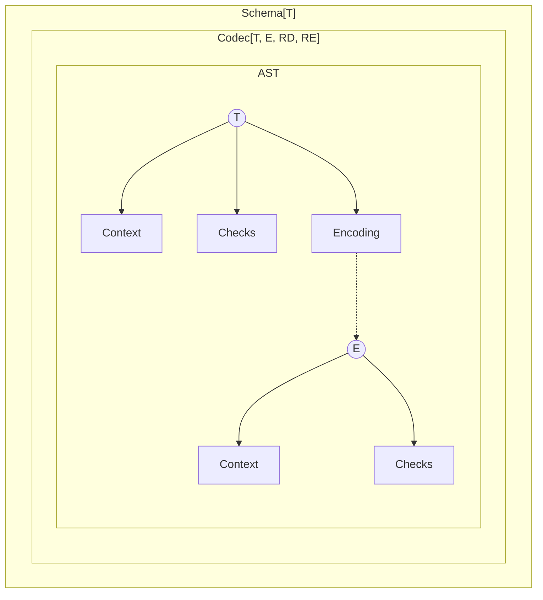
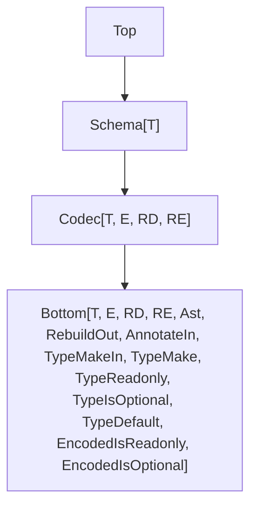

This document outlines upcoming improvements to the `Schema` module in the Effect library.

## Model



## Type Hierarchy



## More Requirement Type Parameters

Requirements are now split into two separate types:

- `RD`: for decoding
- `RE`: for encoding

```ts
interface Codec<T, E, RD, RE> {
  // ...
}
```

This makes it easier to apply requirements only where needed. For instance, encoding requirements can be ignored during decoding:

```ts
import type { Effect } from "effect"
import { Context, Schema } from "effect"

class EncodingService extends Context.Tag<
  EncodingService,
  { encode: Effect.Effect<string> }
>()("EncodingService") {}

declare const field: Schema.Codec<string, string, never, EncodingService>

const schema = Schema.Struct({
  a: field
})

//     ┌─── Effect.Effect<{ readonly a: string; }, Schema.CodecError, never>
//     ▼
const dec = Schema.decodeUnknownEffect(schema)({ a: "a" })

//     ┌─── Effect.Effect<{ readonly a: string; }, Schema.CodecError, EncodingService>
//     ▼
const enc = Schema.encodeUnknownEffect(schema)({ a: "a" })
```

## Default JSON Serialization

The `SchemaSerializer.json` function creates a codec that converts a schema’s encoded type into a JSON-friendly format and back. Given a `schema: Codec<T, E>`:

- `Schema.encodeUnknownSync(schema)` produces a value of type `E`.
- `Schema.encodeUnknownSync(SchemaSerializer.json(schema))` produces a JSON-compatible version of `E`. If `E` already fits JSON types, it is unchanged; otherwise, any `serialization` annotations on `E` are applied.

**Example** (Serializing and Deserializing a Map)

```ts
import { Option, Schema, SchemaSerializer } from "effect"

// Define a schema for a Map from optional symbols to dates
//
//      ┌─── Codec<Map<Option.Option<symbol>, Date>>
//      ▼
const schema = Schema.Map(Schema.Option(Schema.Symbol), Schema.Date)

// Create a JSON serializer for that schema
//
//      ┌─── Codec<Map<Option.Option<symbol>, Date>, unknown>
//      ▼
const serializer = SchemaSerializer.json(Schema.typeCodec(schema))

const data = new Map([[Option.some(Symbol.for("a")), new Date("2021-01-01")]])

// Encode the Map to a JSON-compatible value
//
//      ┌─── unknown
//      ▼
const json = Schema.encodeUnknownSync(serializer)(data)

console.log(json)
// Output: [ [ [ 'a' ], '2021-01-01T00:00:00.000Z' ] ]

// Decode the JSON value back into the original Map
console.log(Schema.decodeUnknownSync(serializer)(json))
/*
Output:
Map(1) {
  { _id: 'Option', _tag: 'Some', value: Symbol(a) } => 2021-01-01T00:00:00.000Z
}
*/
```

### Use Cases

There are two common scenarios for JSON serialization:

1. **Custom JSON Formats** (for REST APIs, file storage, etc.)
2. **Network Transmission** (for RPC or messaging systems)

#### Serializing to a Custom JSON Format

In this scenario, you define how your domain model maps to a specific JSON structure. For example, a `User` type where `name` may be `null` or a `string`, but in your code you prefer an `Option<string>`:

```ts
import { Option, Schema, SchemaTransformation } from "effect"

// The JSON custom format
interface Payload {
  readonly id: number
  readonly name: string | null
}

// The domain model
interface User {
  readonly id: number
  readonly name: Option.Option<string> // must be decoded from string | null
}

// Schema that encodes Option<string> to string | null and back
const User = Schema.Struct({
  id: Schema.Number,
  name: Schema.Option(Schema.String).pipe(
    Schema.encodeTo(
      Schema.NullOr(Schema.String),
      SchemaTransformation.transform({
        decode: Option.fromNullable,
        encode: Option.getOrNull
      })
    )
  )
})

const payload = JSON.parse(`{"id":1,"name":"John"}`)

// Decode JSON into our domain model
console.log(Schema.decodeUnknownSync(User)(payload))
// { id: 1, name: { _id: 'Option', _tag: 'Some', value: 'John' } }

// Encode our domain model back into JSON format
console.log(Schema.encodeUnknownSync(User)({ id: 1, name: Option.none() }))
// { id: 1, name: null }
```

#### Transmitting Data Over the Network

When sending a `User` instance over a network, the exact JSON format usually does not matter. You only need a way to convert the `User` value into something that can be sent and then back again.

You can use `SchemaSerializer.json` to build a codec that handles this conversion between your `User` type and a JSON-friendly format.

In the example below, an `Option` value is converted to an internal tuple format (`[value]` for `Some`, or `[]` for `None`).

**Example** (Serializing and Deserializing a User)

```ts
import {
  Effect,
  Option,
  Schema,
  SchemaSerializer,
  SchemaTransformation
} from "effect"

// The domain model
interface User {
  readonly id: number
  readonly name: Option.Option<string>
}

const User = Schema.Struct({
  id: Schema.Number,
  name: Schema.Option(Schema.String).pipe(
    Schema.encodeTo(
      Schema.NullOr(Schema.String),
      SchemaTransformation.transform({
        decode: Option.fromNullable,
        encode: Option.getOrNull
      })
    )
  )
})

const data = { id: 1, name: Option.some("John") }

const program = Effect.gen(function* () {
  const json = yield* Schema.encodeEffect(
    SchemaSerializer.json(Schema.typeCodec(User))
  )(data)
  console.log(json)
  const t = yield* Schema.decodeEffect(
    SchemaSerializer.json(Schema.typeCodec(User))
  )(json)
  console.log(t)
})

Effect.runPromise(program)
// { id: 1, name: [ 'John' ] }
// { id: 1, name: { _id: 'Option', _tag: 'Some', value: 'John' } }
```

## Flipping Schemas

Flipping is a transformation that creates a new codec from an existing one by swapping its input and output types.

```ts
import { Schema } from "effect"

// Flips a schema that decodes a string into a number,
// turning it into one that decodes a number into a string
//
// const StringFromFinite: flip<decodeTo<Number, String, never, never>>
const StringFromFinite = Schema.flip(Schema.FiniteFromString)

// Schema.Codec<string, number, never, never>
const revealed = Schema.revealCodec(StringFromFinite)
```

The original schema can be retrieved from the flipped one using `.schema`

```ts
import { Schema } from "effect"

const StringFromFinite = Schema.flip(Schema.FiniteFromString)

// decodeTo<Number, String, never, never>
StringFromFinite.schema
```

Applying `flip` twice will return a schema with the same shape as the original one:

```ts
import { Schema } from "effect"

// const schema: decodeTo<Number, String, never, never>
const schema = Schema.flip(Schema.flip(Schema.FiniteFromString))
```

All internal operations have been made symmetrical. This made it possible to define `Schema.flip`, and also simplified the implementation of the decoding / encoding engine.

```ts
// Encoding with a schema is equivalent to decoding with its flipped version
encode(schema) = decode(flip(schema))
```

## Constructors Redesign

### Constructors in Composed Schemas

To support constructing values from composed schemas, `makeSync` is now available on all schemas, including unions.

```ts
import { Schema } from "effect"

const schema = Schema.Union([
  Schema.Struct({ a: Schema.String }),
  Schema.Struct({ b: Schema.Number })
])

schema.makeSync({ a: "hello" })
schema.makeSync({ b: 1 })
```

### Branded Constructors

For branded schemas, the default constructor accepts an unbranded input and returns a branded output.

```ts
import { Schema } from "effect"

const schema = Schema.String.pipe(Schema.brand("a"))

// makeSync(input: string, options?: Schema.MakeOptions): string & Brand<"a">
schema.makeSync
```

However, when a branded schema is part of a composite (such as a struct), you must pass a branded value.

```ts
import { Schema } from "effect"

const schema = Schema.Struct({
  a: Schema.String.pipe(Schema.brand("a")),
  b: Schema.Number
})

/*
makeSync(input: {
    readonly a: string & Brand<"a">;
    readonly b: number;
}, options?: Schema.MakeOptions): {
    readonly a: string & Brand<"a">;
    readonly b: number;
}
*/
schema.makeSync
```

### Refined Constructors

For refined schemas, the constructor accepts the unrefined type and returns the refined one.

```ts
import { Option, Schema } from "effect"

const schema = Schema.Option(Schema.String).pipe(Schema.guard(Option.isSome))

// makeSync(input: Option.Option<string>, options?: Schema.MakeOptions): Option.Some<string>
schema.makeSync
```

As with branding, when used in a composite schema, the refined value must be provided.

```ts
import { Option, Schema } from "effect"

const schema = Schema.Struct({
  a: Schema.Option(Schema.String).pipe(Schema.guard(Option.isSome)),
  b: Schema.Number
})

/*
makeSync(input: {
    readonly a: Option.Some<string>;
    readonly b: number;
}, options?: Schema.MakeOptions): {
    readonly a: Option.Some<string>;
    readonly b: number;
}
*/
schema.makeSync
```

### Default Values in Constructors

You can define a default value for a field using `Schema.withConstructorDefault`. If no value is provided at runtime, the constructor uses this default.

**Example** (Providing a default number)

```ts
import { Option, Schema } from "effect"

const schema = Schema.Struct({
  a: Schema.Number.pipe(Schema.withConstructorDefault(() => Option.some(-1)))
})

console.log(schema.makeSync({ a: 5 }))
// { a: 5 }

console.log(schema.makeSync({}))
// { a: -1 }
```

The function passed to `withConstructorDefault` will be executed each time a default value is needed.

**Example** (Re-executing the default function)

```ts
import { Option, Schema } from "effect"

const schema = Schema.Struct({
  a: Schema.Date.pipe(
    Schema.withConstructorDefault(() => Option.some(new Date()))
  )
})

console.log(schema.makeSync({}))
// { a: 2025-05-19T16:46:10.912Z }

console.log(schema.makeSync({}))
// { a: 2025-05-19T16:46:10.913Z }
```

If the default function returns `Option.none()`, it means no default value was provided, and the field is considered missing.

**Example** (Returning `None` to skip a default)

```ts
import { Option, Schema } from "effect"

const schema = Schema.Struct({
  a: Schema.Date.pipe(
    Schema.withConstructorDefault(() => {
      const d = new Date()
      if (d.getTime() % 2 === 0) {
        // Provide a default value
        return Option.some(d)
      }
      // Skip the default
      return Option.none()
    })
  )
})

try {
  console.log(schema.makeSync({}))
} catch (error) {
  console.error(error)
}
// Error: makeSync failure

try {
  console.log(schema.makeSync({}))
  // { a: 2025-05-19T16:46:10.913Z }
} catch (error) {
  console.error(error)
}
// { a: 2025-05-19T16:48:41.948Z }
```

#### Nested Constructor Default Values

Default values can be nested inside composed schemas. In this case, inner defaults are resolved first.

**Example** (Nested default values)

```ts
import { Result, Schema } from "effect"

const schema = Schema.Struct({
  a: Schema.Struct({
    b: Schema.Number.pipe(
      Schema.withConstructorDefault(() => Result.succeedSome(-1))
    )
  }).pipe(Schema.withConstructorDefault(() => Result.succeedSome({})))
})

console.log(schema.makeSync({}))
// { a: { b: -1 } }
console.log(schema.makeSync({ a: {} }))
// { a: { b: -1 } }
```

### Effectful Defaults

Default values can also be computed using effects, as long as the environment is `never`.

**Example** (Using an effect to provide a default)

```ts
import { Effect, Option, Schema, SchemaResult } from "effect"

const schema = Schema.Struct({
  a: Schema.Number.pipe(
    Schema.withConstructorDefault(() =>
      Effect.gen(function* () {
        yield* Effect.sleep(100)
        return Option.some(-1)
      })
    )
  )
})

SchemaResult.asEffect(schema.make({})).pipe(Effect.runPromise).then(console.log)
// { a: -1 }
```

**Example** (Providing a default from an optional service)

```ts
import { Context, Effect, Option, Schema, SchemaResult } from "effect"

// Define a service that may provide a default value
class ConstructorService extends Context.Tag<
  ConstructorService,
  { defaultValue: Effect.Effect<number> }
>()("ConstructorService") {}

const schema = Schema.Struct({
  a: Schema.Number.pipe(
    Schema.withConstructorDefault(() =>
      Effect.gen(function* () {
        yield* Effect.sleep(100)
        const oservice = yield* Effect.serviceOption(ConstructorService)
        if (Option.isNone(oservice)) {
          return Option.none()
        }
        return Option.some(yield* oservice.value.defaultValue)
      })
    )
  )
})

SchemaResult.asEffect(schema.make({}))
  .pipe(
    Effect.provideService(
      ConstructorService,
      ConstructorService.of({ defaultValue: Effect.succeed(-1) })
    ),
    Effect.runPromise
  )
  .then(console.log, console.error)
// { a: -1 }
```

## Filters Redesign

Filters are applied using the either the `.check` method or the `Schema.check` function.

### Return Type Preservation

When you use `Schema.check`, the original schema's type is preserved. This means that any metadata or methods associated with the schema remain available even after applying filters.

**Example** (Preserving type and methods after filtering)

```ts
import { Schema, SchemaCheck } from "effect"

//      ┌─── Schema.String
//      ▼
Schema.String

//      ┌─── Schema.String
//      ▼
const NonEmptyString = Schema.String.check(SchemaCheck.nonEmpty)

//      ┌─── Schema.String
//      ▼
const schema = NonEmptyString.annotate({})
```

This helps keep functionality such as `.makeSync` or `.fields` intact, even after filters are applied.

```ts
import { Schema, SchemaCheck } from "effect"

const schema = Schema.Struct({
  name: Schema.String,
  age: Schema.Number
}).check(SchemaCheck.make(() => true))

// The fields of the original struct are still accessible
//
//      ┌─── { readonly name: Schema.String; readonly age: Schema.Number; }
//      ▼
const fields = schema.fields
```

### Filters as First-Class

Filters are standalone values. They can be reused, composed, and applied to any schema that has the necessary structure. For example, `minLength` is no longer limited to strings, it can be used with arrays or objects that have a `length` property.

You can pass multiple filters.

**Example** (Validating a trimmed string with a minimum length)

```ts
import { Effect, Schema, SchemaCheck, SchemaFormatter } from "effect"

const schema = Schema.String.check(
  SchemaCheck.minLength(3), // Filter<string>
  SchemaCheck.trimmed // Filter<string>
)

Schema.decodeUnknownEffect(schema)(" a")
  .pipe(
    Effect.mapError((err) => SchemaFormatter.TreeFormatter.format(err.issue)),
    Effect.runPromise
  )
  .then(console.log, console.error)
/*
Output:
string & minLength(3) & trimmed
└─ minLength(3)
   └─ Invalid data " a"
*/
```

**Example** (Applying `minLength` to an object with a `length` field)

```ts
import { Effect, Schema, SchemaCheck, SchemaFormatter } from "effect"

const schema = Schema.Struct({ length: Schema.Number }).check(
  SchemaCheck.minLength(3)
)

Schema.decodeUnknownEffect(schema)({ length: 2 })
  .pipe(
    Effect.mapError((err) => SchemaFormatter.TreeFormatter.format(err.issue)),
    Effect.runPromise
  )
  .then(console.log, console.error)
/*
Output:
{ readonly "length": number } & minLength(3)
└─ minLength(3)
   └─ Invalid value {"length":2}
*/
```

**Example** (Applying `minLength` to an array)

```ts
import { Effect, Schema, SchemaCheck, SchemaFormatter } from "effect"

const schema = Schema.Array(Schema.String).check(SchemaCheck.minLength(3))

Schema.decodeUnknownEffect(schema)(["a", "b"])
  .pipe(
    Effect.mapError((err) => SchemaFormatter.TreeFormatter.format(err.issue)),
    Effect.runPromise
  )
  .then(console.log, console.error)
/*
Output:
ReadonlyArray<string> & minLength(3)
└─ minLength(3)
   └─ Invalid data ["a","b"]
*/
```

By default, when `{ errors: "all" }` is passed, all filters are evaluated, even if one fails. This allows multiple issues to be reported at once.

**Example** (Collecting multiple validation issues)

```ts
import { Effect, Schema, SchemaCheck, SchemaFormatter } from "effect"

const schema = Schema.String.check(
  SchemaCheck.minLength(3),
  SchemaCheck.trimmed
)

Schema.decodeUnknownEffect(schema)(" a", { errors: "all" })
  .pipe(
    Effect.mapError((err) => SchemaFormatter.TreeFormatter.format(err.issue)),
    Effect.runPromise
  )
  .then(console.log, console.error)
/*
Output:
string & minLength(3) & trimmed
├─ minLength(3)
│  └─ Invalid value " a"
└─ trimmed
   └─ Invalid value " a"
*/
```

If you want to stop validation as soon as a filter fails, you can wrap it with `SchemaCheck.abort`.

**Example** (Stop validation)

```ts
import { Effect, Schema, SchemaCheck, SchemaFormatter } from "effect"

const schema = Schema.String.check(
  SchemaCheck.abort(SchemaCheck.minLength(3)), // Stop on failure here
  SchemaCheck.trimmed // This will not run if minLength fails
)

Schema.decodeUnknownEffect(schema)(" a", { errors: "all" })
  .pipe(
    Effect.mapError((err) => SchemaFormatter.TreeFormatter.format(err.issue)),
    Effect.runPromise
  )
  .then(console.log, console.error)
/*
Output:
string & minLength(3) & trimmed
└─ minLength(3)
   └─ Invalid value " a"
*/
```

### Filter Groups

Filters can be grouped to make them easier to reuse.

**Example** (Creating a filter group for a 32-bit integer)

```ts
import { SchemaCheck } from "effect"

export const int32 = new SchemaCheck.FilterGroup(
  [SchemaCheck.int, SchemaCheck.between(-2147483648, 2147483647)],
  {
    title: "int32",
    description: "a 32-bit integer"
  }
)
```

### Filter Factories

A **filter factory** is a function that creates reusable filters. These can be configured with arguments at runtime.

**Example** (Creating a `greaterThan` filter for ordered values)

You can create filters like `greaterThan` for any type with an ordering.

```ts
import type { SchemaAnnotations } from "effect"
import { Order, SchemaCheck } from "effect"

// Create a filter factory for values greater than a given value
export const deriveGreaterThan = <T>(options: {
  readonly order: Order.Order<T>
  readonly annotate?:
    | ((exclusiveMinimum: T) => SchemaAnnotations.Filter)
    | undefined
  readonly format?: (value: T) => string | undefined
}) => {
  const greaterThan = Order.greaterThan(options.order)
  const format = options.format ?? globalThis.String
  return (exclusiveMinimum: T, annotations?: SchemaAnnotations.Filter) => {
    return SchemaCheck.make<T>(
      (input) => greaterThan(input, exclusiveMinimum),
      {
        title: `greaterThan(${format(exclusiveMinimum)})`,
        description: `a value greater than ${format(exclusiveMinimum)}`,
        ...options.annotate?.(exclusiveMinimum),
        ...annotations
      }
    )
  }
}
```

### Effectful Filters

Simple filters must be synchronous, though they can still use effects as long as the environment is `never`.

For more advanced scenarios, such as performing asynchronous validation or accessing services during decoding, you can define an effectful filter using `SchemaGetter.checkEffect`. This is done as part of a transformation.

**Example** (Asynchronous validation of a numeric value)

```ts
import {
  Effect,
  Option,
  Result,
  Schema,
  SchemaGetter,
  SchemaIssue
} from "effect"

// Simulated API call that fails when userId is 0
const myapi = (userId: number) =>
  Effect.gen(function* () {
    if (userId === 0) {
      return new Error("not found")
    }
    return { userId }
  }).pipe(Effect.delay(100))

const schema = Schema.Finite.pipe(
  Schema.decode({
    decode: SchemaGetter.checkEffect((n) =>
      Effect.gen(function* () {
        // Call the async API and wrap the result in a Result
        const user = yield* Effect.result(myapi(n))

        // If the result is an error, return a SchemaIssue
        return Result.isErr(user)
          ? new SchemaIssue.InvalidData(Option.some(n), { title: "not found" })
          : undefined // No issue, value is valid
      })
    ),
    encode: SchemaGetter.passthrough()
  })
)
```

### Refinements

Refinements can be applied using `Schema.refine`. Both **type guards** and **brands** are handled as refinements.

**Example** (Restricting a string to specific values)

```ts
import { Schema, SchemaCheck } from "effect"

//      ┌─── Schema.refine<"a" | "b", Schema.String>
//      ▼
const guarded = Schema.String.pipe(
  Schema.refine(
    SchemaCheck.guarded((s): s is "a" | "b" => s === "a" || s === "b")
  )
)
```

**Example** (Branding a string)

```ts
import { Schema, SchemaCheck } from "effect"

//      ┌─── Schema.refine<string & Brand<"my-brand">, Schema.String>
//      ▼
const branded = Schema.String.pipe(
  Schema.refine(
    SchemaCheck.guarded((s): s is "a" | "b" => s === "a" || s === "b")
  )
)
```

Shortcuts are available: `Schema.guard` and `Schema.brand` are shorthands for refining with a guard or a brand.

```ts
import { Schema } from "effect"

//      ┌─── Schema.refine<"a" | "b", Schema.String>
//      ▼
const guarded = Schema.String.pipe(
  Schema.guard((s): s is "a" | "b" => s === "a" || s === "b")
)

//      ┌─── Schema.refine<string & Brand<"my-brand">, Schema.String>
//      ▼
const branded = Schema.String.pipe(Schema.brand("my-brand"))
```

#### Refinement Groups

Multiple refinements can be combined into a single group. This makes it easier to apply and reuse sets of related checks or constraints.

**Example** (Combining multiple refinements into a group)

```ts
import { SchemaCheck } from "effect"

// A group that checks:
// - minimum length of 3
// - the string is trimmed
// - the value is either "a" or "b"
//
//      ┌─── SchemaCheck.RefinementGroup<"a" | "b", string>
//      ▼
export const guardedGroup = new SchemaCheck.FilterGroup(
  [SchemaCheck.minLength(3), SchemaCheck.trimmed],
  undefined
).and(SchemaCheck.guarded((s): s is "a" | "b" => s === "a" || s === "b"))

// A group that checks:
// - minimum length of 3
// - the string is trimmed
// - the value is branded as "my-brand"
//
//      ┌─── SchemaCheck.RefinementGroup<string & Brand<"my-brand">, string>
//      ▼
export const brandedGroup = new SchemaCheck.FilterGroup(
  [SchemaCheck.minLength(3), SchemaCheck.trimmed],
  undefined
).and(SchemaCheck.branded("my-brand"))
```

**Example** (Creating a branded `Username` schema with grouped refinements)

Imagine you are building a system where usernames must:

- Be at least 3 characters long
- Contain only alphanumeric characters
- Have no leading or trailing whitespace
- Be treated as a distinct type (`Username`) once validated

You can group these constraints and brand the result for use throughout your codebase.

```ts
import { Schema, SchemaCheck } from "effect"

// Group constraints for a valid username
const usernameGroup = new SchemaCheck.FilterGroup(
  [
    SchemaCheck.minLength(3),
    SchemaCheck.regex(/^[a-zA-Z0-9]+$/, {
      title: "alphanumeric",
      description: "must contain only letters and numbers"
    }),
    SchemaCheck.trimmed
  ],
  {
    title: "username",
    description: "a valid username"
  }
).and(SchemaCheck.branded("Username"))

// Create a Schema<String & Brand<"Username">>
export const Username = Schema.String.pipe(Schema.refine(usernameGroup))

// Usage in a struct
const User = Schema.Struct({
  username: Username,
  email: Schema.String
})
```

### Structural Filters

Some filters apply not to individual elements, but to the overall structure of a value. These are called **structural filters**.

Structural filters are different from regular filters in that they validate aspects of a container type, like the number of items in an array or the presence of keys in an object, rather than the contents themselves. Examples include:

- `minLength` or `maxLength` on arrays
- `minKeys` or `maxKeys` on objects
- any constraint that applies to the "shape" of a value rather than to its nested values

These filters are evaluated separately from item-level filters and allow multiple issues to be reported when `{ errors: "all" }` is used.

**Example** (Validating an array with item and structural constraints)

```ts
import { Effect, Schema, SchemaCheck, SchemaFormatter } from "effect"

const schema = Schema.Struct({
  tags: Schema.Array(Schema.String.check(SchemaCheck.nonEmpty)).check(
    SchemaCheck.minLength(3) // structural filter
  )
})

Schema.decodeUnknownEffect(schema)({ tags: ["a", ""] }, { errors: "all" })
  .pipe(
    Effect.mapError((err) => SchemaFormatter.TreeFormatter.format(err.issue)),
    Effect.runPromise
  )
  .then(console.log, console.error)

/*
Output:
{ readonly "tags": ReadonlyArray<string & minLength(1)> & minLength(3) }
└─ ["tags"]
   └─ ReadonlyArray<string & minLength(1)> & minLength(3)
      ├─ [1]
      │  └─ string & minLength(1)
      │     └─ minLength(1)
      │        └─ Expected a value with a length of at least 1, actual ""
      └─ minLength(3)
         └─ Expected a value with a length of at least 3, actual ["a",""]
*/
```

## Structs

### Optional and Mutable Keys

You can mark struct properties as optional or mutable using `Schema.optionalKey` and `Schema.mutableKey`.

```ts
import { Schema } from "effect"

const schema = Schema.Struct({
  a: Schema.String,
  b: Schema.optionalKey(Schema.String),
  c: Schema.mutableKey(Schema.String),
  d: Schema.optionalKey(Schema.mutableKey(Schema.String))
})

/*
with "exactOptionalPropertyTypes": true

type Type = {
    readonly a: string;
    readonly b?: string;
    c: string;
    d?: string;
}
*/
type Type = (typeof schema)["Type"]
```

### Optional Fields

By combining `Schema.optionalKey` and `Schema.NullOr` you can represent any kind of optional property.

```ts
import { Schema } from "effect"

export const schema = Schema.Struct({
  // Exact Optional Property
  a: Schema.optionalKey(Schema.NumberFromString),
  // Optional Property
  b: Schema.optional(Schema.NumberFromString),
  // Exact Optional Property with Nullability
  c: Schema.optionalKey(Schema.NullOr(Schema.NumberFromString)),
  // Optional Property with Nullability
  d: Schema.optional(Schema.NullOr(Schema.NumberFromString))
})

/*
type Encoded = {
    readonly a?: string;
    readonly b?: string | undefined;
    readonly c?: string | null;
    readonly d?: string | null | undefined;
}
*/
export type Encoded = typeof schema.Encoded

/*
type Type = {
    readonly a?: number;
    readonly b?: number | undefined;
    readonly c?: number | null;
    readonly d?: number | null | undefined;
}
*/
export type Type = typeof schema.Type
```

#### Omitting Values When Transforming Optional Fields

```ts
import { Option, Predicate, Schema, SchemaGetter } from "effect"

export const schema = Schema.Struct({
  a: Schema.optional(Schema.NumberFromString).pipe(
    Schema.decodeTo(Schema.optionalKey(Schema.Number), {
      decode: SchemaGetter.transformOptional(
        Option.filter(Predicate.isNotUndefined) // omit undefined
      ),
      encode: SchemaGetter.passthrough()
    })
  )
})

/*
type Encoded = {
    readonly a?: string | undefined;
}
*/
export type Encoded = typeof schema.Encoded

/*
type Type = {
    readonly a?: number;
}
*/
export type Type = typeof schema.Type
```

#### Representing Optional Fields with never Type

```ts
import { Schema } from "effect"

export const schema = Schema.Struct({
  a: Schema.optionalKey(Schema.Never)
})

/*
type Encoded = {
    readonly a?: never;
}
*/
export type Encoded = typeof schema.Encoded

/*
type Type = {
    readonly a?: never;
}
*/
export type Type = typeof schema.Type
```

### Decoding / Encoding with Default Values

**Example**

```ts
import { Schema, SchemaGetter } from "effect"

const schema = Schema.Struct({
  a: Schema.optional(Schema.FiniteFromString).pipe(
    Schema.decodeTo(Schema.Number, {
      decode: SchemaGetter.withDefault(() => 1),
      encode: SchemaGetter.passthrough()
    })
  )
})

//     ┌─── { readonly a?: string | undefined; }
//     ▼
export type Encoded = typeof schema.Encoded

//     ┌─── { readonly a: number; }
//     ▼
export type Type = typeof schema.Type

// Decoding examples with default applied

console.log(Schema.decodeUnknownSync(schema)({}))
// Output: { a: 1 }

console.log(Schema.decodeUnknownSync(schema)({ a: undefined }))
// Output: { a: 1 }

console.log(Schema.decodeUnknownSync(schema)({ a: "2" }))
// Output: { a: 2 }
```

#### Exact Optional Property with Nullability

```ts
import { Option, Predicate, Schema, SchemaGetter } from "effect"

const schema = Schema.Struct({
  a: Schema.optionalKey(Schema.NullOr(Schema.FiniteFromString)).pipe(
    Schema.decodeTo(Schema.Number, {
      decode: SchemaGetter.transformOptional((oe) =>
        oe.pipe(
          Option.filter(Predicate.isNotNull),
          Option.orElseSome(() => 1)
        )
      ),
      encode: SchemaGetter.passthrough()
    })
  )
})

//     ┌─── { readonly a?: string | null | undefined; }
//     ▼
export type Encoded = typeof schema.Encoded

//     ┌─── { readonly a: number; }
//     ▼
export type Type = typeof schema.Type

console.log(Schema.decodeUnknownSync(schema)({}))
// Output: { a: 1 }

// console.log(Schema.decodeUnknownSync(Product)({ quantity: undefined }))
// throws

console.log(Schema.decodeUnknownSync(schema)({ a: null }))
// Output: { a: 1 }

console.log(Schema.decodeUnknownSync(schema)({ a: "2" }))
// Output: { a: 2 }
```

#### Optional Property with Nullability

```ts
import { Option, Predicate, Schema, SchemaGetter } from "effect"

const schema = Schema.Struct({
  a: Schema.optional(Schema.NullOr(Schema.FiniteFromString)).pipe(
    Schema.decodeTo(Schema.Number, {
      decode: SchemaGetter.transformOptional((oe) =>
        oe.pipe(
          Option.filter(Predicate.isNotNullish),
          Option.orElseSome(() => 1)
        )
      ),
      encode: SchemaGetter.passthrough()
    })
  )
})

//     ┌─── { readonly a?: string | null | undefined; }
//     ▼
export type Encoded = typeof schema.Encoded

//     ┌─── { readonly a: number; }
//     ▼
export type Type = typeof schema.Type

console.log(Schema.decodeUnknownSync(schema)({}))
// Output: { a: 1 }

console.log(Schema.decodeUnknownSync(schema)({ a: undefined }))
// Output: { a: 1 }

console.log(Schema.decodeUnknownSync(schema)({ a: null }))
// Output: { a: 1 }

console.log(Schema.decodeUnknownSync(schema)({ a: "2" }))
// Output: { a: 2 }
```

### Optional Fields as Options

#### Exact Optional Property

```ts
import { Option, Schema, SchemaTransformation } from "effect"

const Product = Schema.Struct({
  quantity: Schema.optionalKey(Schema.NumberFromString).pipe(
    Schema.decodeTo(
      Schema.Option(Schema.Number),
      SchemaTransformation.transformOptional({
        decode: Option.some,
        encode: Option.flatten
      })
    )
  )
})

//     ┌─── { readonly quantity?: string; }
//     ▼
export type Encoded = typeof Product.Encoded

//     ┌─── { readonly quantity: Option<number>; }
//     ▼
export type Type = typeof Product.Type

console.log(Schema.decodeUnknownSync(Product)({}))
// Output: { quantity: { _id: 'Option', _tag: 'None' } }

console.log(Schema.decodeUnknownSync(Product)({ quantity: "2" }))
// Output: { quantity: { _id: 'Option', _tag: 'Some', value: 2 } }

// console.log(Schema.decodeUnknownSync(Product)({ quantity: undefined }))
// throws:

console.log(Schema.encodeSync(Product)({ quantity: Option.some(2) }))
// Output: { quantity: "2" }

console.log(Schema.encodeSync(Product)({ quantity: Option.none() }))
// Output: {}
```

#### Optional Property

```ts
import { Option, Predicate, Schema, SchemaTransformation } from "effect"

const Product = Schema.Struct({
  quantity: Schema.optional(Schema.NumberFromString).pipe(
    Schema.decodeTo(
      Schema.Option(Schema.Number),
      SchemaTransformation.transformOptional({
        decode: (oe) =>
          oe.pipe(Option.filter(Predicate.isNotUndefined), Option.some),
        encode: Option.flatten
      })
    )
  )
})

//     ┌─── { readonly quantity?: string; }
//     ▼
export type Encoded = typeof Product.Encoded

//     ┌─── { readonly quantity: Option<number>; }
//     ▼
export type Type = typeof Product.Type

console.log(Schema.decodeUnknownSync(Product)({}))
// Output: { quantity: { _id: 'Option', _tag: 'None' } }

console.log(Schema.decodeUnknownSync(Product)({ quantity: "2" }))
// Output: { quantity: { _id: 'Option', _tag: 'Some', value: 2 } }

// console.log(Schema.decodeUnknownSync(Product)({ quantity: undefined }))
// throws:

console.log(Schema.encodeSync(Product)({ quantity: Option.some(2) }))
// Output: { quantity: "2" }

console.log(Schema.encodeSync(Product)({ quantity: Option.none() }))
// Output: {}
```

#### Exact Optional Property with Nullability

```ts
import { Option, Predicate, Schema, SchemaTransformation } from "effect"

const Product = Schema.Struct({
  quantity: Schema.optionalKey(Schema.NullOr(Schema.NumberFromString)).pipe(
    Schema.decodeTo(
      Schema.Option(Schema.Number),
      SchemaTransformation.transformOptional({
        decode: (oe) =>
          oe.pipe(Option.filter(Predicate.isNotNull), Option.some),
        encode: Option.flatten
      })
    )
  )
})

//     ┌─── { readonly quantity?: string | null; }
//     ▼
export type Encoded = typeof Product.Encoded

//     ┌─── { readonly quantity: Option<number>; }
//     ▼
export type Type = typeof Product.Type

console.log(Schema.decodeUnknownSync(Product)({}))
// Output: { quantity: { _id: 'Option', _tag: 'None' } }

console.log(Schema.decodeUnknownSync(Product)({ quantity: null }))
// Output: { quantity: { _id: 'Option', _tag: 'None' } }

console.log(Schema.decodeUnknownSync(Product)({ quantity: "2" }))
// Output: { quantity: { _id: 'Option', _tag: 'Some', value: 2 } }

// console.log(Schema.decodeUnknownSync(Product)({ quantity: undefined }))
// throws:
```

#### Optional Property with Nullability

```ts
import { Option, Predicate, Schema, SchemaTransformation } from "effect"

const Product = Schema.Struct({
  quantity: Schema.optional(Schema.NullOr(Schema.NumberFromString)).pipe(
    Schema.decodeTo(
      Schema.Option(Schema.Number),
      SchemaTransformation.transformOptional({
        decode: (oe) =>
          oe.pipe(Option.filter(Predicate.isNotNullish), Option.some),
        encode: Option.flatten
      })
    )
  )
})

//     ┌─── { readonly quantity?: string | null | undefined; }
//     ▼
export type Encoded = typeof Product.Encoded

//     ┌─── { readonly quantity: Option<number>; }
//     ▼
export type Type = typeof Product.Type

console.log(Schema.decodeUnknownSync(Product)({}))
// Output: { quantity: { _id: 'Option', _tag: 'None' } }

console.log(Schema.decodeUnknownSync(Product)({ quantity: undefined }))
// Output: { quantity: { _id: 'Option', _tag: 'None' } }

console.log(Schema.decodeUnknownSync(Product)({ quantity: null }))
// Output: { quantity: { _id: 'Option', _tag: 'None' } }

console.log(Schema.decodeUnknownSync(Product)({ quantity: "2" }))
// Output: { quantity: { _id: 'Option', _tag: 'Some', value: 2 }
```

### Key Annotations

You can annotate keys using `Schema.annotateKey`.

**Example** (Annotating a key)

```ts
import { Effect, Schema, SchemaFormatter } from "effect"

const schema = Schema.Struct({
  a: Schema.String.pipe(
    Schema.annotateKey({ description: "my key description" })
  )
})

Schema.decodeUnknownEffect(schema)({})
  .pipe(
    Effect.mapError((err) => SchemaFormatter.TreeFormatter.format(err.issue)),
    Effect.runPromise
  )
  .then(console.log, console.error)
/*
Output:
{ readonly "a": string }
└─ ["a"] (my key description)
   └─ Missing key
*/
```

### Index Signatures

You can extend a struct with an index signature using `Schema.StructWithRest`. This allows you to define both fixed and dynamic properties in a single schema.

Filters applied to either the struct or the record are preserved when combined.

**Example** (Combining fixed properties with an index signature)

```ts
import { Schema } from "effect"

// Define a schema with one fixed key "a" and any number of string keys mapping to numbers
export const schema = Schema.StructWithRest(
  Schema.Struct({ a: Schema.Number }),
  [Schema.Record(Schema.String, Schema.Number)]
)

/*
type Type = {
    readonly [x: string]: number;
    readonly a: number;
}
*/
export type Type = typeof schema.Type

/*
type Encoded = {
    readonly [x: string]: number;
    readonly a: number;
}
*/
export type Encoded = typeof schema.Encoded
```

If you want the record part to be mutable, you can wrap it in `Schema.mutable`.

**Example** (Allowing dynamic keys to be mutable)

```ts
import { Schema } from "effect"

// Define a schema with one fixed key "a" and any number of string keys mapping to numbers
export const schema = Schema.StructWithRest(
  Schema.Struct({ a: Schema.Number }),
  [Schema.mutable(Schema.Record(Schema.String, Schema.Number))]
)

/*
type Type = {
    [x: string]: number;
    readonly a: number;
}
*/
export type Type = typeof schema.Type

/*
type Encoded = {
    [x: string]: number;
    readonly a: number;
}
*/
export type Encoded = typeof schema.Encoded
```

## Records

### Key Transformations

`Schema.Record` supports transforming keys during decoding and encoding. This can be useful when working with different naming conventions.

**Example** (Transforming snake_case keys to camelCase)

```ts
import { Schema, SchemaTransformation } from "effect"

const SnakeToCamel = Schema.String.pipe(
  Schema.decode(SchemaTransformation.snakeToCamel())
)

const schema = Schema.Record(SnakeToCamel, Schema.Number)

console.log(Schema.decodeUnknownSync(schema)({ a_b: 1, c_d: 2 }))
// { aB: 1, cD: 2 }
```

By default, if a transformation results in duplicate keys, the last value wins.

**Example** (Merging transformed keys by keeping the last one)

```ts
import { Schema, SchemaTransformation } from "effect"

const SnakeToCamel = Schema.String.pipe(
  Schema.decode(SchemaTransformation.snakeToCamel())
)

const schema = Schema.Record(SnakeToCamel, Schema.Number)

console.log(Schema.decodeUnknownSync(schema)({ a_b: 1, aB: 2 }))
// { aB: 2 }
```

You can customize how key conflicts are resolved by providing a `combine` function.

**Example** (Combining values for conflicting keys)

```ts
import { Schema, SchemaTransformation } from "effect"

const SnakeToCamel = Schema.String.pipe(
  Schema.decode(SchemaTransformation.snakeToCamel())
)

const schema = Schema.Record(SnakeToCamel, Schema.Number, {
  key: {
    decode: {
      // When decoding, combine values of conflicting keys by summing them
      combine: ([_, v1], [k2, v2]) => [k2, v1 + v2] // you can pass a Semigroup to combine keys
    },
    encode: {
      // Same logic applied when encoding
      combine: ([_, v1], [k2, v2]) => [k2, v1 + v2]
    }
  }
})

console.log(Schema.decodeUnknownSync(schema)({ a_b: 1, aB: 2 }))
// { aB: 3 }

console.log(Schema.encodeUnknownSync(schema)({ a_b: 1, aB: 2 }))
// { a_b: 3 }
```

### Mutability

By default, records are treated as immutable. You can mark a record as mutable using `Schema.mutable`.

**Example** (Defining a mutable record)

```ts
import { Schema } from "effect"

export const schema = Schema.mutable(
  Schema.Record(Schema.String, Schema.Number)
)

/*
type Type = {
    [x: string]: number;
}
*/
export type Type = typeof schema.Type

/*
type Encoded = {
    [x: string]: number;
}
*/
export type Encoded = typeof schema.Encoded
```

## Opaque Structs

**Use Case**: When you are fine with a struct but you want an opaque type for its `Type`.

Opaque structs wrap an existing struct in a new class type. They preserve the schema's shape but hide implementation details.
Instance methods or custom constructors **are not allowed** on opaque structs.

**Open Problems**:

- instance methods are not supported but this is not enforced (eslint rule?)

**Example** (Creating an Opaque Struct)

```ts
import { Schema } from "effect"

class Person extends Schema.Opaque<Person>()(
  Schema.Struct({
    name: Schema.String
  })
) {}

//      ┌─── Codec<Person, { readonly name: string; }, never, never>
//      ▼
const codec = Schema.revealCodec(Person)

// const x: Person
const person = Person.makeSync({ name: "John" })

console.log(person.name)
// "John"

// The class itself holds the original schema and its metadata
console.log(Person)
// -> [Function: Person] Struct$

// { readonly name: Schema.String }
Person.fields

/*
const another: Schema.Struct<{
    readonly name: typeof Person;
}>
*/
const another = Schema.Struct({ name: Person }) // You can use the opaque type inside other schemas

/*
type Type = {
    readonly name: Person;
}
*/
type Type = (typeof another)["Type"]
```

Opaque structs can be used just like regular structs, with no other changes needed.

**Example** (Retrieving Schema Fields)

```ts
import { Schema } from "effect"

// A function that takes a generic struct
const getFields = <Fields extends Schema.Struct.Fields>(
  struct: Schema.Struct<Fields>
) => struct.fields

class Person extends Schema.Opaque<Person>()(
  Schema.Struct({
    name: Schema.String
  })
) {}

/*
const fields: {
    readonly name: Schema.String;
}
*/
const fields = getFields(Person)
```

### Static methods

You can add static members to an opaque struct class to extend its behavior.

**Example** (Custom serializer via static method)

```ts
import { Schema, SchemaSerializer } from "effect"

class Person extends Schema.Opaque<Person>()(
  Schema.Struct({
    name: Schema.String,
    createdAt: Schema.Date
  })
) {
  // Create a custom serializer using the class itself
  static readonly serializer = SchemaSerializer.json(this)
}

console.log(
  Schema.encodeUnknownSync(Person)({
    name: "John",
    createdAt: new Date()
  })
)
// { name: 'John', createdAt: 2025-05-02T13:49:29.926Z }

console.log(
  Schema.encodeUnknownSync(Person.serializer)({
    name: "John",
    createdAt: new Date()
  })
)
// { name: 'John', createdAt: '2025-05-02T13:49:29.928Z' }
```

### Annotations and filters

You can attach filters and annotations to the struct passed into `Opaque`.

**Example** (Applying a filter and title annotation)

```ts
import { Effect, Schema, SchemaCheck, SchemaFormatter } from "effect"

class Person extends Schema.Opaque<Person>()(
  Schema.Struct({
    name: Schema.String
  })
    .check(SchemaCheck.make(({ name }) => name.length > 0))
    .annotate({ title: "Person" })
) {}

Schema.decodeUnknownEffect(Person)({ name: "" })
  .pipe(
    Effect.mapError((err) => SchemaFormatter.TreeFormatter.format(err.issue)),
    Effect.runPromise
  )
  .then(console.log, console.error)
/*
Person & <filter>
└─ <filter>
   └─ Invalid value {"name":""}
*/
```

When you call methods like `annotate` on an opaque struct, you get back the original struct, not a new class.

```ts
import { Schema } from "effect"

class Person extends Schema.Opaque<Person>()(
  Schema.Struct({
    name: Schema.String
  })
) {}

/*
const S: Schema.Struct<{
    readonly name: Schema.String;
}>
*/
const S = Person.annotate({ title: "Person" }) // `annotate` returns the wrapped struct type
```

### Recursive Opaque Structs

**Example** (Recursive Opaque Struct with Same Encoded and Type)

```ts
import { Schema } from "effect"

export class Category extends Schema.Opaque<Category>()(
  Schema.Struct({
    name: Schema.String,
    children: Schema.Array(
      Schema.suspend((): Schema.Codec<Category> => Category)
    )
  })
) {}

/*
type Encoded = {
    readonly children: readonly Category[];
    readonly name: string;
}
*/
export type Encoded = (typeof Category)["Encoded"]
```

**Example** (Recursive Opaque Struct with Different Encoded and Type)

```ts
import { Schema } from "effect"

interface CategoryEncoded extends Schema.Codec.Encoded<typeof Category> {}

export class Category extends Schema.Opaque<Category>()(
  Schema.Struct({
    name: Schema.FiniteFromString,
    children: Schema.Array(
      Schema.suspend((): Schema.Codec<Category, CategoryEncoded> => Category)
    )
  })
) {}

/*
type Encoded = {
    readonly children: readonly CategoryEncoded[];
    readonly name: string;
}
*/
export type Encoded = (typeof Category)["Encoded"]
```

**Example** (Mutually Recursive Schemas)

```ts
import { Schema } from "effect"

class Expression extends Schema.Opaque<Expression>()(
  Schema.Struct({
    type: Schema.Literal("expression"),
    value: Schema.Union([
      Schema.Number,
      Schema.suspend((): Schema.Codec<Operation> => Operation)
    ])
  })
) {}

class Operation extends Schema.Opaque<Operation>()(
  Schema.Struct({
    type: Schema.Literal("operation"),
    operator: Schema.Literals(["+", "-"]),
    left: Expression,
    right: Expression
  })
) {}

/*
type Encoded = {
    readonly type: "operation";
    readonly operator: "+" | "-";
    readonly left: {
        readonly type: "expression";
        readonly value: number | Operation;
    };
    readonly right: {
        readonly type: "expression";
        readonly value: number | Operation;
    };
}
*/
export type Encoded = (typeof Operation)["Encoded"]
```

## Tuples

### Rest Elements

You can add rest elements to a tuple using `Schema.TupleWithRest`.

**Example** (Adding rest elements to a tuple)

```ts
import { Schema } from "effect"

export const schema = Schema.TupleWithRest(
  Schema.Tuple([Schema.FiniteFromString, Schema.String]),
  [Schema.Boolean, Schema.String]
)

/*
type Type = readonly [number, string, ...boolean[], string]
*/
export type Type = typeof schema.Type

/*
type Encoded = readonly [string, string, ...boolean[], string]
*/
export type Encoded = typeof schema.Encoded
```

### Element Annotations

You can annotate elements using `Schema.annotateKey`.

**Example** (Annotating an element)

```ts
import { Effect, Schema, SchemaFormatter } from "effect"

const schema = Schema.Tuple([
  Schema.String.pipe(
    Schema.annotateKey({ description: "my element description" })
  )
])

Schema.decodeUnknownEffect(schema)([])
  .pipe(
    Effect.mapError((err) => SchemaFormatter.TreeFormatter.format(err.issue)),
    Effect.runPromise
  )
  .then(console.log, console.error)
/*
Output:
readonly [string]
└─ [0] (my element description)
   └─ Missing key
*/
```

## Classes

### Existing Classes

#### Validating the Constructor

**Use Case**: When you want to validate the constructor arguments of an existing class.

**Example** (Using a tuple to validate the constructor arguments)

```ts
import { Schema, SchemaFormatter, SchemaIssue } from "effect"

const PersonConstructorArguments = Schema.Tuple([Schema.String, Schema.Finite])

// Existing class
class Person {
  constructor(
    readonly name: string,
    readonly age: number
  ) {
    PersonConstructorArguments.makeSync([name, age])
  }
}

try {
  new Person("John", NaN)
} catch (error) {
  if (error instanceof Error) {
    if (SchemaIssue.isIssue(error.cause)) {
      console.error(SchemaFormatter.TreeFormatter.format(error.cause))
    } else {
      console.error(error)
    }
  }
}
/*
readonly [string, number & finite]
└─ [1]
   └─ number & finite
      └─ finite
         └─ Invalid value NaN
*/
```

**Example** (Inheritance)

```ts
import { Schema } from "effect"

const PersonConstructorArguments = Schema.Tuple([Schema.String, Schema.Finite])

class Person {
  constructor(
    readonly name: string,
    readonly age: number
  ) {
    PersonConstructorArguments.makeSync([name, age])
  }
}

const PersonWithEmailConstructorArguments = Schema.Tuple([Schema.String])

class PersonWithEmail extends Person {
  constructor(
    name: string,
    age: number,
    readonly email: string
  ) {
    // Only validate the additional argument
    PersonWithEmailConstructorArguments.makeSync([email])
    super(name, age)
  }
}
```

#### Defining a Schema

```ts
import { Schema, SchemaTransformation } from "effect"

class Person {
  constructor(
    readonly name: string,
    readonly age: number
  ) {}
}

const PersonSchema = Schema.instanceOf({
  constructor: Person,
  annotations: {
    title: "Person",
    // optional: default JSON serialization
    defaultJsonSerializer: () =>
      Schema.link<Person>()(
        Schema.Tuple([Schema.String, Schema.Number]),
        SchemaTransformation.transform({
          decode: (args) => new Person(...args),
          encode: (instance) => [instance.name, instance.age] as const
        })
      )
  }
})
  // optional: explicit encoding
  .pipe(
    Schema.encodeTo(
      Schema.Struct({
        name: Schema.String,
        age: Schema.Number
      }),
      SchemaTransformation.transform({
        decode: (args) => new Person(args.name, args.age),
        encode: (instance) => instance
      })
    )
  )
```

**Example** (Inheritance)

```ts
import { Schema, SchemaTransformation } from "effect"

class Person {
  constructor(
    readonly name: string,
    readonly age: number
  ) {}
}

const PersonSchema = Schema.instanceOf({
  constructor: Person,
  annotations: {
    title: "Person",
    // optional: default JSON serialization
    defaultJsonSerializer: () =>
      Schema.link<Person>()(
        Schema.Tuple([Schema.String, Schema.Number]),
        SchemaTransformation.transform({
          decode: (args) => new Person(...args),
          encode: (instance) => [instance.name, instance.age] as const
        })
      )
  }
})
  // optional: explicit encoding
  .pipe(
    Schema.encodeTo(
      Schema.Struct({
        name: Schema.String,
        age: Schema.Number
      }),
      SchemaTransformation.transform({
        decode: (args) => new Person(args.name, args.age),
        encode: (instance) => instance
      })
    )
  )

class PersonWithEmail extends Person {
  constructor(
    name: string,
    age: number,
    readonly email: string
  ) {
    super(name, age)
  }
}

// const PersonWithEmailSchema = ...repeat the pattern above...
```

#### Errors

**Example** (Extending Data.Error)

```ts
import { Data, Effect, identity, Schema, SchemaTransformation } from "effect"

const Props = Schema.Struct({
  message: Schema.String
})

class Err extends Data.Error<typeof Props.Type> {
  constructor(props: typeof Props.Type) {
    super(Props.makeSync(props))
  }
}

const program = Effect.gen(function* () {
  yield* new Err({ message: "Uh oh" })
})

Effect.runPromiseExit(program).then((exit) =>
  console.log(JSON.stringify(exit, null, 2))
)
/*
{
  "_id": "Exit",
  "_tag": "Failure",
  "cause": {
    "_id": "Cause",
    "failures": [
      {
        "_tag": "Fail",
        "error": {
          "message": "Uh oh"
        }
      }
    ]
  }
}
*/

const transformation = SchemaTransformation.transform<
  Err,
  (typeof Props)["Type"]
>((props) => new Err(props), identity)

const schema = Schema.instanceOf({
  constructor: Err,
  annotations: {
    title: "Err",
    serialization: {
      json: () => Schema.link<Err>()(Props, transformation)
    }
  }
}).pipe(Schema.encodeTo(Props, transformation))

// built-in helper?
const builtIn = Schema.getNativeClassSchema(Err, { encoding: Props })
```

### Class API

**Example**

```ts
import { Schema } from "effect"

class A extends Schema.Class<A>("A")({
  a: Schema.String
}) {
  readonly _a = 1
}

console.log(new A({ a: "a" }))
// A { a: 'a', _a: 1 }
console.log(A.makeSync({ a: "a" }))
// A { a: 'a', _a: 1 }
console.log(Schema.decodeUnknownSync(A)({ a: "a" }))
// A { a: 'a', _a: 1 }
```

#### Branded Classes

You can optionally add a brand to a class to prevent accidental mixing of different types.

```ts
import { Schema } from "effect"

class A extends Schema.Class<A, { readonly brand: unique symbol }>("A")({
  a: Schema.String
}) {}

class B extends Schema.Class<B, { readonly brand: unique symbol }>("B")({
  a: Schema.String
}) {}

// @ts-expect-error
export const a: A = B.makeSync({ a: "a" })
// @ts-expect-error
export const b: B = A.makeSync({ a: "a" })
```

or using the `Brand` module:

```ts
import type { Brand } from "effect"
import { Schema } from "effect"

class A extends Schema.Class<A, Brand.Brand<"A">>("A")({
  a: Schema.String
}) {}

class B extends Schema.Class<B, Brand.Brand<"B">>("B")({
  a: Schema.String
}) {}

// @ts-expect-error
export const a: A = B.makeSync({ a: "a" })
// @ts-expect-error
export const b: B = A.makeSync({ a: "a" })
```

#### Filters

```ts
import { Schema, SchemaCheck, SchemaFormatter, SchemaIssue } from "effect"

class A extends Schema.Class<A>("A")({
  a: Schema.String.check(SchemaCheck.nonEmpty)
}) {}

try {
  new A({ a: "" })
} catch (error) {
  if (error instanceof Error) {
    if (SchemaIssue.isIssue(error.cause)) {
      console.error(SchemaFormatter.TreeFormatter.format(error.cause))
    } else {
      console.error(error)
    }
  }
}
/*
{ readonly "a": string & minLength(1) }
└─ ["a"]
   └─ string & minLength(1)
      └─ minLength(1)
         └─ Invalid value ""
*/
```

#### Annotations

```ts
import { Schema, SchemaFormatter, SchemaIssue } from "effect"

export class A extends Schema.Class<A>("A")(
  {
    a: Schema.String
  },
  {
    title: "A"
  }
) {}

try {
  Schema.decodeUnknownSync(A)({ a: null })
} catch (error) {
  if (SchemaIssue.isIssue(error)) {
    console.error(SchemaFormatter.TreeFormatter.format(error))
  } else {
    console.error(error)
  }
}
/*
A <-> { readonly "a": string }
└─ { readonly "a": string }
   └─ ["a"]
      └─ Expected string, actual null
*/
```

#### extend

```ts
import { Schema } from "effect"

class A extends Schema.Class<A>("A")(
  Schema.Struct({
    a: Schema.String
  })
) {
  readonly _a = 1
}
class B extends A.extend<B>("B")({
  b: Schema.Number
}) {
  readonly _b = 2
}

console.log(new B({ a: "a", b: 2 }))
// B { a: 'a', _a: 1, _b: 2 }
console.log(B.makeSync({ a: "a", b: 2 }))
// B { a: 'a', _a: 1, _b: 2 }
console.log(Schema.decodeUnknownSync(B)({ a: "a", b: 2 }))
// B { a: 'a', _a: 1, _b: 2 }
```

#### Recursive Classes

```ts
import { Schema } from "effect"

export class Category extends Schema.Class<Category>("Category")(
  Schema.Struct({
    name: Schema.String,
    children: Schema.Array(
      Schema.suspend((): Schema.Codec<Category> => Category)
    )
  })
) {}

/*
type Encoded = {
    readonly children: readonly Category[];
    readonly name: string;
}
*/
export type Encoded = (typeof Category)["Encoded"]
```

**Example** (Recursive Opaque Struct with Different Encoded and Type)

```ts
import { Schema } from "effect"

interface CategoryEncoded extends Schema.Codec.Encoded<typeof Category> {}

export class Category extends Schema.Class<Category>("Category")(
  Schema.Struct({
    name: Schema.FiniteFromString,
    children: Schema.Array(
      Schema.suspend((): Schema.Codec<Category, CategoryEncoded> => Category)
    )
  })
) {}

/*
type Encoded = {
    readonly children: readonly CategoryEncoded[];
    readonly name: string;
}
*/
export type Encoded = (typeof Category)["Encoded"]
```

**Example** (Mutually Recursive Schemas)

```ts
import { Schema } from "effect"

class Expression extends Schema.Class<Expression>("Expression")(
  Schema.Struct({
    type: Schema.Literal("expression"),
    value: Schema.Union([
      Schema.Number,
      Schema.suspend((): Schema.Codec<Operation> => Operation)
    ])
  })
) {}

class Operation extends Schema.Class<Operation>("Operation")(
  Schema.Struct({
    type: Schema.Literal("operation"),
    operator: Schema.Literals(["+", "-"]),
    left: Expression,
    right: Expression
  })
) {}

/*
type Encoded = {
    readonly type: "operation";
    readonly operator: "+" | "-";
    readonly left: {
        readonly type: "expression";
        readonly value: number | Operation;
    };
    readonly right: {
        readonly type: "expression";
        readonly value: number | Operation;
    };
}
*/
export type Encoded = (typeof Operation)["Encoded"]
```

### ErrorClass

```ts
import { Schema } from "effect"

class E extends Schema.ErrorClass<E>("E")({
  id: Schema.Number
}) {}
```

### RequestClass

```ts
import { Schema } from "effect"

class A extends Schema.RequestClass<A>("A")({
  payload: Schema.Struct({
    a: Schema.String
  }),
  success: Schema.String,
  error: Schema.Number
}) {}
```

## Unions

By default, unions are inclusive, meaning that the union matches if any member matches.

Members are checked in order, and the first match is returned.

### Exclusive Unions

You can create an exclusive union, where the union matches if exactly one member matches, by passing the `{ mode: "oneOf" }` option.

**Example** (Exclusive Union)

```ts
import { Effect, Schema, SchemaFormatter } from "effect"

const schema = Schema.Union(
  [Schema.Struct({ a: Schema.String }), Schema.Struct({ b: Schema.Number })],
  { mode: "oneOf" }
)

Schema.decodeUnknownEffect(schema)({ a: "a", b: 1 })
  .pipe(
    Effect.mapError((err) => SchemaFormatter.TreeFormatter.format(err.issue)),
    Effect.runPromise
  )
  .then(console.log, console.error)
/*
Output:
Expected exactly one successful result for { readonly "a": string } ⊻ { readonly "b": number }, actual {"a":"a","b":1}
*/
```

## Transformations Redesign

### Transformations as First-Class

Transformations are now treated as first-class values, rather than being tied to specific codec combinations as in v3.

For example, `trim` is no longer just a codec combinator. It is now a standalone transformation that can be used with any codec that supports it, in this case, any codec working with strings.

**Example**

```ts
import { Schema, SchemaTransformation } from "effect"

const schema = Schema.String.pipe(Schema.decode(SchemaTransformation.trim()))

console.log(Schema.decodeUnknownSync(schema)("  123"))
// 123
```

### Transformation Composition

Transformation composition is the process of combining multiple transformations into a single transformation.

```ts
import { SchemaTransformation } from "effect"

/*
decoding: trim + toLowerCase
encoding: passthrough
*/
const trimToLowerCase = SchemaTransformation.trim().compose(
  SchemaTransformation.toLowerCase()
)
```

### Schema Composition

#### decodeTo / encodeTo

The `Schema.decodeTo` API allows you to compose two schemas without requiring the types to match. It skips type checking during the transformation and focuses on structure alone.

```ts
import { Schema } from "effect"

const From = Schema.Struct({
  a: Schema.String,
  b: Schema.FiniteFromString
})

const To = Schema.Struct({
  a: Schema.FiniteFromString,
  b: Schema.UndefinedOr(Schema.Number)
})

const schema = From.pipe(Schema.decodeTo(To))
```

This approach is useful when you want to connect schemas without enforcing type compatibility between them.

If you want more control over how the types align, such as ensuring one is a subtype or supertype of the other, you can use the `SchemaTransformation.passthrough*` helpers.

The `Schema.encodeTo` API is the same as `Schema.decodeTo` but it applies the composition in the other direction.

```ts
import { Schema } from "effect"

const From = Schema.Struct({
  a: Schema.String,
  b: Schema.FiniteFromString
})

const To = Schema.Struct({
  a: Schema.FiniteFromString,
  b: Schema.UndefinedOr(Schema.Number)
})

const schema = To.pipe(Schema.encodeTo(From)) // same as From.pipe(Schema.decodeTo(To))
```

#### passthrough

The `passthrough` transformation lets you convert from one schema to another when the encoded output of the target schema matches the type of the source schema.

**Example** (Composing schemas where `To.Encoded = From.Type`)

```ts
import { Schema, SchemaTransformation } from "effect"

const From = Schema.Struct({
  a: Schema.String
})

const To = Schema.Struct({
  a: Schema.FiniteFromString
})

// To.Encoded (string) = From.Type (string)
const schema = From.pipe(
  Schema.decodeTo(To, SchemaTransformation.passthrough())
)
```

#### passthroughSubtype

Use `passthroughSubtype` when your source type extends the encoded output of your target schema.

**Example** (Composing schemas where `From.Type extends To.Encoded`)

```ts
import { Schema, SchemaTransformation } from "effect"

const From = Schema.FiniteFromString

const To = Schema.UndefinedOr(Schema.Number)

// From.Type (number) extends To.Encoded (number | undefined)
const schema = From.pipe(
  Schema.decodeTo(To, SchemaTransformation.passthroughSubtype())
)
```

#### passthroughSupertype

Use `passthroughSupertype` when the encoded output of your target schema extends the type of your source schema.

**Example** (Composing schemas where `From.Encoded extends To.Type`)

```ts
import { Schema, SchemaTransformation } from "effect"

const From = Schema.UndefinedOr(Schema.String)

const To = Schema.FiniteFromString

// To.Encoded (string) extends From.Type (string | undefined)
const schema = From.pipe(
  Schema.decodeTo(To, SchemaTransformation.passthroughSupertype())
)
```

#### Turning off strict mode

To turn off strict mode, pass `{ strict: false }` to `passthrough`

```ts
import { Schema, SchemaTransformation } from "effect"

const From = Schema.String

const To = Schema.Number

const schema = From.pipe(
  Schema.decodeTo(To, SchemaTransformation.passthrough({ strict: false }))
)
```

### Parse JSON

## Generics Improvements

Using generics in schema composition and filters can be difficult.

The plan is to make generics **covariant** and easier to use.

**Before (v3)**

```ts
declare const minLength: <S extends Schema.Any>(
  minLength: number,
  annotations?: Annotations.Filter<Schema.Type<S>>
) => <A extends string>(
  self: S & Schema<A, Schema.Encoded<S>, Schema.Context<S>>
) => filter<S>
```

**After (v4)**

```ts
import type { Schema } from "effect"

declare const minLength: <T extends string>(
  minLength: number,
  annotations?: Schema.Annotations.Annotations<T>
) => <S extends Schema.Schema<T>>(self: S) => S
```

## Middlewares

Middlewares are a new feature that allows you to modify the behavior of schemas.

They are similar to transformations, but they are able to catch errors and modify the schema contexts.

### Fallbacks

```ts
import { Effect, Option, Result, Schema, SchemaFormatter } from "effect"

const fallback = Result.ok(Option.some("b"))
const schema = Schema.String.pipe(Schema.catchDecoding(() => fallback))

Schema.decodeUnknownEffect(schema)(null)
  .pipe(
    Effect.mapError((err) => SchemaFormatter.TreeFormatter.format(err.issue)),
    Effect.runPromise
  )
  .then(console.log, console.error)
/*
Output:
b
*/
```

### Providing a Service

```ts
import { Context, Effect, Option, Schema, SchemaFormatter } from "effect"

class Service extends Context.Tag<
  Service,
  { fallback: Effect.Effect<string> }
>()("Service") {}

//      ┌─── Codec<string, string, Service, never>
//      ▼
const schema = Schema.String.pipe(
  Schema.catchDecodingWithContext(() =>
    Effect.gen(function* () {
      const service = yield* Service
      return Option.some(yield* service.fallback)
    })
  )
)

//      ┌─── Codec<string, string, never, never>
//      ▼
const provided = schema.pipe(
  Schema.decodingMiddleware((sr) =>
    Effect.isEffect(sr)
      ? Effect.provideService(sr, Service, { fallback: Effect.succeed("b") })
      : sr
  )
)

Schema.decodeUnknownEffect(provided)(null)
  .pipe(
    Effect.mapError((err) => SchemaFormatter.TreeFormatter.format(err.issue)),
    Effect.runPromise
  )
  .then(console.log, console.error)
/*
Output:
b
*/
```

## Formatters

### TreeFormatter

```ts
import { Effect, Schema, SchemaCheck, SchemaFormatter } from "effect"

const schema = Schema.Struct({
  a: Schema.String.check(SchemaCheck.nonEmpty),
  b: Schema.Number
})

Schema.decodeUnknownEffect(schema)({ a: "", b: null }, { errors: "all" })
  .pipe(
    Effect.mapError((err) => SchemaFormatter.TreeFormatter.format(err.issue)),
    Effect.runPromise
  )
  .then(console.log, console.error)
/*
Output:
{ readonly "a": string & minLength(1); readonly "b": number }
├─ ["a"]
│  └─ string & minLength(1)
│     └─ minLength(1)
│        └─ Invalid data ""
└─ ["b"]
   └─ Expected number, actual null
*/
```

### StructuredFormatter

```ts
import { Effect, Schema, SchemaCheck, SchemaFormatter } from "effect"

const schema = Schema.Struct({
  a: Schema.String.check(SchemaCheck.nonEmpty),
  b: Schema.Number
})

Schema.decodeUnknownEffect(schema)({ a: "", b: null }, { errors: "all" })
  .pipe(
    Effect.mapError((err) =>
      SchemaFormatter.StructuredFormatter.format(err.issue)
    ),
    Effect.runPromise
  )
  .then(console.log, console.error)
/*
Output:
[
  {
    _tag: 'InvalidData',
    ast: StringKeyword {
      annotations: undefined,
      checks: [Array],
      encoding: undefined,
      context: undefined,
      _tag: 'StringKeyword'
    },
    actual: { _id: 'Option', _tag: 'Some', value: '' },
    path: [ 'a' ],
    meta: { id: 'minLength', minLength: 1 },
    abort: false
  },
  {
    _tag: 'InvalidType',
    ast: NumberKeyword {
      annotations: undefined,
      checks: undefined,
      encoding: undefined,
      context: undefined,
      _tag: 'NumberKeyword'
    },
    actual: { _id: 'Option', _tag: 'Some', value: null },
    path: [ 'b' ],
    meta: undefined
  }
]
*/
```

## Generating a JSON Schema from a Schema

### Basic Conversion (no annotations)

By default, a plain schema (with no extra annotations) will yield the minimal valid JSON Schema for that shape. For example:

```ts
import { Schema, SchemaToJsonSchema } from "effect"

const schema = Schema.Tuple([Schema.String, Schema.Number])

// you can omit the target, default target is draft-07
const jsonSchema = SchemaToJsonSchema.make(schema, { target: "draft-07" })

console.log(JSON.stringify(jsonSchema, null, 2))
/*
Output:
{
  "$schema": "http://json-schema.org/draft-07/schema",
  "type": "array",
  "items": [
    {
      "type": "string"
    },
    {
      "type": "number"
    }
  ],
  "additionalItems": false
}
*/
```

Similarly, for Draft 2020-12:

```ts
import { Schema, SchemaToJsonSchema } from "effect"

const schema = Schema.Tuple([Schema.String, Schema.Number])

const jsonSchema = SchemaToJsonSchema.make(schema, { target: "draft-2020-12" })

console.log(JSON.stringify(jsonSchema, null, 2))
/*
Output:
{
  "$schema": "https://json-schema.org/draft/2020-12/schema",
  "type": "array",
  "prefixItems": [
    {
      "type": "string"
    },
    {
      "type": "number"
    }
  ],
  "items": false
}
*/
```

No errors are thrown as long as your schema is not a “Declaration” (e.g. `Schema.Option(Schema.String)`), `Void`, `Undefined`, `BigInt`, `Symbol`, or `UniqueSymbol` at the top level. In those cases, you'll see runtime errors like:

> `cannot generate JSON Schema for Declaration at root`

> `cannot generate JSON Schema for VoidKeyword at root`

> etc.

### Attaching Standard Metadata (`title`, `description`, `default`, `examples`)

Any schema implementing `Bottom<T>` (which includes all primitive keywords, arrays, tuples, objects, etc.) accepts the `.annotate(...)` method, where you may pass standard “documentation” or “metadata” fields:

```ts
import { Schema, SchemaToJsonSchema } from "effect"

const schema = Schema.NonEmptyString.annotate({
  title: "Username",
  description: "A non-empty user name string",
  default: "anonymous",
  examples: ["alice", "bob"]
})

const jsonSchema = SchemaToJsonSchema.make(schema)

console.log(JSON.stringify(jsonSchema, null, 2))
/*
Output:
{
  "$schema": "http://json-schema.org/draft-07/schema",
  "type": "string",
  "title": "Username",
  "description": "A non-empty user name string",
  "default": "anonymous",
  "examples": [
    "alice",
    "bob"
  ],
  "allOf": [
    {
      "title": "minLength(1)",
      "description": "a value with a length of at least 1",
      "minLength": 1
    }
  ]
}
*/
```

### Overriding the Generated JSON Schema

Sometimes you want to tamper with the default JSON Schema that Effect would generate. For that, use the special `jsonSchema: { type: "override"; override: (default) => JsonSchema }` in your annotation. In other words:

```ts
import { Schema, SchemaCheck, SchemaToJsonSchema } from "effect"

const schema = Schema.Number.check(SchemaCheck.greaterThan(0)).annotate({
  jsonSchema: {
    type: "override",
    override: (defaultJson) => {
      // `defaultJson` would look like:
      //   { type: "number", exclusiveMinimum: 0, description: "...", title: "greaterThan(0)" }
      // We can replace `type: "number"` with `type: "integer"`:
      return { ...defaultJson, type: "integer" }
    }
  }
})

const jsonSchema = SchemaToJsonSchema.make(schema)

console.log(JSON.stringify(jsonSchema, null, 2))
/*
Output:
{
  "$schema": "http://json-schema.org/draft-07/schema",
  "type": "integer",
  "title": "greaterThan(0)",
  "description": "a value greater than 0",
  "exclusiveMinimum": 0
}
*/
```

- The override function receives exactly the JSON Schema that Effect built for you, including any `title/description/default/examples` you may have supplied.
- You can manipulate or drop any piece of that output. Whatever you return is taken verbatim as your final JSON Schema content (aside from the `$schema` header).

### Embedding Schema-Level Fragments via `check` Annotations

Whenever you call `.check(...)` on a schema, Effect attaches a filter which may carry a `"jsonSchema"` annotation of one of two forms:

- A single fragment. (`type: "fragment"; fragment: JsonSchema`)
- Multiple named fragments. (`type: "fragments"; fragments: Record<string, JsonSchema>`)

These fragments are then merged into the final JSON Schema:

- `type: "fragment"`: the `fragment` object’s properties are merged into the parent schema (possibly under an `allOf` array).
- `type: "fragments"`: each key/value in `fragments` becomes a named “sub‐schema” that can be referenced via `$ref` or combined, depending on context.

Below are the two most common scenarios:

#### Single-fragment filters (e.g. `minLength`, `maxLength`, `exclusiveMinimum`, etc.)

Effect’s built-in checks already carry a `jsonSchema` fragment. For example:

```ts
import { Schema, SchemaCheck, SchemaToJsonSchema } from "effect"

const schema = Schema.String.check(SchemaCheck.minLength(1))

const jsonSchema = SchemaToJsonSchema.make(schema)

console.log(JSON.stringify(jsonSchema, null, 2))
/*
Output:
{
  "$schema": "http://json-schema.org/draft-07/schema",
  "type": "string",
  "title": "minLength(1)",
  "description": "a value with a length of at least 1",
  "minLength": 1
}
*/
```

Because no “outer” annotate() was used, and this is the first filter, we merge the fragment's keywords into the top‐level schema.

If you stack two filters:

```ts
import { Schema, SchemaCheck, SchemaToJsonSchema } from "effect"

const schema = Schema.String.check(
  SchemaCheck.minLength(1),
  SchemaCheck.maxLength(2)
)

const jsonSchema = SchemaToJsonSchema.make(schema)

console.log(JSON.stringify(jsonSchema, null, 2))
/*
Output:
{
  "$schema": "http://json-schema.org/draft-07/schema",
  "type": "string",
  "allOf": [
    {
      "title": "maxLength(2)",
      "description": "a value with a length of at most 2",
      "maxLength": 2
    }
  ],
  "title": "minLength(1)",
  "description": "a value with a length of at least 1",
  "minLength": 1
}
*/
```

- the FIRST filter (minLength) is inlined at top level
- the SECOND filter (maxLength) is wrapped in an `allOf` array

In other words:

- The **first** fragment (if any) is merged directly into the parent schema.
- Any **subsequent** fragments are wrapped under `"allOf": [ { /* fragment */ }, … ]`.
- If you later call `.annotate(...)` on top of these checks, your `title/description/default/examples` appear alongside (or above) these filter fragments but never conflict.

#### Declaring your own single-fragment filter

You can build a custom filter and attach a JSON fragment yourself:

```ts
import { Schema, SchemaCheck, SchemaToJsonSchema } from "effect"

const schema = Schema.String.check(
  SchemaCheck.make((s) => /foo/.test(s), {
    description: "must contain 'foo'",
    jsonSchema: {
      type: "fragment",
      fragment: {
        pattern: "foo", // any valid JSON‐Schema string keyword
        minLength: 3
      }
    },
    meta: { id: "containsFoo" }
  })
)

const jsonSchema = SchemaToJsonSchema.make(schema)

console.log(JSON.stringify(jsonSchema, null, 2))
/*
Output:
{
  "$schema": "http://json-schema.org/draft-07/schema",
  "type": "string",
  "description": "must contain 'foo'",
  "pattern": "foo",
  "minLength": 3
}
*/
```

The resulting JSON Schema merges `pattern: "foo"` at top level, along with the human‐readable `title` and `description` from your filter.

If your filter applies to multiple kind of schemas (e.g. `SchemaCheck.minLength` which can be applied to `string` and `array`), you can use `type: "fragments"` to attach multiple fragments, one for each schema type.

## Generating an Arbitrary from a Schema

At its simplest, you can go from any non-declaration, non-`never` schema to a Fast-Check `Arbitrary<T>` with:

```ts
import { Schema, SchemaToArbitrary } from "effect"

const arbString = SchemaToArbitrary.make(Schema.String)
// arbString is FastCheck.Arbitrary<string>

const arbTuple = SchemaToArbitrary.make(
  Schema.Tuple([Schema.String, Schema.Number])
)
// arbTuple is FastCheck.Arbitrary<readonly [string, number]>
```

If you need lazy/recursive support, use `makeLazy`:

```ts
const lazyArb = SchemaToArbitrary.makeLazy(Schema.String)
// lazyArb: (fc, ctx) => Arbitrary<string>
const arb = lazyArb(FastCheck, {}) // same as make(...)
```

Under the hood, the library walks your schema’s AST and, for each node:

- Emits constants (`null`, `undefined`)
- Maps keywords `fc.boolean()` / `fc.integer()` / `fc.string()` / `fc.bigInt()`
- Tuples `fc.tuple(...)` + optional/rest handling
- Records/structs `fc.record(...)` plus index‐signature expansion
- Unions `fc.oneof(...)`
- Template literals `fc.stringMatching(...)`
- Recursion (`Schema.suspend`) depth-limited `fc.oneof`

It also **collects any `.check(...)` filters** and applies them as `.filter(...)` calls on the generated arbitrary.

### Applying Constraint Filters

Whenever you write

```ts
Schema.String.check(SchemaCheck.minLength(3), SchemaCheck.regex(/^[A-Z]/))
```

each `SchemaCheck` carries an `annotations.arbitrary` fragment like

```json
{
  "type": "fragment",
  "fragment": {
    "type": "string",
    "minLength": 3
  }
}
```

or multiple fragments under a `"fragments"` annotation. Internally all filter fragments for the same schema node are **merged** into a single `Context.

**Example**

```ts
const s = Schema.String.pipe(
  Schema.check(SchemaCheck.minLength(2), SchemaCheck.maxLength(4))
)
const arb = SchemaToArbitrary.make(s)
// arb will only generate strings of length 2–4
```

### Customizing Generation via Annotations

Sometimes you need full control:

#### Overrides

Any schema supporting `Bottom<T>` (primitives, arrays, tuples, objects, etc.) can carry:

```ts
.annotate({
  arbitrary: {
    type: "override",
    override: (fc, ctx) => {
      // return any FastCheck.Arbitrary<T>
      return fc.constant("always this")
    }
  }
})
```

This replaces the entire default generation for that node:

```ts
const s = Schema.Number.annotate({
  arbitrary: {
    type: "override",
    override: (fc) => fc.integer({ min: 10, max: 20 })
  }
})
const arb = SchemaToArbitrary.make(s)
// arb only ever produces integers between 10 and 20
```

#### Declarations

Some schemas in Effect, like `Schema.Option<T>`, `Schema.Map<K, V>` or any `Schema.Class`, are modeled as **declarations** and carry one or more **type parameters**. To override their default arbitrary, you attach an `arbitrary` annotation of **type** `"declaration"`, whose `declaration` function receives the **inner** arbitraries corresponding to each type parameter.

```ts
{
  arbitrary: {
    type: "declaration"
    declaration: (innerArbs: FastCheck.Arbitrary<any>[]) =>
      (fc: typeof FastCheck, ctx?: Context) =>
        FastCheck.Arbitrary<Schema["Type"]>
  }
}
```

## Usage

### Primitives

```ts
import { Schema } from "effect"

// primitive types
Schema.String
Schema.Number
Schema.BigInt
Schema.Boolean
Schema.Symbol
Schema.Undefined
Schema.Null
```

To coerce input data to the appropriate type:

```ts
import { Schema, SchemaGetter, SchemaToParser } from "effect"

//      ┌─── Codec<string, unknown>
//      ▼
const schema = Schema.Unknown.pipe(
  Schema.decodeTo(Schema.String, {
    decode: SchemaGetter.String(),
    encode: SchemaGetter.passthrough()
  })
)

const parser = SchemaToParser.decodeUnknownSync(schema)

console.log(parser("tuna")) // => "tuna"
console.log(parser(42)) // => "42"
console.log(parser(true)) // => "true"
console.log(parser(null)) // => "null"
```

### Literals

Literal types:

```ts
import { Schema } from "effect"

const tuna = Schema.Literal("tuna")
const twelve = Schema.Literal(12)
const twobig = Schema.Literal(2n)
const tru = Schema.Literal(true)
```

Symbol literals:

```ts
import { Schema } from "effect"

const terrific = Schema.UniqueSymbol(Symbol("terrific"))
```

`null`, `undefined`, and `void`:

```ts
import { Schema } from "effect"

Schema.Null
Schema.Undefined
Schema.Void
```

To allow multiple literal values:

```ts
import { Schema } from "effect"

const schema = Schema.Literals(["red", "green", "blue"])
```

To extract the set of allowed values from a literal schema:

```ts
import { Schema } from "effect"

const schema = Schema.Literals(["red", "green", "blue"])

schema.literals
```

### Strings

```ts
import { Schema, SchemaCheck } from "effect"

Schema.String.check(SchemaCheck.maxLength(5))
Schema.String.check(SchemaCheck.minLength(5))
Schema.String.check(SchemaCheck.length(5))
Schema.String.check(SchemaCheck.regex(/^[a-z]+$/))
Schema.String.check(SchemaCheck.startsWith("aaa"))
Schema.String.check(SchemaCheck.endsWith("zzz"))
Schema.String.check(SchemaCheck.includes("---"))
Schema.String.check(SchemaCheck.uppercased)
Schema.String.check(SchemaCheck.lowercased)
```

To perform some simple string transforms:

```ts
import { Schema, SchemaTransformation } from "effect"

Schema.String.decode(SchemaTransformation.trim())
Schema.String.decode(SchemaTransformation.toLowerCase())
Schema.String.decode(SchemaTransformation.toUpperCase())
```

### String formats

```ts
import { Schema, SchemaCheck } from "effect"

Schema.String.check(SchemaCheck.uuid())
Schema.String.check(SchemaCheck.base64)
Schema.String.check(SchemaCheck.base64url)
```

### Numbers

```ts
import { Schema } from "effect"

Schema.Number // all numbers
Schema.Finite // finite numbers (i.e. not +/-Infinity or NaN)
```

number-specific validations

```ts
import { Schema, SchemaCheck } from "effect"

Schema.Number.check(SchemaCheck.between(5, 10))
Schema.Number.check(SchemaCheck.greaterThan(5))
Schema.Number.check(SchemaCheck.greaterThanOrEqualTo(5))
Schema.Number.check(SchemaCheck.lessThan(5))
Schema.Number.check(SchemaCheck.lessThanOrEqualTo(5))
Schema.Number.check(SchemaCheck.positive)
Schema.Number.check(SchemaCheck.nonNegative)
Schema.Number.check(SchemaCheck.negative)
Schema.Number.check(SchemaCheck.nonPositive)
Schema.Number.check(SchemaCheck.multipleOf(5))
```

### Integers

```ts
import { Schema, SchemaCheck } from "effect"

Schema.Number.check(SchemaCheck.int)
Schema.Number.check(SchemaCheck.int32)
```

### BigInts

```ts
import { BigInt, Order, Schema, SchemaCheck } from "effect"

const options = { order: Order.bigint }

const between = SchemaCheck.deriveBetween(options)
const greaterThan = SchemaCheck.deriveGreaterThan(options)
const greaterThanOrEqualTo = SchemaCheck.deriveGreaterThanOrEqualTo(options)
const lessThan = SchemaCheck.deriveLessThan(options)
const lessThanOrEqualTo = SchemaCheck.deriveLessThanOrEqualTo(options)
const multipleOf = SchemaCheck.deriveMultipleOf({
  remainder: BigInt.remainder,
  zero: 0n
})

const positive = greaterThan(0n)
const nonNegative = greaterThanOrEqualTo(0n)
const negative = lessThan(0n)
const nonPositive = lessThanOrEqualTo(0n)

Schema.BigInt.check(between(5n, 10n))
Schema.BigInt.check(greaterThan(5n))
Schema.BigInt.check(greaterThanOrEqualTo(5n))
Schema.BigInt.check(lessThan(5n))
Schema.BigInt.check(lessThanOrEqualTo(5n))
Schema.BigInt.check(multipleOf(5n))
Schema.BigInt.check(positive)
Schema.BigInt.check(nonNegative)
Schema.BigInt.check(negative)
Schema.BigInt.check(nonPositive)
```

### Dates

```ts
import { Schema, SchemaGetter } from "effect"

Schema.Date

const DateFromString = Schema.Date.pipe(
  Schema.encodeTo(Schema.String, {
    decode: SchemaGetter.Date,
    encode: SchemaGetter.String
  })
)
```

### Template literals

You can use `Schema.TemplateLiteral` to define structured string patterns made of multiple parts. Each part can be a literal or a schema, and additional constraints (such as `minLength` or `maxLength`) can be applied to individual segments.

**Example** (Constraining parts of an email-like string)

```ts
import { Effect, Schema, SchemaCheck, SchemaFormatter } from "effect"

// Construct a template literal schema for values like `${string}@${string}`
// Apply constraints to both sides of the "@" symbol
const email = Schema.TemplateLiteral([
  // Left part: must be a non-empty string
  Schema.String.check(SchemaCheck.minLength(1)),

  // Separator
  "@",

  // Right part: must be a string with a maximum length of 64
  Schema.String.check(SchemaCheck.maxLength(64))
])

// The inferred type is `${string}@${string}`
export type Type = typeof email.Type

Schema.decodeUnknownEffect(email)("@b.com")
  .pipe(
    Effect.mapError((err) => SchemaFormatter.TreeFormatter.format(err.issue)),
    Effect.runPromise
  )
  .then(console.log, console.error)
// Output: Expected `${string & minLength(1)}@${string & maxLength(64)}`, actual "@b.com"
```

#### Template literal parser

If you want to extract the parts of a string that match a template, you can use `Schema.TemplateLiteralParser`. This allows you to parse the input into its individual components rather than treat it as a single string.

**Example** (Parsing a template literal into components)

```ts
import { Effect, Schema, SchemaCheck, SchemaFormatter } from "effect"

const email = Schema.TemplateLiteralParser([
  Schema.String.check(SchemaCheck.minLength(1)),
  "@",
  Schema.String.check(SchemaCheck.maxLength(64))
])

// The inferred type is `readonly [string, "@", string]`
export type Type = typeof email.Type

Schema.decodeUnknownEffect(email)("a@b.com")
  .pipe(
    Effect.mapError((err) => SchemaFormatter.TreeFormatter.format(err.issue)),
    Effect.runPromise
  )
  .then(console.log, console.error)
// Output: [ 'a', '@', 'b.com' ]
```

## RWC References

- https://github.com/Anastasia-Labs/lucid-evolution/blob/5068114c9f8f95c6b997d0d2233a9e9543632f35/packages/experimental/src/TSchema.ts#L353

## Snippets

### Memoization

```ts
function memoizeIdempotent(f: (ast: AST) => AST): (ast: AST) => AST {
  const cache = new WeakMap<AST, AST>()
  return (ast) => {
    if (cache.has(ast)) {
      return cache.get(ast)!
    }
    const result = f(ast)
    cache.set(ast, result)
    cache.set(result, result)
    return result
  }
}

function memoizeInvolution(f: (ast: AST) => AST): (ast: AST) => AST {
  const cache = new WeakMap<AST, AST>()
  return (ast) => {
    if (cache.has(ast)) {
      return cache.get(ast)!
    }
    const result = f(ast)
    cache.set(ast, result)
    cache.set(result, ast)
    return result
  }
}
```
