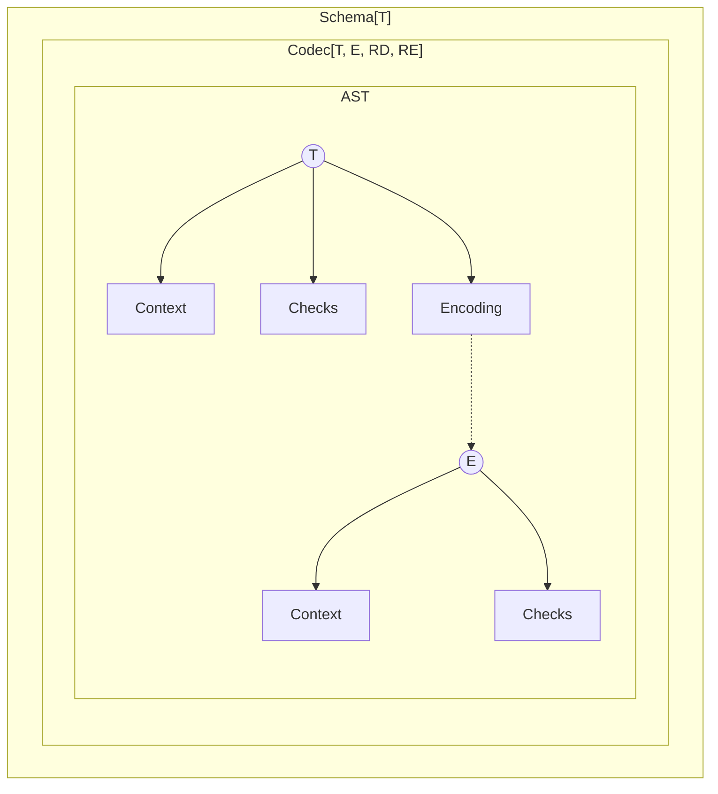
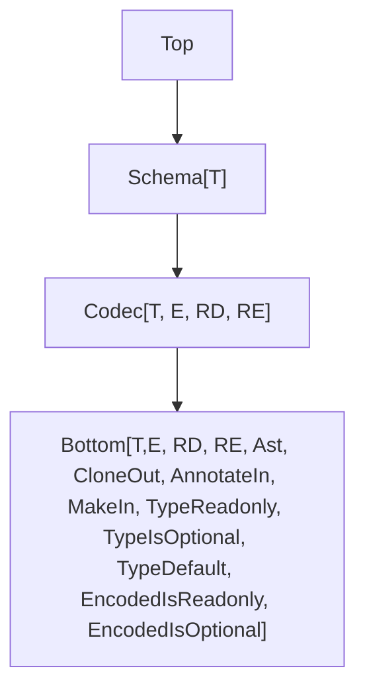

This document outlines upcoming improvements to the `Schema` module in the Effect library.

## Model



## Current Pain Points

These are known limitations and difficulties:

- `partial` only allows toggling all fields at once, which limits flexibility.
- Suspended schemas are awkward to use.
- Performance and bundle size need improvement.
- (optional) Custom error handling is limited ([example](https://discord.com/channels/795981131316985866/1347665724361019433/1347831833282347079)).

## Type Hierarchy



## More Requirement Type Parameters

Requirements are now split into two separate types:

- `RD`: for decoding
- `RE`: for encoding

```ts
interface Codec<T, E, RD, RE> {
  // ...
}
```

This makes it easier to apply requirements only where needed. For instance, encoding requirements can be ignored during decoding:

```ts
import type { Effect } from "effect"
import { Context, Schema } from "effect"

class EncodingService extends Context.Tag<
  EncodingService,
  { encode: Effect.Effect<string> }
>()("EncodingService") {}

declare const field: Schema.Codec<string, string, never, EncodingService>

const schema = Schema.Struct({
  a: field
})

//     ┌─── Effect.Effect<{ readonly a: string; }, Schema.CodecError, never>
//     ▼
const dec = Schema.decodeUnknown(schema)({ a: "a" })

//     ┌─── Effect.Effect<{ readonly a: string; }, Schema.CodecError, EncodingService>
//     ▼
const enc = Schema.encodeUnknown(schema)({ a: "a" })
```

## Default JSON Serialization

The `SchemaSerializer.json` function creates a codec that converts a schema’s encoded type into a JSON-friendly format and back. Given a `schema: Codec<T, E>`:

- `Schema.encodeUnknownSync(schema)` produces a value of type `E`.
- `Schema.encodeUnknownSync(SchemaSerializer.json(schema))` produces a JSON-compatible version of `E`. If `E` already fits JSON types, it is unchanged; otherwise, any `serialization` annotations on `E` are applied.

**Example** (Serializing and Deserializing a Map)

```ts
import { Option, Schema, SchemaSerializer } from "effect"

// Define a schema for a Map from optional symbols to dates
//
//      ┌─── Codec<Map<Option.Option<symbol>, Date>>
//      ▼
const schema = Schema.Map(Schema.Option(Schema.Symbol), Schema.Date)

// Create a JSON serializer for that schema
//
//      ┌─── Codec<Map<Option.Option<symbol>, Date>, unknown>
//      ▼
const serializer = SchemaSerializer.json(Schema.typeCodec(schema))

const data = new Map([[Option.some(Symbol.for("a")), new Date("2021-01-01")]])

// Encode the Map to a JSON-compatible value
//
//      ┌─── unknown
//      ▼
const json = Schema.encodeUnknownSync(serializer)(data)

console.log(json)
// Output: [ [ [ 'a' ], '2021-01-01T00:00:00.000Z' ] ]

// Decode the JSON value back into the original Map
console.log(Schema.decodeUnknownSync(serializer)(json))
/*
Output:
Map(1) {
  { _id: 'Option', _tag: 'Some', value: Symbol(a) } => 2021-01-01T00:00:00.000Z
}
*/
```

### Use Cases

There are two common scenarios for JSON serialization:

1. **Custom JSON Formats** (for REST APIs, file storage, etc.)
2. **Network Transmission** (for RPC or messaging systems)

#### Serializing to a Custom JSON Format

In this scenario, you define how your domain model maps to a specific JSON structure. For example, a `User` type where `name` may be `null` or a `string`, but in your code you prefer an `Option<string>`:

```ts
import { Option, Schema, SchemaTransformation } from "effect"

// The JSON custom format
interface Payload {
  readonly id: number
  readonly name: string | null
}

// The domain model
interface User {
  readonly id: number
  readonly name: Option.Option<string> // must be decoded from string | null
}

// Schema that encodes Option<string> to string | null and back
const User = Schema.Struct({
  id: Schema.Number,
  name: Schema.Option(Schema.String).pipe(
    Schema.encodeTo(
      Schema.NullOr(Schema.String),
      SchemaTransformation.transform({
        decode: Option.fromNullable,
        encode: Option.getOrNull
      })
    )
  )
})

const payload = JSON.parse(`{"id":1,"name":"John"}`)

// Decode JSON into our domain model
console.log(Schema.decodeUnknownSync(User)(payload))
// { id: 1, name: { _id: 'Option', _tag: 'Some', value: 'John' } }

// Encode our domain model back into JSON format
console.log(Schema.encodeUnknownSync(User)({ id: 1, name: Option.none() }))
// { id: 1, name: null }
```

#### Transmitting Data Over the Network

When sending a `User` instance over a network, the exact JSON format usually does not matter. You only need a way to convert the `User` value into something that can be sent and then back again.

You can use `SchemaSerializer.json` to build a codec that handles this conversion between your `User` type and a JSON-friendly format.

In the example below, an `Option` value is converted to an internal tuple format (`[value]` for `Some`, or `[]` for `None`).

**Example** (Serializing and Deserializing a User)

```ts
import {
  Effect,
  Option,
  Schema,
  SchemaSerializer,
  SchemaTransformation
} from "effect"

// The domain model
interface User {
  readonly id: number
  readonly name: Option.Option<string>
}

const User = Schema.Struct({
  id: Schema.Number,
  name: Schema.Option(Schema.String).pipe(
    Schema.encodeTo(
      Schema.NullOr(Schema.String),
      SchemaTransformation.transform({
        decode: Option.fromNullable,
        encode: Option.getOrNull
      })
    )
  )
})

const data = { id: 1, name: Option.some("John") }

const program = Effect.gen(function* () {
  const json = yield* Schema.encode(
    SchemaSerializer.json(Schema.typeCodec(User))
  )(data)
  console.log(json)
  const t = yield* Schema.decode(SchemaSerializer.json(Schema.typeCodec(User)))(
    json
  )
  console.log(t)
})

Effect.runPromise(program)
// { id: 1, name: [ 'John' ] }
// { id: 1, name: { _id: 'Option', _tag: 'Some', value: 'John' } }
```

## Flipping Schemas

Flipping is a transformation that creates a new codec from an existing one by swapping its input and output types.

```ts
import { Schema } from "effect"

// Flips a schema that decodes a string into a number,
// turning it into one that decodes a number into a string
//
// const StringFromFinite: Schema.flip<Schema.decodeTo<Schema.Number, Schema.String, never, never>>
const StringFromFinite = Schema.flip(Schema.FiniteFromString)

// Schema.Codec<string, number, never, never>
const revealed = Schema.revealCodec(StringFromFinite)
```

The original schema can be retrieved from the flipped one using `.schema`

```ts
import { Schema } from "effect"

const StringFromFinite = Schema.flip(Schema.FiniteFromString)

// Schema.decodeTo<Schema.Number, Schema.String, never, never>
StringFromFinite.schema
```

Applying `flip` twice will return a schema with the same shape as the original one:

```ts
import { Schema } from "effect"

// const schema: Schema.decodeTo<Schema.Number, Schema.String, never, never>
const schema = Schema.flip(Schema.flip(Schema.FiniteFromString))
```

All internal operations have been made symmetrical. This made it possible to define `Schema.flip`, and also simplified the implementation of the decoding / encoding engine.

```ts
// Encoding with a schema is equivalent to decoding with its flipped version
encode(schema) = decode(flip(schema))
```

## Constructors Redesign

### Keeping Constructors in Composed Schemas

To support constructors in composed schemas, `makeSync` will be added to the base `Bottom` type.

### Constructor Default Values

A constructor default allows a schema to generate a value when one is not provided.

**Example** (Providing a default number)

```ts
import { Option, Schema } from "effect"

const schema = Schema.Struct({
  a: Schema.Number.pipe(Schema.withConstructorDefault(() => Option.some(-1)))
})

console.log(schema.makeSync({ a: 5 }))
// { a: 5 }

console.log(schema.makeSync({}))
// { a: -1 }
```

The function passed to `withConstructorDefault` will be executed each time a default value is needed.

**Example** (Re-executing the default function)

```ts
import { Option, Schema } from "effect"

const schema = Schema.Struct({
  a: Schema.Date.pipe(
    Schema.withConstructorDefault(() => Option.some(new Date()))
  )
})

console.log(schema.makeSync({}))
// { a: 2025-05-19T16:46:10.912Z }

console.log(schema.makeSync({}))
// { a: 2025-05-19T16:46:10.913Z }
```

If the function returns `Option.none()`, it means no default value was provided, and the field is considered missing.

**Example** (Returning `None` to skip a default)

```ts
import { Option, Schema } from "effect"

const schema = Schema.Struct({
  a: Schema.Date.pipe(
    Schema.withConstructorDefault(() => {
      const d = new Date()
      if (d.getTime() % 2 === 0) {
        // Provide a default value
        return Option.some(d)
      }
      // Skip the default
      return Option.none()
    })
  )
})

try {
  console.log(schema.makeSync({}))
} catch (error) {
  console.error(error)
}
// Error: makeSync failure

try {
  console.log(schema.makeSync({}))
  // { a: 2025-05-19T16:46:10.913Z }
} catch (error) {
  console.error(error)
}
// { a: 2025-05-19T16:48:41.948Z }
```

#### Effectful Defaults

Default values can also be computed using effects, as long as the environment is `never`.

**Example** (Using an effect to provide a default)

```ts
import { Effect, Option, Schema, SchemaResult } from "effect"

const schema = Schema.Struct({
  a: Schema.Number.pipe(
    Schema.withConstructorDefault(() =>
      Effect.gen(function* () {
        yield* Effect.sleep(100)
        return Option.some(-1)
      })
    )
  )
})

SchemaResult.asEffect(schema.make({})).pipe(Effect.runPromise).then(console.log)
// { a: -1 }
```

**Example** (Providing a default from an optional service)

```ts
import { Context, Effect, Option, Schema, SchemaResult } from "effect"

// Define a service that may provide a default value
class ConstructorService extends Context.Tag<
  ConstructorService,
  { defaultValue: Effect.Effect<number> }
>()("ConstructorService") {}

const schema = Schema.Struct({
  a: Schema.Number.pipe(
    Schema.withConstructorDefault(() =>
      Effect.gen(function* () {
        yield* Effect.sleep(100)
        const oservice = yield* Effect.serviceOption(ConstructorService)
        if (Option.isNone(oservice)) {
          return Option.none()
        }
        return Option.some(yield* oservice.value.defaultValue)
      })
    )
  )
})

SchemaResult.asEffect(schema.make({}))
  .pipe(
    Effect.provideService(
      ConstructorService,
      ConstructorService.of({ defaultValue: Effect.succeed(-1) })
    ),
    Effect.runPromise
  )
  .then(console.log, console.error)
// { a: -1 }
```

### Nested Constructor Default Values

Default values can be nested inside composed schemas. In this case, inner defaults are resolved first.

**Example** (Nested default values)

```ts
import { Result, Schema } from "effect"

const schema = Schema.Struct({
  a: Schema.Struct({
    b: Schema.Number.pipe(
      Schema.withConstructorDefault(() => Result.succeedSome(-1))
    )
  }).pipe(Schema.withConstructorDefault(() => Result.succeedSome({})))
})

console.log(schema.makeSync({}))
// { a: { b: -1 } }
console.log(schema.makeSync({ a: {} }))
// { a: { b: -1 } }
```

## Filters Redesign

Filters can be effectful as long as the environment is `never`.

### Return Type Preservation

When using `Schema.check`, the return type of the original schema is preserved. This means any additional metadata or methods remain available after applying filters.

```ts
import { Schema, SchemaCheck } from "effect"

//      ┌─── Schema.String
//      ▼
Schema.String

//      ┌─── Schema.String
//      ▼
const NonEmptyString = Schema.String.pipe(Schema.check(SchemaCheck.nonEmpty))

//      ┌─── Schema.String
//      ▼
const schema = NonEmptyString.annotate({})
```

This helps keep functionality such as `.makeSync` or `.fields` intact, even after filters are applied.

```ts
import { Schema, SchemaCheck } from "effect"

const schema = Schema.Struct({
  name: Schema.String,
  age: Schema.Number
}).pipe(Schema.check(SchemaCheck.makeFilter(() => true)))

// The fields of the original struct are still accessible
//
//      ┌─── { readonly name: Schema.String; readonly age: Schema.Number; }
//      ▼
const fields = schema.fields
```

Refinements are excluded as the type will change:

**Example** (Refining an Option to be Some)

```ts
import { Effect, Option, Schema, SchemaFormatter } from "effect"

const schema = Schema.Option(Schema.String).pipe(
  Schema.refine(Option.isSome, { title: "Some" })
)

Schema.decodeUnknown(schema)(Option.none())
  .pipe(
    Effect.mapError((err) => SchemaFormatter.TreeFormatter.format(err.issue)),
    Effect.runPromise
  )
  .then(console.log, console.error)
/*
Output:
Option<string> & Some
└─ Some
   └─ Expected Option<string> & Some, actual {
  "_id": "Option",
  "_tag": "None"
}
*/
```

### Filters as First-Class

Filters are now standalone values. This allows them to be composed, reused, and applied to any schema that supports the necessary structure.

For example, `minLength` is no longer specific to strings. It can be applied to any schema that defines a `length` property.

**Example** (Validating a trimmed string with minimum length)

```ts
import { Effect, Schema, SchemaCheck, SchemaFormatter } from "effect"

const schema = Schema.String.pipe(
  Schema.check(
    SchemaCheck.minLength(3), // Filter<string>
    SchemaCheck.trimmed // Filter<string>
  )
)

Schema.decodeUnknown(schema)(" a")
  .pipe(
    Effect.mapError((err) => SchemaFormatter.TreeFormatter.format(err.issue)),
    Effect.runPromise
  )
  .then(console.log, console.error)
/*
Output:
string & minLength(3) & trimmed
├─ minLength(3)
│  └─ Invalid value " a"
└─ trimmed
   └─ Invalid value " a"
*/
```

**Example** (Applying `minLength` to a non-string schema)

```ts
import { Effect, Schema, SchemaCheck, SchemaFormatter } from "effect"

const schema = Schema.Struct({ length: Schema.Number }).pipe(
  Schema.check(SchemaCheck.minLength(3))
)

Schema.decodeUnknown(schema)({ length: 2 })
  .pipe(
    Effect.mapError((err) => SchemaFormatter.TreeFormatter.format(err.issue)),
    Effect.runPromise
  )
  .then(console.log, console.error)
/*
Output:
{ readonly "length": number } & minLength(3)
└─ minLength(3)
   └─ Invalid value {"length":2}
*/
```

By default when `{ errors: "all" }` all filters are run even if one fails. This allows Schema to collect multiple issues at once.

**Example** (Collecting multiple issues)

```ts
import { Effect, Schema, SchemaCheck, SchemaFormatter } from "effect"

const schema = Schema.String.pipe(
  Schema.check(SchemaCheck.minLength(3), SchemaCheck.trimmed)
)

Schema.decodeUnknown(schema)(" a", { errors: "all" })
  .pipe(
    Effect.mapError((err) => SchemaFormatter.TreeFormatter.format(err.issue)),
    Effect.runPromise
  )
  .then(console.log, console.error)
/*
Output:
string & minLength(3) & trimmed
├─ minLength(3)
│  └─ Invalid value " a"
└─ trimmed
   └─ Invalid value " a"
*/
```

If you want to stop validation as soon as a filter fails, you can call `.abort()` on a filter.

**Example** (Stop at the first failed filter)

```ts
import { Effect, Schema, SchemaCheck, SchemaFormatter } from "effect"

const schema = Schema.String.pipe(
  Schema.check(
    SchemaCheck.abort(SchemaCheck.minLength(3)), // Stop on failure here
    SchemaCheck.trimmed // This will not run if minLength fails
  )
)

Schema.decodeUnknown(schema)(" a", { errors: "all" })
  .pipe(
    Effect.mapError((err) => SchemaFormatter.TreeFormatter.format(err.issue)),
    Effect.runPromise
  )
  .then(console.log, console.error)
/*
Output:
string & minLength(3) & trimmed
└─ minLength(3)
   └─ Invalid value " a"
*/
```

### Groups

Filters can now be grouped together.

**Example** (Grouping filters)

```ts
import { SchemaCheck } from "effect"

export const int32 = new SchemaCheck.Group(
  [SchemaCheck.int, SchemaCheck.between(-2147483648, 2147483647)],
  {
    title: "int32",
    description: "a 32-bit integer"
  }
)
```

### Filter Factories

A **filter factory** is a function that returns a reusable filter. This pattern is useful when you want to create filters that can be customized at runtime.

You can now create filters like `greaterThan` for any type with an ordering.

**Example** (Deriving a `greaterThan` filter)

```ts
import { Order, SchemaCheck } from "effect"

// Creates a filter factory using an Order instance
// Returns a `SchemaAST.Filter<T>`
export const deriveGreaterThan = <T>(options: {
  readonly order: Order.Order<T>
  readonly annotate?: ((exclusiveMinimum: T) => Annotations) | undefined
  readonly format?: (value: T) => string | undefined
}) => {
  const greaterThan = Order.greaterThan(options.order)
  const format = options.format ?? globalThis.String
  return (exclusiveMinimum: T, annotations?: Annotations) => {
    return SchemaCheck.make<T>(
      (input) => greaterThan(input, exclusiveMinimum),
      {
        title: `greaterThan(${format(exclusiveMinimum)})`,
        description: `a value greater than ${format(exclusiveMinimum)}`,
        ...options.annotate?.(exclusiveMinimum),
        ...annotations
      }
    )
  }
}
```

## Structs

### Optional and Mutable Keys

You can mark struct properties as optional or mutable using `Schema.optionalKey` and `Schema.mutableKey`.

```ts
import { Schema } from "effect"

const schema = Schema.Struct({
  a: Schema.String,
  b: Schema.optionalKey(Schema.String),
  c: Schema.mutableKey(Schema.String),
  d: Schema.optionalKey(Schema.mutableKey(Schema.String))
})

/*
with "exactOptionalPropertyTypes": true

type Type = {
    readonly a: string;
    readonly b?: string;
    c: string;
    d?: string;
}
*/
type Type = (typeof schema)["Type"]
```

### Optional Fields

By combining `Schema.optionalKey` and `Schema.NullOr` you can represent any kind of optional property.

```ts
import { Schema } from "effect"

export const schema = Schema.Struct({
  // Exact Optional Property
  a: Schema.optionalKey(Schema.NumberFromString),
  // Optional Property
  b: Schema.optional(Schema.NumberFromString),
  // Exact Optional Property with Nullability
  c: Schema.optionalKey(Schema.NullOr(Schema.NumberFromString)),
  // Optional Property with Nullability
  d: Schema.optional(Schema.NullOr(Schema.NumberFromString))
})

/*
type Encoded = {
    readonly a?: string;
    readonly b?: string | undefined;
    readonly c?: string | null;
    readonly d?: string | null | undefined;
}
*/
export type Encoded = typeof schema.Encoded

/*
type Type = {
    readonly a?: number;
    readonly b?: number | undefined;
    readonly c?: number | null;
    readonly d?: number | null | undefined;
}
*/
export type Type = typeof schema.Type
```

#### Omitting Values When Transforming Optional Fields

```ts
import { Option, Predicate, Schema, SchemaGetter } from "effect"

export const schema = Schema.Struct({
  a: Schema.optional(Schema.NumberFromString).pipe(
    Schema.decodeTo(Schema.optionalKey(Schema.Number), {
      decode: SchemaGetter.transformOptional(
        Option.filter(Predicate.isNotUndefined) // omit undefined
      ),
      encode: SchemaGetter.passthrough()
    })
  )
})

/*
type Encoded = {
    readonly a?: string | undefined;
}
*/
export type Encoded = typeof schema.Encoded

/*
type Type = {
    readonly a?: number;
}
*/
export type Type = typeof schema.Type
```

#### Representing Optional Fields with never Type

```ts
import { Schema } from "effect"

export const schema = Schema.Struct({
  a: Schema.optionalKey(Schema.Never)
})

/*
type Encoded = {
    readonly a?: never;
}
*/
export type Encoded = typeof schema.Encoded

/*
type Type = {
    readonly a?: never;
}
*/
export type Type = typeof schema.Type
```

### Decoding / Encoding with Default Values

**Example**

```ts
import { Schema, SchemaGetter } from "effect"

const schema = Schema.Struct({
  a: Schema.optional(Schema.FiniteFromString).pipe(
    Schema.decodeTo(Schema.Number, {
      decode: SchemaGetter.withDefault(() => 1),
      encode: SchemaGetter.passthrough()
    })
  )
})

//     ┌─── { readonly a?: string | undefined; }
//     ▼
export type Encoded = typeof schema.Encoded

//     ┌─── { readonly a: number; }
//     ▼
export type Type = typeof schema.Type

// Decoding examples with default applied

console.log(Schema.decodeUnknownSync(schema)({}))
// Output: { a: 1 }

console.log(Schema.decodeUnknownSync(schema)({ a: undefined }))
// Output: { a: 1 }

console.log(Schema.decodeUnknownSync(schema)({ a: "2" }))
// Output: { a: 2 }
```

#### Exact Optional Property with Nullability

```ts
import { Option, Predicate, Schema, SchemaGetter } from "effect"

const schema = Schema.Struct({
  a: Schema.optionalKey(Schema.NullOr(Schema.FiniteFromString)).pipe(
    Schema.decodeTo(Schema.Number, {
      decode: SchemaGetter.transformOptional((oe) =>
        oe.pipe(
          Option.filter(Predicate.isNotNull),
          Option.orElseSome(() => 1)
        )
      ),
      encode: SchemaGetter.passthrough()
    })
  )
})

//     ┌─── { readonly a?: string | null | undefined; }
//     ▼
export type Encoded = typeof schema.Encoded

//     ┌─── { readonly a: number; }
//     ▼
export type Type = typeof schema.Type

console.log(Schema.decodeUnknownSync(schema)({}))
// Output: { a: 1 }

// console.log(Schema.decodeUnknownSync(Product)({ quantity: undefined }))
// throws

console.log(Schema.decodeUnknownSync(schema)({ a: null }))
// Output: { a: 1 }

console.log(Schema.decodeUnknownSync(schema)({ a: "2" }))
// Output: { a: 2 }
```

#### Optional Property with Nullability

```ts
import { Option, Predicate, Schema, SchemaGetter } from "effect"

const schema = Schema.Struct({
  a: Schema.optional(Schema.NullOr(Schema.FiniteFromString)).pipe(
    Schema.decodeTo(Schema.Number, {
      decode: SchemaGetter.transformOptional((oe) =>
        oe.pipe(
          Option.filter(Predicate.isNotNullish),
          Option.orElseSome(() => 1)
        )
      ),
      encode: SchemaGetter.passthrough()
    })
  )
})

//     ┌─── { readonly a?: string | null | undefined; }
//     ▼
export type Encoded = typeof schema.Encoded

//     ┌─── { readonly a: number; }
//     ▼
export type Type = typeof schema.Type

console.log(Schema.decodeUnknownSync(schema)({}))
// Output: { a: 1 }

console.log(Schema.decodeUnknownSync(schema)({ a: undefined }))
// Output: { a: 1 }

console.log(Schema.decodeUnknownSync(schema)({ a: null }))
// Output: { a: 1 }

console.log(Schema.decodeUnknownSync(schema)({ a: "2" }))
// Output: { a: 2 }
```

### Optional Fields as Options

#### Exact Optional Property

```ts
import { Option, Schema, SchemaTransformation } from "effect"

const Product = Schema.Struct({
  quantity: Schema.optionalKey(Schema.NumberFromString).pipe(
    Schema.decodeTo(
      Schema.Option(Schema.Number),
      SchemaTransformation.transformOptional({
        decode: Option.some,
        encode: Option.flatten
      })
    )
  )
})

//     ┌─── { readonly quantity?: string; }
//     ▼
export type Encoded = typeof Product.Encoded

//     ┌─── { readonly quantity: Option<number>; }
//     ▼
export type Type = typeof Product.Type

console.log(Schema.decodeUnknownSync(Product)({}))
// Output: { quantity: { _id: 'Option', _tag: 'None' } }

console.log(Schema.decodeUnknownSync(Product)({ quantity: "2" }))
// Output: { quantity: { _id: 'Option', _tag: 'Some', value: 2 } }

// console.log(Schema.decodeUnknownSync(Product)({ quantity: undefined }))
// throws:

console.log(Schema.encodeSync(Product)({ quantity: Option.some(2) }))
// Output: { quantity: "2" }

console.log(Schema.encodeSync(Product)({ quantity: Option.none() }))
// Output: {}
```

#### Optional Property

```ts
import { Option, Predicate, Schema, SchemaTransformation } from "effect"

const Product = Schema.Struct({
  quantity: Schema.optional(Schema.NumberFromString).pipe(
    Schema.decodeTo(
      Schema.Option(Schema.Number),
      SchemaTransformation.transformOptional({
        decode: (oe) =>
          oe.pipe(Option.filter(Predicate.isNotUndefined), Option.some),
        encode: Option.flatten
      })
    )
  )
})

//     ┌─── { readonly quantity?: string; }
//     ▼
export type Encoded = typeof Product.Encoded

//     ┌─── { readonly quantity: Option<number>; }
//     ▼
export type Type = typeof Product.Type

console.log(Schema.decodeUnknownSync(Product)({}))
// Output: { quantity: { _id: 'Option', _tag: 'None' } }

console.log(Schema.decodeUnknownSync(Product)({ quantity: "2" }))
// Output: { quantity: { _id: 'Option', _tag: 'Some', value: 2 } }

// console.log(Schema.decodeUnknownSync(Product)({ quantity: undefined }))
// throws:

console.log(Schema.encodeSync(Product)({ quantity: Option.some(2) }))
// Output: { quantity: "2" }

console.log(Schema.encodeSync(Product)({ quantity: Option.none() }))
// Output: {}
```

#### Exact Optional Property with Nullability

```ts
import { Option, Predicate, Schema, SchemaTransformation } from "effect"

const Product = Schema.Struct({
  quantity: Schema.optionalKey(Schema.NullOr(Schema.NumberFromString)).pipe(
    Schema.decodeTo(
      Schema.Option(Schema.Number),
      SchemaTransformation.transformOptional({
        decode: (oe) =>
          oe.pipe(Option.filter(Predicate.isNotNull), Option.some),
        encode: Option.flatten
      })
    )
  )
})

//     ┌─── { readonly quantity?: string | null; }
//     ▼
export type Encoded = typeof Product.Encoded

//     ┌─── { readonly quantity: Option<number>; }
//     ▼
export type Type = typeof Product.Type

console.log(Schema.decodeUnknownSync(Product)({}))
// Output: { quantity: { _id: 'Option', _tag: 'None' } }

console.log(Schema.decodeUnknownSync(Product)({ quantity: null }))
// Output: { quantity: { _id: 'Option', _tag: 'None' } }

console.log(Schema.decodeUnknownSync(Product)({ quantity: "2" }))
// Output: { quantity: { _id: 'Option', _tag: 'Some', value: 2 } }

// console.log(Schema.decodeUnknownSync(Product)({ quantity: undefined }))
// throws:
```

#### Optional Property with Nullability

```ts
import { Option, Predicate, Schema, SchemaTransformation } from "effect"

const Product = Schema.Struct({
  quantity: Schema.optional(Schema.NullOr(Schema.NumberFromString)).pipe(
    Schema.decodeTo(
      Schema.Option(Schema.Number),
      SchemaTransformation.transformOptional({
        decode: (oe) =>
          oe.pipe(Option.filter(Predicate.isNotNullish), Option.some),
        encode: Option.flatten
      })
    )
  )
})

//     ┌─── { readonly quantity?: string | null | undefined; }
//     ▼
export type Encoded = typeof Product.Encoded

//     ┌─── { readonly quantity: Option<number>; }
//     ▼
export type Type = typeof Product.Type

console.log(Schema.decodeUnknownSync(Product)({}))
// Output: { quantity: { _id: 'Option', _tag: 'None' } }

console.log(Schema.decodeUnknownSync(Product)({ quantity: undefined }))
// Output: { quantity: { _id: 'Option', _tag: 'None' } }

console.log(Schema.decodeUnknownSync(Product)({ quantity: null }))
// Output: { quantity: { _id: 'Option', _tag: 'None' } }

console.log(Schema.decodeUnknownSync(Product)({ quantity: "2" }))
// Output: { quantity: { _id: 'Option', _tag: 'Some', value: 2 }
```

### Key Transformations

`Schema.ReadonlyRecord` now supports key transformations.

**Example**

```ts
import { Schema, SchemaTransformation } from "effect"

const SnakeToCamel = Schema.String.pipe(
  Schema.decodeTo(Schema.String, SchemaTransformation.snakeToCamel)
)

const schema = Schema.ReadonlyRecord(SnakeToCamel, Schema.Number)

console.log(Schema.decodeUnknownSync(schema)({ a_b: 1, c_d: 2 }))
// { aB: 1, cD: 2 }
```

By default duplicate keys are merged with the last value.

**Example** (Merging duplicate keys)

```ts
import { Schema, SchemaTransformation } from "effect"

const SnakeToCamel = Schema.String.pipe(
  Schema.decodeTo(Schema.String, SchemaTransformation.snakeToCamel)
)

const schema = Schema.ReadonlyRecord(SnakeToCamel, Schema.Number)

console.log(Schema.decodeUnknownSync(schema)({ a_b: 1, aB: 2 }))
// { aB: 2 }
```

You can also customize how duplicate keys are merged.

**Example** (Customizing key merging)

```ts
import { Schema, SchemaTransformation } from "effect"

const SnakeToCamel = Schema.String.pipe(
  Schema.decodeTo(Schema.String, SchemaTransformation.snakeToCamel)
)

const schema = Schema.ReadonlyRecord(SnakeToCamel, Schema.Number, {
  key: {
    decode: {
      combine: ([_, v1], [k2, v2]) => [k2, v1 + v2] // you can pass a Semigroup to combine keys
    },
    encode: {
      combine: ([_, v1], [k2, v2]) => [k2, v1 + v2]
    }
  }
})

console.log(Schema.decodeUnknownSync(schema)({ a_b: 1, aB: 2 }))
// { aB: 3 }

console.log(Schema.encodeUnknownSync(schema)({ a_b: 1, aB: 2 }))
// { a_b: 3 }
```

## Opaque Structs and Classes

### Opaque Structs

**Use Case**: When you are fine with a struct but you want an opaque type for its `Type`.

Opaque structs wrap an existing struct in a new class type. They preserve the schema's shape but hide implementation details.
Instance methods or custom constructors **are not allowed** on opaque structs.

**Open Problems**:

- instance methods are not supported but this is not enforced (eslint rule?)

**Example** (Creating an Opaque Struct)

```ts
import { Schema } from "effect"

class Person extends Schema.Opaque<Person>()(
  Schema.Struct({
    name: Schema.String
  })
) {}

//      ┌─── Codec<Person, { readonly name: string; }, never, never>
//      ▼
const codec = Schema.revealCodec(Person)

// const x: Person
const person = Person.makeSync({ name: "John" })

console.log(person.name)
// "John"

// The class itself holds the original schema and its metadata
console.log(Person)
// -> [Function: Person] Struct$

// { readonly name: Schema.String }
Person.fields

/*
const another: Schema.Struct<{
    readonly name: typeof Person;
}>
*/
const another = Schema.Struct({ name: Person }) // You can use the opaque type inside other schemas

/*
type Type = {
    readonly name: Person;
}
*/
type Type = (typeof another)["Type"]
```

Opaque structs can be used just like regular structs, with no other changes needed.

**Example** (Retrieving Schema Fields)

```ts
import { Schema } from "effect"

// A function that takes a generic struct
const getFields = <Fields extends Schema.Struct.Fields>(
  struct: Schema.Struct<Fields>
) => struct.fields

class Person extends Schema.Opaque<Person>()(
  Schema.Struct({
    name: Schema.String
  })
) {}

/*
const fields: {
    readonly name: Schema.String;
}
*/
const fields = getFields(Person)
```

#### Static methods

You can add static members to an opaque struct class to extend its behavior.

**Example** (Custom serializer via static method)

```ts
import { Schema, SchemaSerializer } from "effect"

class Person extends Schema.Opaque<Person>()(
  Schema.Struct({
    name: Schema.String,
    createdAt: Schema.Date
  })
) {
  // Create a custom serializer using the class itself
  static readonly serializer = SchemaSerializer.json(this)
}

console.log(
  Schema.encodeUnknownSync(Person)({
    name: "John",
    createdAt: new Date()
  })
)
// { name: 'John', createdAt: 2025-05-02T13:49:29.926Z }

console.log(
  Schema.encodeUnknownSync(Person.serializer)({
    name: "John",
    createdAt: new Date()
  })
)
// { name: 'John', createdAt: '2025-05-02T13:49:29.928Z' }
```

#### Annotations and filters

You can attach filters and annotations to the struct passed into `Opaque`.

**Example** (Applying a filter and title annotation)

```ts
import { Effect, Schema, SchemaCheck, SchemaFormatter } from "effect"

class Person extends Schema.Opaque<Person>()(
  Schema.Struct({
    name: Schema.String
  })
    .pipe(Schema.check(SchemaCheck.makeFilter(({ name }) => name.length > 0)))
    .annotate({ title: "Person" })
) {}

Schema.decodeUnknown(Person)({ name: "" })
  .pipe(
    Effect.mapError((err) => SchemaFormatter.TreeFormatter.format(err.issue)),
    Effect.runPromise
  )
  .then(console.log, console.error)
/*
Person & <filter>
└─ <filter>
   └─ Invalid value {"name":""}
*/
```

When you call methods like `annotate` on an opaque struct class, you get back the original struct, not a new class.

```ts
import { Schema } from "effect"

class Person extends Schema.Opaque<Person>()(
  Schema.Struct({
    name: Schema.String
  })
) {}

/*
const S: Schema.Struct<{
    readonly name: Schema.String;
}>
*/
const S = Person.annotate({ title: "Person" }) // `annotate` returns the wrapped struct type
```

#### Recursive Opaque Structs

```ts
import { Schema } from "effect"

interface CategoryEncoded extends Schema.Codec.Encoded<typeof Category> {}

export class Category extends Schema.Opaque<Category>()(
  Schema.Struct({
    name: Schema.String,
    children: Schema.ReadonlyArray(
      Schema.suspend((): Schema.Codec<Category, CategoryEncoded> => Category)
    )
  })
) {}
```

### Existing Classes

#### Validating the Constructor

**Use Case**: When you want to validate the constructor arguments of an existing class.

**Example** (Using a tuple to validate the constructor arguments)

```ts
import { Schema, SchemaFormatter, SchemaIssue } from "effect"

const PersonConstructorArguments = Schema.ReadonlyTuple([
  Schema.String,
  Schema.Finite
])

// Existing class
class Person {
  constructor(
    readonly name: string,
    readonly age: number
  ) {
    PersonConstructorArguments.makeSync([name, age])
  }
}

try {
  new Person("John", NaN)
} catch (error) {
  if (error instanceof Error) {
    if (SchemaIssue.isIssue(error.cause)) {
      console.error(SchemaFormatter.TreeFormatter.format(error.cause))
    } else {
      console.error(error)
    }
  }
}
/*
readonly [string, number & finite]
└─ [1]
   └─ number & finite
      └─ finite
         └─ Invalid value NaN
*/
```

**Example** (Inheritance)

```ts
import { Schema } from "effect"

const PersonConstructorArguments = Schema.ReadonlyTuple([
  Schema.String,
  Schema.Finite
])

class Person {
  constructor(
    readonly name: string,
    readonly age: number
  ) {
    PersonConstructorArguments.makeSync([name, age])
  }
}

const PersonWithEmailConstructorArguments = Schema.ReadonlyTuple([
  Schema.String
])

class PersonWithEmail extends Person {
  constructor(
    name: string,
    age: number,
    readonly email: string
  ) {
    // Only validate the additional argument
    PersonWithEmailConstructorArguments.makeSync([email])
    super(name, age)
  }
}
```

#### Defining a Schema

```ts
import { Schema, SchemaTransformation } from "effect"

class Person {
  constructor(
    readonly name: string,
    readonly age: number
  ) {}
}

const PersonSchema = Schema.instanceOf({
  constructor: Person,
  annotations: {
    title: "Person",
    // optional: default JSON serialization
    defaultJsonSerializer: () =>
      Schema.link<Person>()(
        Schema.ReadonlyTuple([Schema.String, Schema.Number]),
        SchemaTransformation.transform({
          decode: (args) => new Person(...args),
          encode: (instance) => [instance.name, instance.age] as const
        })
      )
  }
})
  // optional: explicit encoding
  .pipe(
    Schema.encodeTo(
      Schema.Struct({
        name: Schema.String,
        age: Schema.Number
      }),
      SchemaTransformation.transform({
        decode: (args) => new Person(args.name, args.age),
        encode: (instance) => instance
      })
    )
  )
```

**Example** (Inheritance)

```ts
import { Schema, SchemaTransformation } from "effect"

class Person {
  constructor(
    readonly name: string,
    readonly age: number
  ) {}
}

const PersonSchema = Schema.instanceOf({
  constructor: Person,
  annotations: {
    title: "Person",
    // optional: default JSON serialization
    defaultJsonSerializer: () =>
      Schema.link<Person>()(
        Schema.ReadonlyTuple([Schema.String, Schema.Number]),
        SchemaTransformation.transform({
          decode: (args) => new Person(...args),
          encode: (instance) => [instance.name, instance.age] as const
        })
      )
  }
})
  // optional: explicit encoding
  .pipe(
    Schema.encodeTo(
      Schema.Struct({
        name: Schema.String,
        age: Schema.Number
      }),
      SchemaTransformation.transform({
        decode: (args) => new Person(args.name, args.age),
        encode: (instance) => instance
      })
    )
  )

class PersonWithEmail extends Person {
  constructor(
    name: string,
    age: number,
    readonly email: string
  ) {
    super(name, age)
  }
}

// const PersonWithEmailSchema = ...repeat the pattern above...
```

#### Errors

**Example** (Extending Data.Error)

```ts
import { Data, Effect, identity, Schema, SchemaTransformation } from "effect"

const Props = Schema.Struct({
  message: Schema.String
})

class Err extends Data.Error<typeof Props.Type> {
  constructor(props: typeof Props.Type) {
    super(Props.makeSync(props))
  }
}

const program = Effect.gen(function* () {
  yield* new Err({ message: "Uh oh" })
})

Effect.runPromiseExit(program).then((exit) =>
  console.log(JSON.stringify(exit, null, 2))
)
/*
{
  "_id": "Exit",
  "_tag": "Failure",
  "cause": {
    "_id": "Cause",
    "failures": [
      {
        "_tag": "Fail",
        "error": {
          "message": "Uh oh"
        }
      }
    ]
  }
}
*/

const transformation = SchemaTransformation.transform<
  Err,
  (typeof Props)["Type"]
>((props) => new Err(props), identity)

const schema = Schema.instanceOf({
  constructor: Err,
  annotations: {
    title: "Err",
    serialization: {
      json: () => Schema.link<Err>()(Props, transformation)
    }
  }
}).pipe(Schema.encodeTo(Props, transformation))

// built-in helper?
const builtIn = Schema.getClassSchema(Err, { encoding: Props })
```

### Class

**Open Problems**:

- `class D extends A {}` in the example is not supported but this is not enforced (eslint rule?)

**Example**

```ts
import { Schema } from "effect"

class A extends Schema.Class<A>("A")({
  a: Schema.String
}) {
  readonly _a = 1
}

console.log(new A({ a: "a" }))
// A { a: 'a', _a: 1 }
console.log(A.makeSync({ a: "a" }))
// A { a: 'a', _a: 1 }
console.log(Schema.decodeUnknownSync(A)({ a: "a" }))
// A { a: 'a', _a: 1 }

// @ts-expect-error
export class B extends Schema.Class<B>("B")(A) {}

// ok
class C extends Schema.Class<C>("C")(A.fields) {}

console.log(new C({ a: "a" }))
// C { a: 'a' }
console.log(C.makeSync({ a: "a" }))
// C { a: 'a' }
console.log(Schema.decodeUnknownSync(C)({ a: "a" }))
// C { a: 'a' }
```

#### Branded Classes

You can optionally add a brand to a class to prevent accidental mixing of different types.

```ts
import { Schema } from "effect"

class A extends Schema.Class<A, { readonly brand: unique symbol }>("A")({
  a: Schema.String
}) {}

class B extends Schema.Class<B, { readonly brand: unique symbol }>("B")({
  a: Schema.String
}) {}

// @ts-expect-error
export const a: A = B.makeSync({ a: "a" })
// @ts-expect-error
export const b: B = A.makeSync({ a: "a" })
```

or using the `Brand` module:

```ts
import type { Brand } from "effect"
import { Schema } from "effect"

class A extends Schema.Class<A, Brand.Brand<"A">>("A")({
  a: Schema.String
}) {}

class B extends Schema.Class<B, Brand.Brand<"B">>("B")({
  a: Schema.String
}) {}

// @ts-expect-error
export const a: A = B.makeSync({ a: "a" })
// @ts-expect-error
export const b: B = A.makeSync({ a: "a" })
```

#### Filters

```ts
import { Schema, SchemaCheck, SchemaFormatter, SchemaIssue } from "effect"

class A extends Schema.Class<A>("A")({
  a: Schema.String.pipe(Schema.check(SchemaCheck.nonEmpty))
}) {}

try {
  new A({ a: "" })
} catch (error) {
  if (error instanceof Error) {
    if (SchemaIssue.isIssue(error.cause)) {
      console.error(SchemaFormatter.TreeFormatter.format(error.cause))
    } else {
      console.error(error)
    }
  }
}
/*
{ readonly "a": string & minLength(1) }
└─ ["a"]
   └─ string & minLength(1)
      └─ minLength(1)
         └─ Invalid value ""
*/
```

#### Annotations

```ts
import { Schema, SchemaFormatter, SchemaIssue } from "effect"

export class A extends Schema.Class<A>("A")(
  {
    a: Schema.String
  },
  {
    title: "A"
  }
) {}

try {
  Schema.decodeUnknownSync(A)({ a: null })
} catch (error) {
  if (SchemaIssue.isIssue(error)) {
    console.error(SchemaFormatter.TreeFormatter.format(error))
  } else {
    console.error(error)
  }
}
/*
A <-> { readonly "a": string }
└─ { readonly "a": string }
   └─ ["a"]
      └─ Expected string, actual null
*/
```

#### extend

```ts
import { Schema } from "effect"

class A extends Schema.Class<A>("A")(
  Schema.Struct({
    a: Schema.String
  })
) {
  readonly _a = 1
}
class B extends A.extend<B>("B")({
  b: Schema.Number
}) {
  readonly _b = 2
}

console.log(new B({ a: "a", b: 2 }))
// B { a: 'a', _a: 1, _b: 2 }
console.log(B.makeSync({ a: "a", b: 2 }))
// B { a: 'a', _a: 1, _b: 2 }
console.log(Schema.decodeUnknownSync(B)({ a: "a", b: 2 }))
// B { a: 'a', _a: 1, _b: 2 }
```

### ErrorClass

```ts
import { Schema } from "effect"

class E extends Schema.ErrorClass<E>("E")({
  id: Schema.Number
}) {}
```

### RequestClass

```ts
import { Schema } from "effect"

class A extends Schema.RequestClass<A>("A")({
  payload: Schema.Struct({
    a: Schema.String
  }),
  success: Schema.String,
  error: Schema.Number
}) {}
```

## Unions

By default, unions are inclusive, meaning that the union matches if any member matches.

Members are checked in order, and the first match is returned.

### Exclusive Unions

You can create an exclusive union, where the union matches if exactly one member matches, by passing the `{ mode: "oneOf" }` option.

**Example** (Exclusive Union)

```ts
import { Effect, Schema, SchemaFormatter } from "effect"

const schema = Schema.Union(
  [Schema.Struct({ a: Schema.String }), Schema.Struct({ b: Schema.Number })],
  { mode: "oneOf" }
)

Schema.decodeUnknown(schema)({ a: "a", b: 1 })
  .pipe(
    Effect.mapError((err) => SchemaFormatter.TreeFormatter.format(err.issue)),
    Effect.runPromise
  )
  .then(console.log, console.error)
/*
Output:
Expected exactly one successful result for { readonly "a": string } ⊻ { readonly "b": number }, actual {"a":"a","b":1}
*/
```

## Transformations Redesign

### Transformations as First-Class

Transformations are now treated as first-class values, rather than being tied to specific codec combinations as in v3.

For example, `trim` is no longer just a codec combinator. It is now a standalone transformation that can be used with any codec that supports it—in this case, any codec working with strings.

**Example** (Using a transformation with debug logging)

```ts
import { Option, Schema, SchemaTransformation } from "effect"

// Wrap the trim transformation with debug logging
const trim = SchemaTransformation.tap(SchemaTransformation.trim, {
  onDecode: (o) => {
    if (Option.isSome(o)) {
      console.log(`about to trim "${o.value}"`)
    }
  }
})

// Decode a string, trim it, then parse it into a number
const schema = Schema.String.pipe(Schema.decodeTo(Schema.String, trim))

console.log(Schema.decodeUnknownSync(schema)("  123"))
/*
about to trim "  123"
123
*/
```

### Composition

#### compose

The `compose` transformation lets you convert from one schema to another when the encoded output of the target schema matches the type of the source schema.

**Example** (Composing schemas where `To.Encoded = From.Type`)

```ts
import { Schema, SchemaGetter, SchemaTransformation } from "effect"

const FiniteFromString = Schema.String.pipe(
  Schema.decodeTo(Schema.Finite, {
    decode: SchemaGetter.Number,
    encode: SchemaGetter.String
  })
)

const From = Schema.Struct({
  a: Schema.String,
  b: Schema.String
})

const To = Schema.Struct({
  a: FiniteFromString,
  b: FiniteFromString
})

// To.Encoded (string) = From.Type (string)
const schema = From.pipe(
  Schema.decodeTo(To, SchemaTransformation.compose({ strict: false }))
)
```

#### composeSupertype

Use `composeSupertype` when your source type extends the encoded output of your target schema.

**Example** (Composing schemas where `From.Type extends To.Encoded`)

```ts
import { Schema, SchemaGetter, SchemaTransformation } from "effect"

const FiniteFromString = Schema.String.pipe(
  Schema.decodeTo(Schema.Finite, {
    decode: SchemaGetter.Number,
    encode: SchemaGetter.String
  })
)

const From = FiniteFromString

const To = Schema.UndefinedOr(Schema.Number)

// From.Type (number) extends To.Encoded (number | undefined)
const schema = From.pipe(
  Schema.decodeTo(To, SchemaTransformation.composeSupertype())
)
```

#### composeSubtype

Use `composeSubtype` when the encoded output of your target schema extends the type of your source schema.

**Example** (Composing schemas where `From.Encoded extends To.Type`)

```ts
import { Schema, SchemaGetter, SchemaTransformation } from "effect"

const FiniteFromString = Schema.String.pipe(
  Schema.decodeTo(Schema.Finite, {
    decode: SchemaGetter.Number,
    encode: SchemaGetter.String
  })
)

const From = Schema.UndefinedOr(Schema.String)

const To = FiniteFromString

// To.Encoded (string) extends From.Type (string | undefined)
const schema = From.pipe(
  Schema.decodeTo(To, SchemaTransformation.composeSubtype())
)
```

#### Turning off strict mode

To turn off strict mode, pass `{ strict: false }` to `compose`

```ts
import { Schema, SchemaTransformation } from "effect"

const From = Schema.String

const To = Schema.Number

const schema = From.pipe(
  Schema.decodeTo(To, SchemaTransformation.compose({ strict: false }))
)
```

### Parse JSON

## Generics Improvements

Using generics in schema composition and filters can be difficult.

The plan is to make generics **covariant** and easier to use.

**Before (v3)**

```ts
declare const minLength: <S extends Schema.Any>(
  minLength: number,
  annotations?: Annotations.Filter<Schema.Type<S>>
) => <A extends string>(
  self: S & Schema<A, Schema.Encoded<S>, Schema.Context<S>>
) => filter<S>
```

**After (v4)**

```ts
import type { Schema } from "effect"

declare const minLength: <T extends string>(
  minLength: number,
  annotations?: Schema.Annotations.Annotations<T>
) => <S extends Schema.Schema<T>>(self: S) => S
```

## Middlewares

Middlewares are a new feature that allows you to modify the behavior of schemas.

They are similar to transformations, but they are able to catch errors and modify the schema contexts.

### Fallbacks

```ts
import { Effect, Option, Result, Schema, SchemaFormatter } from "effect"

const fallback = Result.ok(Option.some("b"))
const schema = Schema.String.pipe(Schema.catchDecoding(() => fallback))

Schema.decodeUnknown(schema)(null)
  .pipe(
    Effect.mapError((err) => SchemaFormatter.TreeFormatter.format(err.issue)),
    Effect.runPromise
  )
  .then(console.log, console.error)
/*
Output:
b
*/
```

### Providing a Service

```ts
import { Context, Effect, Option, Schema, SchemaFormatter } from "effect"

class Service extends Context.Tag<
  Service,
  { fallback: Effect.Effect<string> }
>()("Service") {}

//      ┌─── Codec<string, string, Service, never>
//      ▼
const schema = Schema.String.pipe(
  Schema.catchDecodingWithContext(() =>
    Effect.gen(function* () {
      const service = yield* Service
      return Option.some(yield* service.fallback)
    })
  )
)

//      ┌─── Codec<string, string, never, never>
//      ▼
const provided = schema.pipe(
  Schema.decodingMiddleware((sr) =>
    Effect.isEffect(sr)
      ? Effect.provideService(sr, Service, { fallback: Effect.succeed("b") })
      : sr
  )
)

Schema.decodeUnknown(provided)(null)
  .pipe(
    Effect.mapError((err) => SchemaFormatter.TreeFormatter.format(err.issue)),
    Effect.runPromise
  )
  .then(console.log, console.error)
/*
Output:
b
*/
```

## Formatters

### TreeFormatter

```ts
import { Effect, Schema, SchemaCheck, SchemaFormatter } from "effect"

const schema = Schema.Struct({
  a: Schema.String.pipe(Schema.check(SchemaCheck.nonEmpty)),
  b: Schema.Number
})

Schema.decodeUnknown(schema)({ a: "", b: null }, { errors: "all" })
  .pipe(
    Effect.mapError((err) => SchemaFormatter.TreeFormatter.format(err.issue)),
    Effect.runPromise
  )
  .then(console.log, console.error)
/*
Output:
{ readonly "a": string & minLength(1); readonly "b": number }
├─ ["a"]
│  └─ string & minLength(1)
│     └─ minLength(1)
│        └─ Invalid data ""
└─ ["b"]
   └─ Expected number, actual null
*/
```

### StructuredFormatter

```ts
import { Effect, Schema, SchemaCheck, SchemaFormatter } from "effect"

const schema = Schema.Struct({
  a: Schema.String.pipe(Schema.check(SchemaCheck.nonEmpty)),
  b: Schema.Number
})

Schema.decodeUnknown(schema)({ a: "", b: null }, { errors: "all" })
  .pipe(
    Effect.mapError((err) =>
      SchemaFormatter.StructuredFormatter.format(err.issue)
    ),
    Effect.runPromise
  )
  .then(console.log, console.error)
/*
Output:
[
  {
    _tag: 'InvalidData',
    ast: StringKeyword {
      annotations: undefined,
      checks: [Array],
      encoding: undefined,
      context: undefined,
      _tag: 'StringKeyword'
    },
    actual: { _id: 'Option', _tag: 'Some', value: '' },
    path: [ 'a' ],
    meta: { id: 'minLength', minLength: 1 },
    abort: false
  },
  {
    _tag: 'InvalidType',
    ast: NumberKeyword {
      annotations: undefined,
      checks: undefined,
      encoding: undefined,
      context: undefined,
      _tag: 'NumberKeyword'
    },
    actual: { _id: 'Option', _tag: 'Some', value: null },
    path: [ 'b' ],
    meta: undefined
  }
]
*/
```

## Primitives

```ts
import { Schema } from "effect"

// primitive types
Schema.String
Schema.Number
Schema.BigInt
Schema.Boolean
Schema.Symbol
Schema.Undefined
Schema.Null
```

To coerce input data to the appropriate type:

```ts
import { Schema, SchemaParser, SchemaTransformation } from "effect"

//      ┌─── Codec<string, unknown>
//      ▼
const schema = Schema.Unknown.pipe(
  Schema.decodeTo(Schema.String, SchemaTransformation.String)
)

const parse = SchemaParser.decodeUnknownSync(schema)

console.log(parse("tuna")) // => "tuna"
console.log(parse(42)) // => "42"
console.log(parse(true)) // => "true"
console.log(parse(null)) // => "null"
```

## Literals

Literal types:

```ts
import { Schema } from "effect"

const tuna = Schema.Literal("tuna")
const twelve = Schema.Literal(12)
const twobig = Schema.Literal(2n)
const tru = Schema.Literal(true)
```

Symbol literals:

```ts
import { Schema } from "effect"

const terrific = Schema.UniqueSymbol(Symbol("terrific"))
```

`null`, `undefined`, and `void`:

```ts
import { Schema } from "effect"

Schema.Null
Schema.Undefined
Schema.Void
```

To allow multiple literal values:

```ts
import { Schema } from "effect"

const schema = Schema.Literals(["red", "green", "blue"])
```

To extract the set of allowed values from a literal schema:

```ts
import { Schema } from "effect"

const schema = Schema.Literals(["red", "green", "blue"])

schema.literals
```

## Strings

```ts
import { Schema, SchemaCheck } from "effect"

Schema.String.pipe(Schema.check(SchemaCheck.maxLength(5)))
Schema.String.pipe(Schema.check(SchemaCheck.minLength(5)))
Schema.String.pipe(Schema.check(SchemaCheck.length(5)))
Schema.String.pipe(Schema.check(SchemaCheck.regex(/^[a-z]+$/)))
Schema.String.pipe(Schema.check(SchemaCheck.startsWith("aaa")))
Schema.String.pipe(Schema.check(SchemaCheck.endsWith("zzz")))
Schema.String.pipe(Schema.check(SchemaCheck.includes("---")))
Schema.String.pipe(Schema.check(SchemaCheck.uppercased))
Schema.String.pipe(Schema.check(SchemaCheck.lowercased))
```

To perform some simple string transforms:

```ts
import { Schema, SchemaTransformation } from "effect"

Schema.String.pipe(Schema.decodeTo(Schema.String, SchemaTransformation.trim))
Schema.String.pipe(
  Schema.decodeTo(Schema.String, SchemaTransformation.toLowerCase)
)
Schema.String.pipe(
  Schema.decodeTo(Schema.String, SchemaTransformation.toUpperCase)
)
```

## String formats

```ts
import { Schema, SchemaCheck } from "effect"

Schema.String.pipe(Schema.check(SchemaCheck.uuid()))
Schema.String.pipe(Schema.check(SchemaCheck.base64))
Schema.String.pipe(Schema.check(SchemaCheck.base64url))
```

## Numbers

```ts
import { Schema } from "effect"

Schema.Number // all numbers
Schema.Finite // finite numbers (i.e. not +/-Infinity or NaN)
```

number-specific validations

```ts
import { Schema, SchemaCheck } from "effect"

Schema.Number.pipe(Schema.check(SchemaCheck.between(5, 10)))
Schema.Number.pipe(Schema.check(SchemaCheck.greaterThan(5)))
Schema.Number.pipe(Schema.check(SchemaCheck.greaterThanOrEqualTo(5)))
Schema.Number.pipe(Schema.check(SchemaCheck.lessThan(5)))
Schema.Number.pipe(Schema.check(SchemaCheck.lessThanOrEqualTo(5)))
Schema.Number.pipe(Schema.check(SchemaCheck.positive))
Schema.Number.pipe(Schema.check(SchemaCheck.nonNegative))
Schema.Number.pipe(Schema.check(SchemaCheck.negative))
Schema.Number.pipe(Schema.check(SchemaCheck.nonPositive))
Schema.Number.pipe(Schema.check(SchemaCheck.multipleOf(5)))
```

## Integers

```ts
import { Schema, SchemaCheck } from "effect"

Schema.Number.pipe(Schema.check(SchemaCheck.int))
Schema.Number.pipe(Schema.check(SchemaCheck.int32))
```

## BigInts

```ts
import { BigInt, Order, Schema, SchemaCheck } from "effect"

const options = { order: Order.bigint }

const between = SchemaCheck.deriveBetween(options)
const greaterThan = SchemaCheck.deriveGreaterThan(options)
const greaterThanOrEqualTo = SchemaCheck.deriveGreaterThanOrEqualTo(options)
const lessThan = SchemaCheck.deriveLessThan(options)
const lessThanOrEqualTo = SchemaCheck.deriveLessThanOrEqualTo(options)
const multipleOf = SchemaCheck.deriveMultipleOf({
  remainder: BigInt.remainder,
  zero: 0n
})

const positive = greaterThan(0n)
const nonNegative = greaterThanOrEqualTo(0n)
const negative = lessThan(0n)
const nonPositive = lessThanOrEqualTo(0n)

Schema.BigInt.pipe(Schema.check(between(5n, 10n)))
Schema.BigInt.pipe(Schema.check(greaterThan(5n)))
Schema.BigInt.pipe(Schema.check(greaterThanOrEqualTo(5n)))
Schema.BigInt.pipe(Schema.check(lessThan(5n)))
Schema.BigInt.pipe(Schema.check(lessThanOrEqualTo(5n)))
Schema.BigInt.pipe(Schema.check(multipleOf(5n)))
Schema.BigInt.pipe(Schema.check(positive))
Schema.BigInt.pipe(Schema.check(nonNegative))
Schema.BigInt.pipe(Schema.check(negative))
Schema.BigInt.pipe(Schema.check(nonPositive))
```

## Dates

```ts
import { Schema, SchemaGetter } from "effect"

Schema.Date

const DateFromString = Schema.Date.pipe(
  Schema.encodeTo(Schema.String, {
    decode: SchemaGetter.Date,
    encode: SchemaGetter.String
  })
)
```

## RWC References

- https://github.com/Anastasia-Labs/lucid-evolution/blob/5068114c9f8f95c6b997d0d2233a9e9543632f35/packages/experimental/src/TSchema.ts#L353

## Snippets

### Memoization

```ts
function memoizeIdempotent(f: (ast: AST) => AST): (ast: AST) => AST {
  const cache = new WeakMap<AST, AST>()
  return (ast) => {
    if (cache.has(ast)) {
      return cache.get(ast)!
    }
    const result = f(ast)
    cache.set(ast, result)
    cache.set(result, result)
    return result
  }
}

function memoizeInvolution(f: (ast: AST) => AST): (ast: AST) => AST {
  const cache = new WeakMap<AST, AST>()
  return (ast) => {
    if (cache.has(ast)) {
      return cache.get(ast)!
    }
    const result = f(ast)
    cache.set(ast, result)
    cache.set(result, ast)
    return result
  }
}
```
