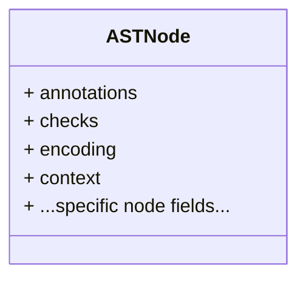
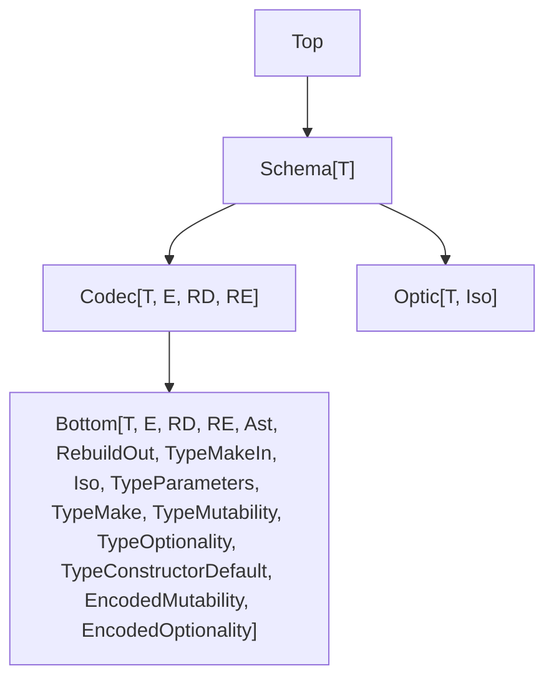

This document outlines upcoming improvements to the `Schema` module in the Effect library.

## Introduction

Since the release of version 3, we've quietly gathered all user feedback, especially around pain points.
Version 4 is focused on addressing those issues and, hopefully, alleviating most of them.

Some improvements have already been introduced in v3, but others require breaking changes. We've been waiting for the right moment, and the new version of Effect is the opportunity we were all waiting for.

We're aiming to design APIs that strike a balance: preserving names and behavior from v3 where possible, while also aligning with the design of other validation libraries (especially zod v4), so that users coming from those tools find Schema familiar and approachable.

An important note about the breaking changes in version 4 is our strong focus on **bundle size**. To avoid bloat, we're designing new ways of doing things that, in some cases, require a bit more work from users but result in a slimmer bundle.

In general, Schema v4 requires more explicit decisions from the user about which features to use. This is especially important to make Schema usable even in contexts where bundle size is critical, without giving up the features that make Effect great.

Ultimately, the intent is to eliminate the need for two separate paths like in version 3 (Effect as the full-featured version and Micro for more constrained use cases).

## Summary

### 1. Design Goals

- **Smaller bundles & opt‑in features** – defaults like issue formatting moved out of the core; you explicitly import what you use.
- **Keep v3 names when possible** while borrowing ergonomics from Zod v4, so migrating users feel at home.

### 2. Core Type Model

- `Bottom<…>` now tracks **14 type parameters** giving fine‑grained control over mutability, optionality, defaults, encoded/decoded shapes, etc.
- Separate requirement type params **`RD` / `RE`** let decoding and encoding depend on different service environments.

### 3. Encoding / Decoding

- **Default JSON codec generator**: `Serializer.json(schema)` does round‑trip‑safe network serialization (Maps → pairs, Options → arrays, Dates → ISO strings, etc.).
- **Explicit helpers**: `Schema.UnknownFromJsonString`, `Schema.fromJsonString`.

### 4. Schema Algebra Goodies

- `Schema.flip` ‑ swap input/output types (encode ≙ decode of the flipped schema).
- **Redesigned constructors** (`makeUnsafe`) everywhere, including unions, with smart handling of brands / refinements / defaults (sync or effectful).
- **Optional & mutable keys** via `Schema.optionalKey` / `Schema.mutableKey`; nested default‑value resolution.
- **Derivation APIs** for structs, tuples, unions (`mapFields`, `mapElements`, `mapMembers`, etc.) to pick/omit/evolve/rename without losing checks.

### 5. Validation Pipeline

- Filters are **first‑class values**:
  - chainable without losing original schema type info,
  - reusable (groups, factories),
  - structural vs element filters,
  - `abort` wrapper to short‑circuit,
  - multi‑issue reporting with `{ errors: "all" }`.

### 6. Transformations

- Now standalone objects (`Transformation<T,E,RD,RE>`) you attach with `Schema.decode`, `Schema.decodeTo`, etc.—composable like optics.
- Passthrough helpers (`passthrough`, `passthroughSubtype`, `passthroughSupertype`) ease schema‑to‑schema transformations.

### 7. Data Types Beyond Plain Structs

- **Opaque structs & classes** – wrap a `Struct` in a class for nominal typing; `Schema.Class` when you need methods/constructors/equality.
- **Tagged structs / tagged unions** helpers (`Schema.TaggedStruct`, `Schema.TaggedUnion`, `Schema.asTaggedUnion`) with auto‑generated guards, matchers, helpers.

### 8. Tooling

- **Middlewares** – intercept decoding/encoding, supply services, or provide fallbacks.
- Generators:
  - **JSON Schema** exporter with override hooks and per‑check fragments.
  - **Fast‑Check Arbitrary** (`ToArbitrary`), **Equivalence** (`ToEquivalence`) derivation.

- **Formatters**: Tree (debug), StandardSchemaV1 (i18n‑friendly hooks), Structured (machine‑consumable).

### 9. Misc

- **UniqueArray**, **TemplateLiteral** & parser, index‑signature merging, key transforms on records, generics are now covariant & simpler.

## Model

A "schema" is a strongly typed wrapper around an untyped AST (abstract syntax tree) node.

The base interface is `Bottom`, which sits at the bottom of the schema type hierarchy. In Schema v4, the number of tracked type parameters has increased to 14, allowing for more precise and flexible schema definitions.

```ts
export interface Bottom<
  out T,
  out E,
  out RD,
  out RE,
  out Ast extends AST.AST,
  out RebuildOut extends Top,
  out TypeMakeIn = T,
  out Iso = T,
  in out TypeParameters extends ReadonlyArray<Top> = readonly [],
  out TypeMake = TypeMakeIn,
  out TypeMutability extends Mutability = "readonly",
  out TypeOptionality extends Optionality = "required",
  out TypeConstructorDefault extends ConstructorDefault = "no-default",
  out EncodedMutability extends Mutability = "readonly",
  out EncodedOptionality extends Optionality = "required"
> extends Pipeable.Pipeable {
  readonly [TypeId]: typeof TypeId

  readonly ast: Ast
  readonly "~rebuild.out": RebuildOut
  readonly "~type.parameters": TypeParameters
  readonly "~annotate.in": Annotations.Bottom<T, TypeParameters>

  readonly Type: T
  readonly Encoded: E
  readonly DecodingServices: RD
  readonly EncodingServices: RE

  readonly "~type.make.in": TypeMakeIn
  readonly "~type.make": TypeMake // useful to type the `refine` interface
  readonly "~type.constructor.default": TypeConstructorDefault
  readonly Iso: Iso

  readonly "~type.mutability": TypeMutability
  readonly "~type.optionality": TypeOptionality
  readonly "~encoded.mutability": EncodedMutability
  readonly "~encoded.optionality": EncodedOptionality

  annotate(annotations: this["~annotate.in"]): this["~rebuild.out"]
  annotateKey(annotations: Annotations.Key<this["Type"]>): this["~rebuild.out"]
  check(...checks: readonly [AST.Check<this["Type"]>, ...Array<AST.Check<this["Type"]>>]): this["~rebuild.out"]
  rebuild(ast: this["ast"]): this["~rebuild.out"]
  /**
   * @throws {Error} The issue is contained in the error cause.
   */
  makeUnsafe(input: this["~type.make.in"], options?: MakeOptions): this["Type"]
}
```

### Parameter Overview

- `T`: the decoded output type
- `E`: the encoded representation
- `RD`: the type of the services required for decoding
- `RE`: the type of the services required for encoding
- `Ast`: the AST node type
- `RebuildOut`: the type returned when modifying the schema (namely when you add annotations or checks)
- `TypeMakeIn`: the type of the input to the `makeUnsafe` constructor
- `Iso`: the type of the focus of the default `Optic.Iso`
- `TypeParameters`: the type of the type parameters

Contextual information about the schema (when the schema is used in a composite schema such as a struct or a tuple):

- `TypeMake`: the type used to construct the value
- `TypeReadonly`: whether the schema is readonly on the type side
- `TypeIsOptional`: whether the schema is optional on the type side
- `TypeDefault`: whether the constructor has a default value
- `EncodedIsReadonly`: whether the schema is readonly on the encoded side
- `EncodedIsOptional`: whether the schema is optional on the encoded side

### AST Node Structure

Every schema is based on an AST node with a consistent internal shape:



- `annotations`: metadata attached to the schema node
- `checks`: an array of validation rules
- `encoding`: a list of transformations that describe how to encode the value
- `context`: includes details used when the schema appears inside composite schemas such as structs or tuples (e.g., whether the field is optional or mutable)

## Type Hierarchy

The `Bottom` type is the foundation of the schema system. It carries all internal type parameters used by the library.

Higher-level schema types build on this base by narrowing those parameters. Common derived types include:

- `Top`: a generic schema with no fixed shape
- `Schema<T>`: represents the TypeScript type `T`
- `Codec<T, E, RD, RE>`: a schema that decodes `E` to `T` and encodes `T` to `E`, possibly requiring services `RD` and `RE`



### Best Practices

Use `Top`, `Schema`, and `Codec` as _constraints_ only. Do not use them as explicit annotations or return types.

**Example** (Prefer constraints over wide annotations)

```ts
import { Schema } from "effect/schema"

// ✅ Use as a constraint. S can be any schema that extends Top.
declare function foo<S extends Schema.Top>(schema: S)

// ❌ Do not return Codec directly. It erases useful type information.
declare function bar(): Schema.Codec<number, string>

// ❌ Avoid wide annotations that lose details baked into a specific schema.
const schema: Schema.Codec<number, string> = Schema.FiniteFromString
```

These wide types reset other internal parameters to defaults, which removes useful information:

- `Top`: all type parameters are set to defaults
- `Schema`: all type parameters except `Type` are set to defaults
- `Codec`: all type parameters except `Type`, `Encoded`, `DecodingServices`, `EncodingServices` are set to defaults

**Example** (How wide annotations erase information)

```ts
import { Schema } from "effect/schema"

// Read a hidden type-level property from a concrete schema
type TypeMutability = (typeof Schema.FiniteFromString)["~type.mutability"] // "readonly"

const schema: Schema.Codec<number, string> = Schema.FiniteFromString

// After widening to Codec<...>, the mutability info is broadened
type TypeMutability2 = (typeof schema)["~type.mutability"] // "readonly" | "mutable"
```

## 🆕 Separate Requirement Type Parameters

In real-world applications, decoding and encoding often have different dependencies. For example, decoding may require access to a database, while encoding does not.

To support this, schemas now have two separate requirement parameters:

```ts
interface Codec<T, E, RD, RE> {
  // ...
}
```

- `RD`: services required **only for decoding**
- `RE`: services required **only for encoding**

This makes it easier to work with schemas in contexts where one direction has no external dependencies.

**Example** (Decoding requirements are ignored during encoding)

```ts
import type { Effect } from "effect"
import { ServiceMap } from "effect"
import { Schema } from "effect/schema"

// A service that retrieves full user info from an ID
class UserDatabase extends ServiceMap.Service<
  UserDatabase,
  {
    getUserById: (id: string) => Effect.Effect<{ readonly id: string; readonly name: string }>
  }
>()("UserDatabase") {}

// Schema that decodes from an ID to a user object using the database,
// but encodes just the ID
declare const User: Schema.Codec<
  { id: string; name: string },
  string,
  UserDatabase, // Decoding requires the database
  never // Encoding does not require any services
>

//     ┌─── Effect<{ readonly id: string; readonly name: string; }, Schema.SchemaError, UserDatabase>
//     ▼
const decoding = Schema.decodeEffect(User)("user-123")

//     ┌─── Effect<string, Schema.SchemaError, never>
//     ▼
const encoding = Schema.encodeEffect(User)({ id: "user-123", name: "John Doe" })
```

## 🆕 Default JSON Serialization / Deserialization

The `Schema` module is not only for validation. It can also encode and decode data.

**Example** (Date to epoch milliseconds)

```ts
import { Schema, Transformation } from "effect/schema"

// Custom Date schema: JSON <-> number (epoch millis)
const DateFromEpochMillis = Schema.Date.pipe(
  Schema.encodeTo(
    Schema.Number,
    Transformation.transform({
      // during decoding, go from number -> Date
      decode: (epochMillis) => new Date(epochMillis),
      // during encoding, go from Date -> number
      encode: (date) => date.getTime()
    })
  )
)

console.log(Schema.encodeUnknownSync(DateFromEpochMillis)(new Date("2021-01-01T00:00:00.000Z")))
// 1609459200000
```

Sometimes you do not want to define a new schema only to send or store data as JSON. You may want a **JSON-ready version** of an existing schema so that values can be serialized and deserialized on both ends of a network call.

Common scenarios:

1. **Network transmission** (RPC, messaging)
2. **Custom JSON formats** (REST APIs, files)

This page starts with the network case, where you mainly need round-trip conversion (encode on one side, decode on the other). The exact JSON shape is less important.

### Transmitting Data Over the Network

For RPC and messaging, it is enough that the JSON representation round-trips.
`Serializer.json` takes a schema and returns a **new schema** that knows how to serialize to JSON and how to parse that JSON back.

**Example** (Round-tripping a `ReadonlySet<Date>`)

```ts
import { Schema, Serializer } from "effect/schema"

// Build a schema for ReadonlySet<Date>
const schema = Schema.ReadonlySet(Schema.Date)

// Ask for a JSON-capable schema
const serializer = Serializer.json(schema)

// A sample value to send
const data = new Set([new Date("2021-01-01"), new Date("2021-01-02")])

// Serialize to the JSON shape
const serialized = JSON.stringify(Schema.encodeUnknownSync(serializer)(data))

console.log(serialized)
// ["2021-01-01T00:00:00.000Z","2021-01-02T00:00:00.000Z"]

// Deserialize back to the original value
console.log(Schema.decodeUnknownSync(serializer)(JSON.parse(serialized)))
// Set(2) { 2021-01-01T00:00:00.000Z, 2021-01-02T00:00:00.000Z }
```

This schema chooses JSON formats based on its parts:

- `ReadonlySet<A>` encodes as a JSON array
- `Date` encodes as an ISO string

> [!WARNING]
> The default JSON formats aim for portability and round-tripping. They may not match domain-specific formats used by public APIs.

#### How it works

`Schema` can encode and decode many values by default, including recursive structures.
Some data types (for example `Schema.ReadonlyMap`, `Schema.Option`, `Schema.ReadonlySet`) are built using `SchemaAST.Declaration`.
These types attach a **default JSON serializer** via an annotation so `Serializer.json` can discover how to encode them.

Here is how the built-in `Schema.Date` sets its annotation:

**Example** (Defining the default JSON serializer for `Date`)

```ts
import { Schema, Transformation } from "effect/schema"

// Define a Date schema with a default JSON serializer annotation
const Date = Schema.instanceOf(globalThis.Date, {
  defaultJsonSerializer: () =>
    Schema.link<globalThis.Date>()(
      Schema.String, // JSON representation
      Transformation.transform({
        decode: (s) => new globalThis.Date(s), // JSON string -> Date
        encode: (date) => date.toISOString() // Date -> JSON string
      })
    )
})
```

The same idea applies to `Schema.ReadonlySet`. When you call `Serializer.json` on `Schema.ReadonlySet(Schema.Date)`, the library walks the schema tree and combines the `defaultJsonSerializer` annotations it finds.

### Custom JSON Formats

`Serializer.json` respects **explicit encodings** you add to a schema. If you choose a custom representation, that choice takes priority.

**Example** (ReadonlySet<Date> encoded as epoch milliseconds)

```ts
import { Schema, Serializer, Transformation } from "effect/schema"

const DateFromEpochMillis = Schema.Date.pipe(
  Schema.encodeTo(
    Schema.Number,
    Transformation.transform({
      decode: (epochMillis) => new Date(epochMillis),
      encode: (date) => date.getTime()
    })
  )
)

// Use the custom Date inside a Set
const schema = Schema.ReadonlySet(DateFromEpochMillis)

// Request a JSON-capable schema
const serializer = Serializer.json(schema)

const data = new Set([new Date("2021-01-01"), new Date("2021-01-02")])

const serialized = JSON.stringify(Schema.encodeUnknownSync(serializer)(data))

console.log(serialized)
// [1609459200000,1609545600000]
```

Here the set is still an array, but each `Date` uses the custom number format, as requested by `DateFromEpochMillis`.

## 🆕 String‑Pojo Serializer

`Serializer.stringPojo` lets you funnel many string‑based inputs—URL queries, form posts, CLI args—into any **Schema** without adding custom transformations.

The process has two steps:

1. **Format → tree**
   A short helper converts the raw data into a structure whose leaves are all strings.

   ```ts
   type StringPojo = string | undefined | { [key: string]: StringPojo } | Array<StringPojo>
   ```

2. **Tree → value**
   A normal schema decodes that tree into your typed model.

Write the schema using the types you actually need: `Schema.Number`, `Schema.Boolean`, `Schema.Date`, and so on.
`Serializer.stringPojo` will convert the string leaves to these types while decoding, so you do **not** have to insert helpers like `numberFromString` or `booleanFromString`.

Below are two quick examples.

**Example** (Decode `URLSearchParams`)

```ts
import { Schema, Serializer } from "effect/schema"

// 1. URL params ➜ StringPojo
function toStringPojo(p: URLSearchParams): Serializer.StringPojo {
  const out: Serializer.StringPojo = {}
  for (const [key, value] of p.entries()) {
    if (out[key] === undefined) {
      out[key] = value
    } else if (Array.isArray(out[key])) {
      out[key].push(value)
    } else {
      out[key] = [out[key], value]
    }
  }
  return out
}

// 2. schema
const Query = Schema.Struct({
  page: Schema.Finite,
  q: Schema.optionalKey(Schema.Array(Schema.String))
})

const serializer = Serializer.ensureArray(Serializer.stringPojo(Query))

console.log(Schema.decodeSync(serializer)(toStringPojo(new URLSearchParams("?page=1&q=foo"))))
// => { page: 1, q: [ 'foo' ] }

console.log(Schema.decodeSync(serializer)(toStringPojo(new URLSearchParams("?page=2"))))
// => { page: 2 }

console.log(Schema.decodeSync(serializer)(toStringPojo(new URLSearchParams("?page=1&q=foo&q=bar"))))
// => { page: 1, q: [ 'foo', 'bar' ] }

console.log(Schema.decodeSync(serializer)(toStringPojo(new URLSearchParams("?page=1&q="))))
// => { page: 1, q: [] }
```

**Example** (Decode `FormData`)

```ts
import * as Predicate from "effect/data/Predicate"
import { Schema, Serializer } from "effect/schema"

// 1. FormData ➜ StringPojo
const toStringPojo = (fd: FormData): Serializer.StringPojo =>
  // exclude File values
  Object.fromEntries([...fd.entries()].filter((entry): entry is [string, string] => Predicate.isString(entry[1])))

// 2. schema
const User = Schema.Struct({
  user: Schema.NonEmptyString,
  pass: Schema.NonEmptyString,
  age: Schema.Finite
})

const serializer = Serializer.stringPojo(User)

const fd = new FormData()
fd.set("user", "alice")
fd.set("pass", "secret")
fd.set("age", "30")
fd.set("age", "31")

console.log(Schema.decodeSync(serializer)(toStringPojo(fd)))
// => { user: "alice", pass: "secret", age: 30 }
```

### How it works

The `stringPojo` serializer first delegates to `Serializer.json` to obtain a plain JSON‑safe value, then converts every leaf (number, boolean, null) to a string so the whole tree matches `StringPojo`.

**Example** (Difference between the two serializers)

```ts
import { Schema, Serializer } from "effect/schema"

const schema = Schema.Struct({
  name: Schema.String,
  age: Schema.Number,
  isAdmin: Schema.Boolean,
  createdAt: Schema.Date
})

const json = Serializer.json(schema)

const stringPojo = Serializer.stringPojo(schema)

const value = {
  name: "John",
  age: 30,
  isAdmin: true,
  createdAt: new Date()
}

console.log(Schema.encodeSync(json)(value))
/*
{
  name: 'John',
  age: 30, // still a number
  isAdmin: true, // still a boolean
  createdAt: '2025-07-25T17:04:40.434Z' // Date represented as a string thanks to the `json` serializer
}
*/

console.log(Schema.encodeSync(stringPojo)(value))
/*
everything is a string
{
  name: 'John',
  age: '30',
  isAdmin: 'true',
  createdAt: '2025-07-25T17:04:40.434Z'
}
*/
```

## 🆕 XML Encoder

`Serializer.xmlEncoder` lets you serialize values to XML.

**Example**

```ts
import { Effect } from "effect"
import { Option } from "effect/data"
import { Schema, Serializer } from "effect/schema"

const schema = Schema.Struct({
  a: Schema.String,
  b: Schema.Array(Schema.NullOr(Schema.String)),
  c: Schema.Struct({
    d: Schema.Option(Schema.String),
    e: Schema.Date
  }),
  f: Schema.optional(Schema.String)
})

// const encoder: (t: {...}) => Effect<string, Schema.SchemaError, never>
const xmlEncoder = Serializer.xmlEncoder(schema)

console.log(
  Effect.runSync(
    xmlEncoder({
      a: "",
      b: ["bar", "baz", null],
      c: { d: Option.some("qux"), e: new Date("2021-01-01") },
      f: undefined
    })
  )
)
/*
<root>
  <a></a>
  <b>
    <item>bar</item>
    <item>baz</item>
    <item/>
  </b>
  <c>
    <d>
      <_tag>Some</_tag>
      <value>qux</value>
    </d>
    <e>2021-01-01T00:00:00.000Z</e>
  </c>
  <f/>
</root>
*/
```

## Explicit JSON Serialization

### UnknownFromJsonString

A schema that decodes a JSON-encoded string into an unknown value.

This schema takes a string as input and attempts to parse it as JSON during decoding. If parsing succeeds, the result is passed along as an unknown value. If the string is not valid JSON, decoding fails.

When encoding, any value is converted back into a JSON string using JSON.stringify. If the value is not a valid JSON value, encoding fails.

**Example**

```ts
import { Schema } from "effect/schema"

Schema.decodeUnknownSync(Schema.UnknownFromJsonString)(`{"a":1,"b":2}`)
// => { a: 1, b: 2 }
```

### fromJsonString

Returns a schema that decodes a JSON string and then decodes the parsed value using the given schema.

This is useful when working with JSON-encoded strings where the actual structure of the value is known and described by an existing schema.

The resulting schema first parses the input string as JSON, and then runs the provided schema on the parsed result.

**Example**

```ts
import { Schema } from "effect/schema"

const schema = Schema.Struct({ a: Schema.Number })
const schemaFromJsonString = Schema.fromJsonString(schema)

Schema.decodeUnknownSync(schemaFromJsonString)(`{"a":1,"b":2}`)
// => { a: 1 }
```

## 🆕 Flipping Schemas

You can now flip a schema to create a new one that reverses its input and output types.

This is useful when you want to reuse an existing schema but invert its direction.

**Example** (Flipping a schema that parses a string into a number)

```ts
import { Schema } from "effect/schema"

// Flips a schema that decodes a string into a number,
// turning it into one that decodes a number into a string
//
//      ┌─── flip<FiniteFromString>
//      ▼
const StringFromFinite = Schema.flip(Schema.FiniteFromString)
```

You can access the original schema using the `.schema` property:

**Example** (Accessing the original schema)

```ts
import { Schema } from "effect/schema"

const StringFromFinite = Schema.flip(Schema.FiniteFromString)

//                 ┌─── FiniteFromString
//                 ▼
StringFromFinite.schema
```

Flipping a schema twice returns a schema with the same structure and behavior as the original:

**Example** (Double flipping restores the original schema)

```ts
import { Schema } from "effect/schema"

//      ┌─── FiniteFromString
//      ▼
const schema = Schema.flip(Schema.flip(Schema.FiniteFromString))
```

### How it works

All internal operations defined in the Schema AST are now symmetrical. This change simplifies the design of the encoding and decoding engine, allowing one to be defined in terms of the other:

```ts
// Encoding with a schema is the same as decoding with its flipped version
encode(schema) = decode(flip(schema))
```

This symmetry made it possible to introduce `Schema.flip` and ensures that flipping works consistently across all schema types.

### Flipped constructors

A flipped schema also includes a constructor. It builds values of the **encoded** type from the original schema.

**Example** (Using a flipped schema to construct an encoded value)

```ts
import { Schema } from "effect/schema"

const schema = Schema.Struct({
  a: Schema.FiniteFromString
})

/*
type Encoded = {
    readonly a: string;
}
*/
type Encoded = (typeof schema)["Encoded"]

// makeUnsafe: { readonly a: string }  ──▶  { readonly a: string }
Schema.flip(schema).makeUnsafe
```

## Typed Annotations

You can retrieve typed annotations with the `Annotations.getUnsafe` function.

You can also extend the available annotations by adding your own in a module declaration file.

**Example** (Adding a custom annotation for versioning)

```ts
import { Annotations, Schema } from "effect/schema"

// Extend the Annotations interface with a custom `version` annotation
declare module "effect/schema/Annotations" {
  interface Annotations {
    readonly version?: readonly [major: number, minor: number, patch: number] | undefined
  }
}

// The `version` annotation is now recognized by the TypeScript compiler
const schema = Schema.String.annotate({ version: [1, 2, 0] })

// Retrieve the annotation using `getUnsafe`
const version = Annotations.getUnsafe(schema)?.["version"]

if (version) {
  // Access individual parts of the version
  console.log(version[1])
  // Output: 2
}
```

## Constructors Redesign

### Constructors in Composed Schemas

To support constructing values from composed schemas, `makeUnsafe` is now available on all schemas, including unions.

```ts
import { Schema } from "effect/schema"

const schema = Schema.Union([Schema.Struct({ a: Schema.String }), Schema.Struct({ b: Schema.Number })])

schema.makeUnsafe({ a: "hello" })
schema.makeUnsafe({ b: 1 })
```

### Branded Constructors

For branded schemas, the default constructor accepts an unbranded input and returns a branded output.

```ts
import { Schema } from "effect/schema"

const schema = Schema.String.pipe(Schema.brand("a"))

// makeUnsafe(input: string, options?: Schema.MakeOptions): string & Brand<"a">
schema.makeUnsafe
```

However, when a branded schema is part of a composite (such as a struct), you must pass a branded value.

```ts
import { Schema } from "effect/schema"

const schema = Schema.Struct({
  a: Schema.String.pipe(Schema.brand("a")),
  b: Schema.Number
})

/*
makeUnsafe(input: {
    readonly a: string & Brand<"a">;
    readonly b: number;
}, options?: Schema.MakeOptions): {
    readonly a: string & Brand<"a">;
    readonly b: number;
}
*/
schema.makeUnsafe
```

### Refined Constructors

For refined schemas, the constructor accepts the unrefined type and returns the refined one.

```ts
import { Option } from "effect/data"
import { Schema } from "effect/schema"

const schema = Schema.Option(Schema.String).pipe(Schema.refineByGuard(Option.isSome))

// makeUnsafe(input: Option.Option<string>, options?: Schema.MakeOptions): Option.Some<string>
schema.makeUnsafe
```

As with branding, when used in a composite schema, the refined value must be provided.

```ts
import { Option } from "effect/data"
import { Schema } from "effect/schema"

const schema = Schema.Struct({
  a: Schema.Option(Schema.String).pipe(Schema.refineByGuard(Option.isSome)),
  b: Schema.Number
})

/*
makeUnsafe(input: {
    readonly a: Option.Some<string>;
    readonly b: number;
}, options?: Schema.MakeOptions): {
    readonly a: Option.Some<string>;
    readonly b: number;
}
*/
schema.makeUnsafe
```

### Default Values in Constructors

You can define a default value for a field using `Schema.withConstructorDefault`. If no value is provided at runtime, the constructor uses this default.

**Example** (Providing a default number)

```ts
import { Option } from "effect/data"
import { Schema } from "effect/schema"

const schema = Schema.Struct({
  a: Schema.Number.pipe(Schema.withConstructorDefault(() => Option.some(-1)))
})

console.log(schema.makeUnsafe({ a: 5 }))
// { a: 5 }

console.log(schema.makeUnsafe({}))
// { a: -1 }
```

The function passed to `withConstructorDefault` will be executed each time a default value is needed.

**Example** (Re-executing the default function)

```ts
import { Option } from "effect/data"
import { Schema } from "effect/schema"

const schema = Schema.Struct({
  a: Schema.Date.pipe(Schema.withConstructorDefault(() => Option.some(new Date())))
})

console.log(schema.makeUnsafe({}))
// { a: 2025-05-19T16:46:10.912Z }

console.log(schema.makeUnsafe({}))
// { a: 2025-05-19T16:46:10.913Z }
```

If the default function returns `Option.none()`, it means no default value was provided, and the field is considered missing.

**Example** (Returning `None` to skip a default)

```ts
import { Option } from "effect/data"
import { Schema } from "effect/schema"

const schema = Schema.Struct({
  a: Schema.Date.pipe(
    Schema.withConstructorDefault(() => {
      const d = new Date()
      if (d.getTime() % 2 === 0) {
        // Provide a default value
        return Option.some(d)
      }
      // Skip the default
      return Option.none()
    })
  )
})

try {
  console.log(schema.makeUnsafe({}))
} catch (error) {
  console.error(error)
}
/*
Error: Missing key
  at ["a"]
*/

try {
  console.log(schema.makeUnsafe({}))
  // { a: 2025-05-19T16:46:10.913Z }
} catch (error) {
  console.error(error)
}
// { a: 2025-05-19T16:48:41.948Z }
```

#### Nested Constructor Default Values

Default values can be nested inside composed schemas. In this case, inner defaults are resolved first.

**Example** (Nested default values)

```ts
import { Result } from "effect"
import { Schema } from "effect/schema"

const schema = Schema.Struct({
  a: Schema.Struct({
    b: Schema.Number.pipe(Schema.withConstructorDefault(() => Result.succeedSome(-1)))
  }).pipe(Schema.withConstructorDefault(() => Result.succeedSome({})))
})

console.log(schema.makeUnsafe({}))
// { a: { b: -1 } }
console.log(schema.makeUnsafe({ a: {} }))
// { a: { b: -1 } }
```

### Effectful Defaults

Default values can also be computed using effects, as long as the environment is `never`.

**Example** (Using an effect to provide a default)

```ts
import { Effect } from "effect"
import { Option } from "effect/data"
import { Schema, ToParser } from "effect/schema"

const schema = Schema.Struct({
  a: Schema.Number.pipe(
    Schema.withConstructorDefault(() =>
      Effect.gen(function* () {
        yield* Effect.sleep(100)
        return Option.some(-1)
      })
    )
  )
})

ToParser.makeEffect(schema)({}).pipe(Effect.runPromise).then(console.log)
// { a: -1 }
```

**Example** (Providing a default from an optional service)

```ts
import { Effect, ServiceMap } from "effect"
import { Option } from "effect/data"
import { Schema, ToParser } from "effect/schema"

// Define a service that may provide a default value
class ConstructorService extends ServiceMap.Service<ConstructorService, { defaultValue: Effect.Effect<number> }>()(
  "ConstructorService"
) {}

const schema = Schema.Struct({
  a: Schema.Number.pipe(
    Schema.withConstructorDefault(() =>
      Effect.gen(function* () {
        yield* Effect.sleep(100)
        const oservice = yield* Effect.serviceOption(ConstructorService)
        if (Option.isNone(oservice)) {
          return Option.none()
        }
        return Option.some(yield* oservice.value.defaultValue)
      })
    )
  )
})

ToParser.makeEffect(schema)({})
  .pipe(
    Effect.provideService(ConstructorService, ConstructorService.of({ defaultValue: Effect.succeed(-1) })),
    Effect.runPromise
  )
  .then(console.log, console.error)
// { a: -1 }
```

## Filters Redesign

You can apply filters with the `.check` method or the `Schema.check` function.

Define custom filters with `Schema.makeFilter`.

**Example** (Custom filter that checks minimum length)

```ts
import { Schema } from "effect/schema"

// Filter: the string must have at least 3 characters
const schema = Schema.String.check(Schema.makeFilter((s) => s.length >= 3))

console.log(String(Schema.decodeUnknownExit(schema)("")))
// Failure(Cause([Fail(SchemaError: Expected <filter>, got "")]))
```

You can attach annotations and provide a custom error message when defining a filter.

**Example** (Filter with annotations and a custom message)

```ts
import { Schema } from "effect/schema"

// Filter with a title, description, and custom error message
const schema = Schema.String.check(
  Schema.makeFilter((s) => s.length >= 3 || `length must be >= 3, got ${s.length}`, {
    title: "length >= 3",
    description: "a string with at least 3 characters"
  })
)

console.log(String(Schema.decodeUnknownExit(schema)("")))
// Failure(Cause([Fail(SchemaError: length must be >= 3, got 0)]))
```

### 🆕 Preserving Schema Type After Filtering

When you apply a filter using `Schema.check`, the original schema type and methods remain available. You can still access schema-specific properties like `.fields` or call methods like `.makeUnsafe` after adding filters.

**Example** (Chaining filters and annotations without losing type information)

```ts
import { Schema } from "effect/schema"

//      ┌─── Schema.String
//      ▼
Schema.String

//      ┌─── Schema.String
//      ▼
const NonEmptyString = Schema.String.check(Schema.isNonEmpty())

//      ┌─── Schema.String
//      ▼
const schema = NonEmptyString.annotate({})
```

Even after adding a filter and an annotation, the schema is still a `Schema.String`.

**Example** (Accessing struct fields after filtering)

```ts
import { Schema } from "effect/schema"

// Define a struct and apply a (dummy) filter
const schema = Schema.Struct({
  name: Schema.String,
  age: Schema.Number
}).check(Schema.makeFilter(() => true))

// The `.fields` property is still available
const fields = schema.fields
```

### 🆕 Filters as First-Class

Filters are standalone values. You can reuse them across schemas, combine them, and apply them to any compatible type. For example, `Schema.isMinLength` works not only with strings but also with arrays or any object that has a `length` property.

You can pass multiple filters to a single `.check(...)` call.

**Example** (Combining filters on a string)

```ts
import { Schema } from "effect/schema"

const schema = Schema.String.check(
  Schema.isMinLength(3), // value must be at least 3 chars long
  Schema.isTrimmed() // no leading/trailing whitespace
)

console.log(String(Schema.decodeUnknownExit(schema)(" a")))
// Failure(Cause([Fail(SchemaError: Expected a value with a length of at least 3, got " a")]))
```

**Example** (Using `isMinLength` with an object that has `length`)

```ts
import { Schema } from "effect/schema"

// Object must have a numeric `length` field that is >= 3
const schema = Schema.Struct({ length: Schema.Number }).check(Schema.isMinLength(3))

console.log(String(Schema.decodeUnknownExit(schema)({ length: 2 })))
// Failure(Cause([Fail(SchemaError: Expected a value with a length of at least 3, got {"length":2}]))
```

**Example** (Validating array length)

```ts
import { Schema } from "effect/schema"

// Array must contain at least 3 strings
const schema = Schema.Array(Schema.String).check(Schema.isMinLength(3))

console.log(String(Schema.decodeUnknownExit(schema)(["a", "b"])))
// Failure(Cause([Fail(SchemaError: Expected a value with a length of at least 3, got ["a","b"]]))
```

### 🆕 Multiple Issues Reporting

By default, when `{ errors: "all" }` is passed, all filters are evaluated, even if one fails. This allows multiple issues to be reported at once.

**Example** (Collecting multiple validation issues)

```ts
import { Schema } from "effect/schema"

const schema = Schema.String.check(Schema.isMinLength(3), Schema.isTrimmed())

console.log(
  String(
    Schema.decodeUnknownExit(schema)(" a", {
      errors: "all"
    })
  )
)
/*
Failure(Cause([Fail(SchemaError: Expected a value with a length of at least 3, got " a"
Expected a string with no leading or trailing whitespace, got " a")]))
*/
```

### 🆕 Aborting Validation

If you want to stop validation as soon as a filter fails, you can call the `abort` method on the filter.

**Example** (Short-circuit on first failure)

```ts
import { Schema } from "effect/schema"

const schema = Schema.String.check(
  Schema.isMinLength(3).abort(), // Stop on failure here
  Schema.isTrimmed() // This will not run if minLength fails
)

console.log(
  String(
    Schema.decodeUnknownExit(schema)(" a", {
      errors: "all"
    })
  )
)
// Failure(Cause([Fail(SchemaError: Expected a value with a length of at least 3, got " a")]))
```

### 🆕 Filter Groups

Group filters into a reusable unit with `Schema.makeFilterGroup`. This helps when the same set of checks appears in multiple places.

**Example** (Reusable group for 32-bit integers)

```ts
import { Schema } from "effect/schema"

//      ┌─── FilterGroup<number>
//      ▼
const isInt32 = Schema.makeFilterGroup([Schema.isInt(), Schema.isBetween(-2147483648, 2147483647)], {
  title: "isInt32",
  description: "a 32-bit integer"
})
```

### Refinements and Branding

Use `Schema.refine` to add extra checks to an existing schema. These checks can enforce type guards or add a brand.

```ts
import { Schema } from "effect/schema"

//      ┌─── refine<readonly string[] & readonly [string, string, ...string[]], Schema.Array$<Schema.String>>
//      ▼
const guarded = Schema.Array(Schema.String).pipe(
  Schema.refine(
    Schema.makeRefinedByGuard(
      (arr: ReadonlyArray<string>): arr is readonly [string, string, ...Array<string>] => arr.length >= 2
    )
  )
)

//      ┌─── refine<string & Brand<"UserId">, Schema.String>
//      ▼
const branded = Schema.String.pipe(Schema.refine(Schema.makeBrand("UserId")))
```

For convenience, `Schema.refineByGuard` and `Schema.brand` are shorthands for these patterns.

**Example** (Require at least two items in a string array)

```ts
import { Schema } from "effect/schema"

//      ┌─── refine<readonly [string, string, ...string[]], Schema.Array$<Schema.String>>
//      ▼
const guarded = Schema.Array(Schema.String).pipe(
  Schema.refineByGuard((arr): arr is readonly [string, string, ...Array<string>] => arr.length >= 2)
)
```

**Example** (Brand a string as a UserId)

```ts
import { Schema } from "effect/schema"

//      ┌─── Schema.refine<string & Brand<"UserId">, Schema.String>
//      ▼
const branded = Schema.String.pipe(Schema.brand("UserId"))
```

### 🆕 Refinement Groups

You can group multiple refinements using `Schema.makeFilterGroup` and then layer additional rules with guards or brands.

**Example** (Group with a type guard and other checks)

```ts
import { Schema } from "effect/schema"

// A group that checks:
// - minimum length of 3
// - all letters are lowercase
//
//      ┌─── RefinementGroup<Lowercase<string>, string>
//      ▼
export const guardedGroup = Schema.makeFilterGroup([Schema.isMinLength(3), Schema.isTrimmed()]).pipe(
  Schema.isRefinedByGuard((s): s is Lowercase<string> => s.toLowerCase() === s)
)
```

**Example** (Group that adds a brand)

```ts
import { Schema } from "effect/schema"

// A group that checks:
// - minimum length of 3
// - the string is trimmed
// - the value is branded as "my-string"
//
//      ┌─── Check.RefinementGroup<string & Brand<"my-string">, string>
//      ▼
const brandedGroup = Schema.makeFilterGroup([Schema.isMinLength(3), Schema.isTrimmed()]).pipe(
  Schema.isBranded("my-string")
)
```

A more complete example:

**Example** (Branded `Username` schema with grouped refinements)

Usernames must:

- Be at least 3 characters
- Contain only alphanumeric characters
- Have no leading or trailing whitespace
- Be treated as a distinct type (`Username`) once validated

Group these constraints and brand the result for reuse.

```ts
import { Schema } from "effect/schema"

// Group for a valid username
const username = Schema.makeFilterGroup(
  [
    Schema.isMinLength(3),
    Schema.isRegex(/^[a-zA-Z0-9]+$/, {
      title: "alphanumeric",
      description: "must contain only letters and numbers"
    }),
    Schema.isTrimmed()
  ],
  {
    title: "username",
    description: "a valid username"
  }
).pipe(Schema.isBranded("Username"))

// Apply the group to a string
//
//      ┌─── refine<string & Brand<"Username">, Schema.String>
//      ▼
const Username = Schema.String.pipe(Schema.refine(username))
```

### Structural Filters

Some filters apply not to individual elements, but to the overall structure of a value. These are called **structural filters**.

Structural filters are different from regular filters in that they validate aspects of a container type, like the number of items in an array or the presence of keys in an object, rather than the contents themselves. Examples include:

- `isMinLength` or `isMaxLength` on arrays
- `isMinSize` or `isMaxSize` on objects with a `size` property
- `isMinEntries` or `isMaxEntries` on objects
- any constraint that applies to the "shape" of a value rather than to its nested values

These filters are evaluated separately from item-level filters and allow multiple issues to be reported when `{ errors: "all" }` is used.

**Example** (Validating an array with item and structural constraints)

```ts
import { Schema } from "effect/schema"

const schema = Schema.Struct({
  tags: Schema.Array(Schema.String.check(Schema.isNonEmpty())).check(
    Schema.isMinLength(3) // structural filter
  )
})

console.log(String(Schema.decodeUnknownExit(schema)({ tags: ["a", ""] }, { errors: "all" })))
/*
Failure(Cause([Fail(SchemaError: Expected a value with a length of at least 1, got ""
  at ["tags"][1]
Expected a value with a length of at least 3, got ["a",""]
  at ["tags"])]))
*/
```

### Effectful Filters

Filters used with `.check` are synchronous.

For asynchronous validation or when you need services during decoding, define an effectful filter with `Getter.checkEffect` as part of a transformation.

**Example** (Asynchronous validation of a numeric value)

```ts
import { Effect } from "effect"
import { Option, Result } from "effect/data"
import { Getter, Issue, Schema } from "effect/schema"

// Simulated API call that fails when userId is 0
const myapi = (userId: number) =>
  Effect.gen(function* () {
    if (userId === 0) {
      return new Error("not found")
    }
    return { userId }
  }).pipe(Effect.delay(100))

const schema = Schema.Finite.pipe(
  Schema.decode({
    decode: Getter.checkEffect((n) =>
      Effect.gen(function* () {
        // Call the async API and wrap the result in a Result
        const user = yield* Effect.result(myapi(n))

        // If the result is an error, return a SchemaIssue
        return Result.isFailure(user) ? new Issue.InvalidValue(Option.some(n), { title: "not found" }) : undefined // No issue, value is valid
      })
    ),
    encode: Getter.passthrough()
  })
)
```

### Patterns

#### Filter Factories

A **filter factory** is a function that creates reusable, parameterized filters.

**Example** (Factory for a `isGreaterThan` filter on ordered values)

```ts
import { Order } from "effect/data"
import type { Annotations } from "effect/schema"
import { Schema } from "effect/schema"

// Create a filter factory for values greater than a given value
export const deriveGreaterThan = <T>(options: {
  readonly order: Order.Order<T>
  readonly annotate?: ((exclusiveMinimum: T) => Annotations.Filter) | undefined
  readonly format?: (value: T) => string | undefined
}) => {
  const greaterThan = Order.greaterThan(options.order)
  const format = options.format ?? globalThis.String
  return (exclusiveMinimum: T, annotations?: Annotations.Filter) => {
    return Schema.makeFilter<T>((input) => greaterThan(input, exclusiveMinimum), {
      title: `greaterThan(${format(exclusiveMinimum)})`,
      description: `a value greater than ${format(exclusiveMinimum)}`,
      ...options.annotate?.(exclusiveMinimum),
      ...annotations
    })
  }
}
```

#### Filters with brands

You can combine `Schema.refine` with `Schema.isBranded` to build branded filters.

```ts
import { Schema } from "effect/schema"

// Constrain to integers and add "Int" brand
const int = Schema.refine(Schema.isInt().pipe(Schema.isBranded("Int")))

// Constrain to positive numbers and add "Positive" brand
const positive = Schema.refine(Schema.isPositive().pipe(Schema.isBranded("Positive")))

// Compose both refinements to get a PositiveInt
export const PositiveInt = Schema.Number.pipe(int, positive)

// type PositiveInt = number & Brand<"Int"> & Brand<"Positive">
type PositiveInt = typeof PositiveInt.Type
```

## Structs

### 🆕 Optional and Mutable Keys

You can mark struct properties as optional or mutable using `Schema.optionalKey` and `Schema.mutableKey`.

```ts
import { Schema } from "effect/schema"

const schema = Schema.Struct({
  a: Schema.String,
  b: Schema.optionalKey(Schema.String),
  c: Schema.mutableKey(Schema.String),
  d: Schema.optionalKey(Schema.mutableKey(Schema.String))
})

/*
with "exactOptionalPropertyTypes": true

type Type = {
    readonly a: string;
    readonly b?: string;
    c: string;
    d?: string;
}
*/
type Type = (typeof schema)["Type"]
```

### Optional Fields

By combining `Schema.optionalKey` and `Schema.NullOr` you can represent any kind of optional property.

```ts
import { Schema } from "effect/schema"

export const schema = Schema.Struct({
  // Exact Optional Property
  a: Schema.optionalKey(Schema.FiniteFromString),
  // Optional Property
  b: Schema.optional(Schema.FiniteFromString),
  // Exact Optional Property with Nullability
  c: Schema.optionalKey(Schema.NullOr(Schema.FiniteFromString)),
  // Optional Property with Nullability
  d: Schema.optional(Schema.NullOr(Schema.FiniteFromString))
})

/*
type Encoded = {
    readonly a?: string;
    readonly b?: string | undefined;
    readonly c?: string | null;
    readonly d?: string | null | undefined;
}
*/
type Encoded = typeof schema.Encoded

/*
type Type = {
    readonly a?: number;
    readonly b?: number | undefined;
    readonly c?: number | null;
    readonly d?: number | null | undefined;
}
*/
type Type = typeof schema.Type
```

#### Omitting Values When Transforming Optional Fields

```ts
import { Option, Predicate } from "effect/data"
import { Getter, Schema } from "effect/schema"

export const schema = Schema.Struct({
  a: Schema.optional(Schema.FiniteFromString).pipe(
    Schema.decodeTo(Schema.optionalKey(Schema.Number), {
      decode: Getter.transformOptional(
        Option.filter(Predicate.isNotUndefined) // omit undefined
      ),
      encode: Getter.passthrough()
    })
  )
})

/*
type Encoded = {
    readonly a?: string | undefined;
}
*/
type Encoded = typeof schema.Encoded

/*
type Type = {
    readonly a?: number;
}
*/
type Type = typeof schema.Type
```

#### Representing Optional Fields with never Type

```ts
import { Schema } from "effect/schema"

export const schema = Schema.Struct({
  a: Schema.optionalKey(Schema.Never)
})

/*
type Encoded = {
    readonly a?: never;
}
*/
type Encoded = typeof schema.Encoded

/*
type Type = {
    readonly a?: never;
}
*/
type Type = typeof schema.Type
```

### Decoding Defaults

You can assign default values to fields during decoding using:

- `Schema.withDecodingDefaultKey`: for optional fields
- `Schema.withDecodingDefault`: for optional or undefined fields

In both cases, the provided value must be of the **encoded** type, and it is used when:

1. the field is missing, or
2. the field is explicitly `undefined`

**Example** (Providing a default for a missing or undefined value)

```ts
import { Schema } from "effect/schema"

const schema = Schema.Struct({
  a: Schema.FiniteFromString.pipe(Schema.withDecodingDefault(() => "1"))
})

//     ┌─── { readonly a?: string | undefined; }
//     ▼
type Encoded = typeof schema.Encoded

//     ┌─── { readonly a: number; }
//     ▼
type Type = typeof schema.Type

console.log(Schema.decodeUnknownSync(schema)({}))
// Output: { a: 1 }

console.log(Schema.decodeUnknownSync(schema)({ a: undefined }))
// Output: { a: 1 }

console.log(Schema.decodeUnknownSync(schema)({ a: "2" }))
// Output: { a: 2 }
```

#### Nested Decoding Defaults

You can also apply decoding defaults within nested structures.

**Example** (Nested struct with defaults for missing or undefined fields)

```ts
import { Schema } from "effect/schema"

const schema = Schema.Struct({
  a: Schema.Struct({
    b: Schema.FiniteFromString.pipe(Schema.withDecodingDefault(() => "1"))
  }).pipe(Schema.withDecodingDefault(() => ({})))
})

/*
type Encoded = {
    readonly a?: {
        readonly b?: string | undefined;
    } | undefined;
}
*/
type Encoded = typeof schema.Encoded

/*
type Type = {
    readonly a: {
        readonly b: number;
    };
}
*/
type Type = typeof schema.Type

console.log(Schema.decodeUnknownSync(schema)({}))
// Output: { a: { b: 1 } }

console.log(Schema.decodeUnknownSync(schema)({ a: undefined }))
// Output: { a: { b: 1 } }

console.log(Schema.decodeUnknownSync(schema)({ a: {} }))
// Output: { a: { b: 1 } }

console.log(Schema.decodeUnknownSync(schema)({ a: { b: undefined } }))
// Output: { a: { b: 1 } }

console.log(Schema.decodeUnknownSync(schema)({ a: { b: "2" } }))
// Output: { a: { b: 2 } }
```

### Manual Decoding Defaults

If the defaulting logic is more specific than just handling `undefined` or missing values, you can use `Schema.decodeTo` to apply custom fallback rules.

This is useful when you need to account for values like `null` or other invalid states.

**Example** (Providing a fallback when value is `null` or missing)

```ts
import { Option, Predicate } from "effect/data"
import { Getter, Schema } from "effect/schema"

const schema = Schema.Struct({
  a: Schema.optionalKey(Schema.NullOr(Schema.String)).pipe(
    Schema.decodeTo(Schema.FiniteFromString, {
      decode: Getter.transformOptional((oe) =>
        oe.pipe(
          // remove null values
          Option.filter(Predicate.isNotNull),
          // default to "1" if none
          Option.orElseSome(() => "1")
        )
      ),
      encode: Getter.passthrough()
    })
  )
})

//     ┌─── { readonly a?: string | null; }
//     ▼
type Encoded = typeof schema.Encoded

//     ┌─── { readonly a: number; }
//     ▼
type Type = typeof schema.Type

console.log(Schema.decodeUnknownSync(schema)({}))
// Output: { a: 1 }

// console.log(Schema.decodeUnknownSync(Product)({ quantity: undefined }))
// throws

console.log(Schema.decodeUnknownSync(schema)({ a: null }))
// Output: { a: 1 }

console.log(Schema.decodeUnknownSync(schema)({ a: "2" }))
// Output: { a: 2 }
```

**Example** (Providing a fallback when value is `null`, `undefined`, or missing)

```ts
import { Option, Predicate } from "effect/data"
import { Getter, Schema } from "effect/schema"

const schema = Schema.Struct({
  a: Schema.optional(Schema.NullOr(Schema.String)).pipe(
    Schema.decodeTo(Schema.FiniteFromString, {
      decode: Getter.transformOptional((oe) =>
        oe.pipe(
          // remove null and undefined
          Option.filter(Predicate.isNotNullish),
          // default to "1" if none
          Option.orElseSome(() => "1")
        )
      ),
      encode: Getter.passthrough()
    })
  )
})

//     ┌─── { readonly a?: string | null | undefined; }
//     ▼
type Encoded = typeof schema.Encoded

//     ┌─── { readonly a: number; }
//     ▼
type Type = typeof schema.Type

console.log(Schema.decodeUnknownSync(schema)({}))
// Output: { a: 1 }

console.log(Schema.decodeUnknownSync(schema)({ a: undefined }))
// Output: { a: 1 }

console.log(Schema.decodeUnknownSync(schema)({ a: null }))
// Output: { a: 1 }

console.log(Schema.decodeUnknownSync(schema)({ a: "2" }))
// Output: { a: 2 }
```

### Optional Fields as Options

#### Exact Optional Property

```ts
import { Option } from "effect/data"
import { Schema } from "effect/schema"

const Product = Schema.Struct({
  quantity: Schema.OptionFromOptionalKey(Schema.FiniteFromString)
})

//     ┌─── { readonly quantity?: string; }
//     ▼
type Encoded = typeof Product.Encoded

//     ┌─── { readonly quantity: Option<number>; }
//     ▼
export type Type = typeof Product.Type

console.log(Schema.decodeUnknownSync(Product)({}))
// Output: { quantity: { _id: 'Option', _tag: 'None' } }

console.log(Schema.decodeUnknownSync(Product)({ quantity: "2" }))
// Output: { quantity: { _id: 'Option', _tag: 'Some', value: 2 } }

// console.log(Schema.decodeUnknownSync(Product)({ quantity: undefined }))
// throws:

console.log(Schema.encodeSync(Product)({ quantity: Option.some(2) }))
// Output: { quantity: "2" }

console.log(Schema.encodeSync(Product)({ quantity: Option.none() }))
// Output: {}
```

#### Optional Property

```ts
import { Option } from "effect/data"
import { Schema } from "effect/schema"

const Product = Schema.Struct({
  quantity: Schema.OptionFromOptional(Schema.FiniteFromString)
})

//     ┌─── { readonly quantity?: string; }
//     ▼
type Encoded = typeof Product.Encoded

//     ┌─── { readonly quantity: Option<number>; }
//     ▼
export type Type = typeof Product.Type

console.log(Schema.decodeUnknownSync(Product)({}))
// Output: { quantity: { _id: 'Option', _tag: 'None' } }

console.log(Schema.decodeUnknownSync(Product)({ quantity: "2" }))
// Output: { quantity: { _id: 'Option', _tag: 'Some', value: 2 } }

// console.log(Schema.decodeUnknownSync(Product)({ quantity: undefined }))
// throws:

console.log(Schema.encodeSync(Product)({ quantity: Option.some(2) }))
// Output: { quantity: "2" }

console.log(Schema.encodeSync(Product)({ quantity: Option.none() }))
// Output: {}
```

#### Exact Optional Property with Nullability

```ts
import { Option, Predicate } from "effect/data"
import { Schema, Transformation } from "effect/schema"

const Product = Schema.Struct({
  quantity: Schema.optionalKey(Schema.NullOr(Schema.FiniteFromString)).pipe(
    Schema.decodeTo(
      Schema.Option(Schema.Number),
      Transformation.transformOptional({
        decode: (oe) => oe.pipe(Option.filter(Predicate.isNotNull), Option.some),
        encode: Option.flatten
      })
    )
  )
})

//     ┌─── { readonly quantity?: string | null; }
//     ▼
type Encoded = typeof Product.Encoded

//     ┌─── { readonly quantity: Option<number>; }
//     ▼
export type Type = typeof Product.Type

console.log(Schema.decodeUnknownSync(Product)({}))
// Output: { quantity: { _id: 'Option', _tag: 'None' } }

console.log(Schema.decodeUnknownSync(Product)({ quantity: null }))
// Output: { quantity: { _id: 'Option', _tag: 'None' } }

console.log(Schema.decodeUnknownSync(Product)({ quantity: "2" }))
// Output: { quantity: { _id: 'Option', _tag: 'Some', value: 2 } }

// console.log(Schema.decodeUnknownSync(Product)({ quantity: undefined }))
// throws:
```

#### Optional Property with Nullability

```ts
import { Option, Predicate } from "effect/data"
import { Schema, Transformation } from "effect/schema"

const Product = Schema.Struct({
  quantity: Schema.optional(Schema.NullOr(Schema.FiniteFromString)).pipe(
    Schema.decodeTo(
      Schema.Option(Schema.Number),
      Transformation.transformOptional({
        decode: (oe) => oe.pipe(Option.filter(Predicate.isNotNullish), Option.some),
        encode: Option.flatten
      })
    )
  )
})

//     ┌─── { readonly quantity?: string | null | undefined; }
//     ▼
type Encoded = typeof Product.Encoded

//     ┌─── { readonly quantity: Option<number>; }
//     ▼
export type Type = typeof Product.Type

console.log(Schema.decodeUnknownSync(Product)({}))
// Output: { quantity: { _id: 'Option', _tag: 'None' } }

console.log(Schema.decodeUnknownSync(Product)({ quantity: undefined }))
// Output: { quantity: { _id: 'Option', _tag: 'None' } }

console.log(Schema.decodeUnknownSync(Product)({ quantity: null }))
// Output: { quantity: { _id: 'Option', _tag: 'None' } }

console.log(Schema.decodeUnknownSync(Product)({ quantity: "2" }))
// Output: { quantity: { _id: 'Option', _tag: 'Some', value: 2 }
```

### Key Annotations

You can annotate individual keys using the `annotateKey` method. This is useful for adding a description or customizing the error message shown when the key is missing.

**Example** (Annotating a required `username` field)

```ts
import { Schema } from "effect/schema"

const schema = Schema.Struct({
  username: Schema.String.annotateKey({
    description: "The username used to log in",
    // Custom message shown if the key is missing
    missingKeyMessage: "Username is required"
  })
})

console.log(String(Schema.decodeUnknownExit(schema)({})))
/*
Failure(Cause([Fail(SchemaError: Username is required
  at ["username"]
)]))
*/
```

### Unexpected Key Message

You can annotate a struct with a custom message to use when a key is unexpected (when `onExcessProperty` is `error`).

**Example** (Annotating a struct with a custom message)

```ts
import { Schema } from "effect/schema"

const schema = Schema.Struct({
  a: Schema.String
}).annotate({ unexpectedKeyMessage: "Custom message" })

console.log(String(Schema.decodeUnknownExit(schema)({ a: "a", b: "b" }, { onExcessProperty: "error" })))
/*
Failure(Cause([Fail(SchemaError: Custom message
  at ["b"]
)]))
*/
```

### Preserve unexpected keys

You can preserve unexpected keys by setting `onExcessProperty` to `preserve`.

**Example** (Preserving unexpected keys)

```ts
import { Schema } from "effect/schema"

const schema = Schema.Struct({
  a: Schema.String
})

console.log(String(Schema.decodeUnknownExit(schema)({ a: "a", b: "b" }, { onExcessProperty: "preserve" })))
/*
Output:
Success({"b":"b","a":"a"})
*/
```

### Index Signatures

You can extend a struct with an index signature using `Schema.StructWithRest`. This allows you to define both fixed and dynamic properties in a single schema.

Filters applied to either the struct or the record are preserved when combined.

**Example** (Combining fixed properties with an index signature)

```ts
import { Schema } from "effect/schema"

// Define a schema with one fixed key "a" and any number of string keys mapping to numbers
export const schema = Schema.StructWithRest(Schema.Struct({ a: Schema.Number }), [
  Schema.Record(Schema.String, Schema.Number)
])

/*
type Type = {
    readonly [x: string]: number;
    readonly a: number;
}
*/
type Type = typeof schema.Type

/*
type Encoded = {
    readonly [x: string]: number;
    readonly a: number;
}
*/
type Encoded = typeof schema.Encoded
```

If you want the record part to be mutable, you can wrap it in `Schema.mutable`.

**Example** (Allowing dynamic keys to be mutable)

```ts
import { Schema } from "effect/schema"

// Define a schema with one fixed key "a" and any number of string keys mapping to numbers
export const schema = Schema.StructWithRest(Schema.Struct({ a: Schema.Number }), [
  Schema.mutable(Schema.Record(Schema.String, Schema.Number))
])

/*
type Type = {
    [x: string]: number;
    readonly a: number;
}
*/
type Type = typeof schema.Type

/*
type Encoded = {
    [x: string]: number;
    readonly a: number;
}
*/
type Encoded = typeof schema.Encoded
```

### 🆕 Deriving Structs

You can map the fields of a struct schema using the `mapFields` static method on `Schema.Struct`. The `mapFields` static method accepts a function from `Struct.Fields` to new fields, and returns a new `Schema.Struct` based on the result.

This can be used to pick, omit, modify, or extend struct fields.

#### Pick

Use `Struct.pick` to keep only a selected set of fields.

**Example** (Picking specific fields from a struct)

```ts
import { Struct } from "effect/data"
import { Schema } from "effect/schema"

/*
const schema: Schema.Struct<{
  readonly a: Schema.String;
}>
*/
const schema = Schema.Struct({
  a: Schema.String,
  b: Schema.Number
}).mapFields(Struct.pick(["a"]))
```

#### Omit

Use `Struct.omit` to remove specified fields from a struct.

**Example** (Omitting fields from a struct)

```ts
import { Struct } from "effect/data"
import { Schema } from "effect/schema"

/*
const schema: Schema.Struct<{
  readonly a: Schema.String;
}>
*/
const schema = Schema.Struct({
  a: Schema.String,
  b: Schema.Number
}).mapFields(Struct.omit(["b"]))
```

#### Merge

Use `Struct.merge` to add new fields to an existing struct.

**Example** (Adding fields to a struct)

```ts
import { Struct } from "effect/data"
import { Schema } from "effect/schema"

/*
const schema: Schema.Struct<{
  readonly a: Schema.String;
  readonly b: Schema.Number;
  readonly c: Schema.Boolean;
}>
*/
const schema = Schema.Struct({
  a: Schema.String,
  b: Schema.Number
}).mapFields(
  Struct.merge({
    c: Schema.Boolean
  })
)
```

If you want to preserve the checks of the original struct, you can pass `{ preserveChecks: true }` to the `map` method.

**Example** (Preserving checks when merging fields)

```ts
import { Struct } from "effect/data"
import { Schema } from "effect/schema"

const original = Schema.Struct({
  a: Schema.String,
  b: Schema.String
}).check(Schema.makeFilter(({ a, b }) => a === b, { title: "a === b" }))

const schema = original.mapFields(Struct.merge({ c: Schema.String }), {
  preserveChecks: true
})

console.log(
  String(
    Schema.decodeUnknownExit(schema)({
      a: "a",
      b: "b",
      c: "c"
    })
  )
)
// Failure(Cause([Fail(SchemaError: Expected a === b, got {"a":"a","b":"b","c":"c"})]))
```

#### Mapping individual fields

Use `Struct.evolve` to transform the value schema of individual fields.

**Example** (Modifying the type of a single field)

```ts
import { Struct } from "effect/data"
import { Schema } from "effect/schema"

/*
const schema: Schema.Struct<{
  readonly a: Schema.optionalKey<Schema.String>;
  readonly b: Schema.Number;
}>
*/
const schema = Schema.Struct({
  a: Schema.String,
  b: Schema.Number
}).mapFields(
  Struct.evolve({
    a: (field) => Schema.optionalKey(field)
  })
)
```

#### Mapping all fields at once

If you want to transform the value schema of multiple fields at once, you can use `Struct.map`.

**Example** (Making all fields optional)

```ts
import { Struct } from "effect/data"
import { Schema } from "effect/schema"

/*
const schema: Schema.Struct<{
    readonly a: Schema.optionalKey<Schema.String>;
    readonly b: Schema.optionalKey<Schema.Number>;
    readonly c: Schema.optionalKey<Schema.Boolean>;
}>
*/
const schema = Schema.Struct({
  a: Schema.String,
  b: Schema.Number,
  c: Schema.Boolean
}).mapFields(Struct.map(Schema.optionalKey))
```

#### Mapping a subset of fields at once

If you want to map a subset of elements, you can use `Struct.mapPick` or `Struct.mapOmit`.

**Example** (Making a subset of fields optional)

```ts
import { Struct } from "effect/data"
import { Schema } from "effect/schema"

/*
const schema: Schema.Struct<{
    readonly a: Schema.optionalKey<Schema.String>;
    readonly b: Schema.Number;
    readonly c: Schema.optionalKey<Schema.Boolean>;
}>
*/
const schema = Schema.Struct({
  a: Schema.String,
  b: Schema.Number,
  c: Schema.Boolean
}).mapFields(Struct.mapPick(["a", "c"], Schema.optionalKey))
```

Or if it's more convenient, you can use `Struct.mapOmit`.

```ts
import { Struct } from "effect/data"
import { Schema } from "effect/schema"

/*
const schema: Schema.Struct<{
    readonly a: Schema.optionalKey<Schema.String>;
    readonly b: Schema.Number;
    readonly c: Schema.optionalKey<Schema.Boolean>;
}>
*/
const schema = Schema.Struct({
  a: Schema.String,
  b: Schema.Number,
  c: Schema.Boolean
}).mapFields(Struct.mapOmit(["b"], Schema.optionalKey))
```

#### Mapping individual keys

Use `Struct.evolveKeys` to rename field keys while keeping the corresponding value schemas.

**Example** (Uppercasing keys in a struct)

```ts
import { Struct } from "effect/data"
import { String } from "effect"
import { Schema } from "effect/schema"

/*
const schema: Schema.Struct<{
  readonly A: Schema.String;
  readonly b: Schema.Number;
}>
*/
const schema = Schema.Struct({
  a: Schema.String,
  b: Schema.Number
}).mapFields(
  Struct.evolveKeys({
    a: (key) => String.toUpperCase(key)
  })
)
```

If you simply want to rename keys with static keys, you can use `Struct.renameKeys`.

**Example** (Renaming keys in a struct)

```ts
import { Struct } from "effect/data"
import { Schema } from "effect/schema"

/*
const schema: Schema.Struct<{
  readonly A: Schema.String;
  readonly b: Schema.Number;
}>
*/
const schema = Schema.Struct({
  a: Schema.String,
  b: Schema.Number
}).mapFields(
  Struct.renameKeys({
    a: "A"
  })
)
```

#### Mapping individual entries

Use `Struct.evolveEntries` when you want to transform both the key and the value of specific fields.

**Example** (Transforming keys and value schemas)

```ts
import { Struct } from "effect/data"
import { String } from "effect"
import { Schema } from "effect/schema"

/*
const schema: Schema.Struct<{
  readonly b: Schema.Number;
  readonly A: Schema.optionalKey<Schema.String>;
}>
*/
const schema = Schema.Struct({
  a: Schema.String,
  b: Schema.Number
}).mapFields(
  Struct.evolveEntries({
    a: (key, value) => [String.toUpperCase(key), Schema.optionalKey(value)]
  })
)
```

#### Opaque Structs

The previous examples can be applied to opaque structs as well.

```ts
import { Struct } from "effect/data"
import { Schema } from "effect/schema"

class A extends Schema.Opaque<A>()(
  Schema.Struct({
    a: Schema.String,
    b: Schema.Number
  })
) {}

/*
const schema: Schema.Struct<{
  readonly a: Schema.optionalKey<Schema.String>;
  readonly b: Schema.Number;
}>
*/
const schema = A.mapFields(
  Struct.evolve({
    a: (field) => Schema.optionalKey(field)
  })
)
```

### Tagged Structs

A tagged struct is a struct that includes a `_tag` field. This field is used to identify the specific variant of the object, which is especially useful when working with union types.

When using the `makeUnsafe` method, the `_tag` field is optional and will be added automatically. However, when decoding or encoding, the `_tag` field must be present in the input.

**Example** (Tagged struct as a shorthand for a struct with a `_tag` field)

```ts
import { Schema } from "effect/schema"

// Defines a struct with a fixed `_tag` field
const tagged = Schema.TaggedStruct("A", {
  a: Schema.String
})

// This is the same as writing:
const equivalent = Schema.Struct({
  _tag: Schema.tag("A"),
  a: Schema.String
})
```

**Example** (Accessing the literal value of the tag)

```ts
// The `_tag` field is a schema with a known literal value
const literal = tagged.fields._tag.schema.literal
// literal: "A"
```

## 🆕 Opaque Structs

Goal: opaque typing without changing runtime behavior.

`Schema.Opaque` lets you take an ordinary `Schema.Struct` and wrap it in a thin class shell whose **only** purpose is to create a distinct TypeScript type.

Internally the value is **still the same plain struct schema**.

Instance methods and custom constructors **are not allowed** in opaque structs (no `new ...`).
This is not enforced at the type level, but it may be enforced through a linter in the future.

### How is this different from `Schema.Class`?

`Schema.Class` also wraps a `Struct`, **but** it turns the wrapper into a proper class:

- You can add instance methods, getters, setters, custom constructors.
- The generated class automatically implements `Equal` so structural equality works out of the box.
- Instances carry the class prototype at runtime, so `instanceof` checks succeed and methods are callable.

**Example** (Creating an Opaque Struct)

```ts
import { Schema } from "effect/schema"

class Person extends Schema.Opaque<Person>()(
  Schema.Struct({
    name: Schema.String
  })
) {}

//      ┌─── Codec<Person, { readonly name: string; }, never, never>
//      ▼
const codec = Schema.revealCodec(Person)

// const person: Person
const person = Person.makeUnsafe({ name: "John" })

console.log(person.name)
// "John"

// The class itself holds the original schema and its metadata
console.log(Person)
// -> [Function: Person] Struct$

// { readonly name: Schema.String }
Person.fields

/*
const another: Schema.Struct<{
    readonly name: typeof Person;
}>
*/
const another = Schema.Struct({ name: Person }) // You can use the opaque type inside other schemas

/*
type Type = {
    readonly name: Person;
}
*/
type Type = (typeof another)["Type"]
```

Opaque structs can be used just like regular structs, with no other changes needed.

**Example** (Retrieving Schema Fields)

```ts
import { Schema } from "effect/schema"

// A function that takes a generic struct
const getFields = <Fields extends Schema.Struct.Fields>(struct: Schema.Struct<Fields>) => struct.fields

class Person extends Schema.Opaque<Person>()(
  Schema.Struct({
    name: Schema.String
  })
) {}

/*
const fields: {
    readonly name: Schema.String;
}
*/
const fields = getFields(Person)
```

### Static methods

You can add static members to an opaque struct class to extend its behavior.

**Example** (Custom serializer via static method)

```ts
import { Schema, Serializer } from "effect/schema"

class Person extends Schema.Opaque<Person>()(
  Schema.Struct({
    name: Schema.String,
    createdAt: Schema.Date
  })
) {
  // Create a custom serializer using the class itself
  static readonly serializer = Serializer.json(this)
}

console.log(
  Schema.encodeUnknownSync(Person)({
    name: "John",
    createdAt: new Date()
  })
)
// { name: 'John', createdAt: 2025-05-02T13:49:29.926Z }

console.log(
  Schema.encodeUnknownSync(Person.serializer)({
    name: "John",
    createdAt: new Date()
  })
)
// { name: 'John', createdAt: '2025-05-02T13:49:29.928Z' }
```

### Annotations and filters

You can attach filters and annotations to the struct passed into `Opaque`.

**Example** (Applying a filter and title annotation)

```ts
import { Schema } from "effect/schema"

class Person extends Schema.Opaque<Person>()(
  Schema.Struct({
    name: Schema.String
  }).annotate({ identifier: "Person" })
) {}

console.log(String(Schema.decodeUnknownExit(Person)(null)))
// Failure(Cause([Fail(SchemaError: Expected Person, got null)]))
```

When you call methods like `annotate` on an opaque struct, you get back the original struct, not a new class.

```ts
import { Schema } from "effect/schema"

class Person extends Schema.Opaque<Person>()(
  Schema.Struct({
    name: Schema.String
  })
) {}

/*
const S: Schema.Struct<{
    readonly name: Schema.String;
}>
*/
const S = Person.annotate({ title: "Person" }) // `annotate` returns the wrapped struct type
```

### Recursive Opaque Structs

**Example** (Recursive Opaque Struct with Same Encoded and Type)

```ts
import { Schema } from "effect/schema"

export class Category extends Schema.Opaque<Category>()(
  Schema.Struct({
    name: Schema.String,
    children: Schema.Array(Schema.suspend((): Schema.Codec<Category> => Category))
  })
) {}

/*
type Encoded = {
    readonly children: readonly Category[];
    readonly name: string;
}
*/
export type Encoded = (typeof Category)["Encoded"]
```

**Example** (Recursive Opaque Struct with Different Encoded and Type)

```ts
import { Schema } from "effect/schema"

interface CategoryEncoded extends Schema.Codec.Encoded<typeof Category> {}

export class Category extends Schema.Opaque<Category>()(
  Schema.Struct({
    name: Schema.FiniteFromString,
    children: Schema.Array(Schema.suspend((): Schema.Codec<Category, CategoryEncoded> => Category))
  })
) {}

/*
type Encoded = {
    readonly children: readonly CategoryEncoded[];
    readonly name: string;
}
*/
export type Encoded = (typeof Category)["Encoded"]
```

**Example** (Mutually Recursive Schemas)

```ts
import { Schema } from "effect/schema"

class Expression extends Schema.Opaque<Expression>()(
  Schema.Struct({
    type: Schema.Literal("expression"),
    value: Schema.Union([Schema.Number, Schema.suspend((): Schema.Codec<Operation> => Operation)])
  })
) {}

class Operation extends Schema.Opaque<Operation>()(
  Schema.Struct({
    type: Schema.Literal("operation"),
    operator: Schema.Literals(["+", "-"]),
    left: Expression,
    right: Expression
  })
) {}

/*
type Encoded = {
    readonly type: "operation";
    readonly operator: "+" | "-";
    readonly left: {
        readonly type: "expression";
        readonly value: number | Operation;
    };
    readonly right: {
        readonly type: "expression";
        readonly value: number | Operation;
    };
}
*/
export type Encoded = (typeof Operation)["Encoded"]
```

### Branded Opaque Structs

You can brand an opaque struct using the `Brand` generic parameter.

**Example** (Branded Opaque Struct)

```ts
import { Schema } from "effect/schema"

class A extends Schema.Opaque<A, { readonly brand: unique symbol }>()(
  Schema.Struct({
    a: Schema.String
  })
) {}
class B extends Schema.Opaque<B, { readonly brand: unique symbol }>()(
  Schema.Struct({
    a: Schema.String
  })
) {}

const f = (a: A) => a
const g = (b: B) => b

f(A.makeUnsafe({ a: "a" })) // ok
g(B.makeUnsafe({ a: "a" })) // ok

f(B.makeUnsafe({ a: "a" })) // error: Argument of type 'B' is not assignable to parameter of type 'A'.
g(A.makeUnsafe({ a: "a" })) // error: Argument of type 'A' is not assignable to parameter of type 'B'.
```

Like with branded classes, you can use the `Brand` module to create branded opaque structs.

```ts
import type { Brand } from "effect/data"
import { Schema } from "effect/schema"

class A extends Schema.Opaque<A, Brand.Brand<"A">>()(
  Schema.Struct({
    a: Schema.String
  })
) {}
class B extends Schema.Opaque<B, Brand.Brand<"B">>()(
  Schema.Struct({
    a: Schema.String
  })
) {}

const f = (a: A) => a
const g = (b: B) => b

f(A.makeUnsafe({ a: "a" })) // ok
g(B.makeUnsafe({ a: "a" })) // ok

f(B.makeUnsafe({ a: "a" })) // error: Argument of type 'B' is not assignable to parameter of type 'A'.
g(A.makeUnsafe({ a: "a" })) // error: Argument of type 'A' is not assignable to parameter of type 'B'.
```

## Records

### Key Transformations

`Schema.Record` supports transforming keys during decoding and encoding. This can be useful when working with different naming conventions.

**Example** (Transforming snake_case keys to camelCase)

```ts
import { Schema, Transformation } from "effect/schema"

const SnakeToCamel = Schema.String.pipe(Schema.decode(Transformation.snakeToCamel()))

const schema = Schema.Record(SnakeToCamel, Schema.Number)

console.log(Schema.decodeUnknownSync(schema)({ a_b: 1, c_d: 2 }))
// { aB: 1, cD: 2 }
```

By default, if a transformation results in duplicate keys, the last value wins.

**Example** (Merging transformed keys by keeping the last one)

```ts
import { Schema, Transformation } from "effect/schema"

const SnakeToCamel = Schema.String.pipe(Schema.decode(Transformation.snakeToCamel()))

const schema = Schema.Record(SnakeToCamel, Schema.Number)

console.log(Schema.decodeUnknownSync(schema)({ a_b: 1, aB: 2 }))
// { aB: 2 }
```

You can customize how key conflicts are resolved by providing a `combine` function.

**Example** (Combining values for conflicting keys)

```ts
import { Schema, Transformation } from "effect/schema"

const SnakeToCamel = Schema.String.pipe(Schema.decode(Transformation.snakeToCamel()))

const schema = Schema.Record(SnakeToCamel, Schema.Number, {
  key: {
    decode: {
      // When decoding, combine values of conflicting keys by summing them
      combine: ([_, v1], [k2, v2]) => [k2, v1 + v2] // you can pass a Semigroup to combine keys
    },
    encode: {
      // Same logic applied when encoding
      combine: ([_, v1], [k2, v2]) => [k2, v1 + v2]
    }
  }
})

console.log(Schema.decodeUnknownSync(schema)({ a_b: 1, aB: 2 }))
// { aB: 3 }

console.log(Schema.encodeUnknownSync(schema)({ a_b: 1, aB: 2 }))
// { a_b: 3 }
```

### Number Keys

Records with number keys are supported.

**Example** (Record with number keys)

```ts
import { Schema } from "effect/schema"

const schema = Schema.Record(Schema.Int, Schema.String)

console.log(String(Schema.decodeUnknownExit(schema)({ 1: "a", 2: "b" })))
// Success({"1":"a","2":"b"})

console.log(String(Schema.decodeUnknownExit(schema)({ 1.1: "a" })))
// Failure(Cause([Fail(SchemaError(Expected an integer, got 1.1
//  at ["1.1"]))]))
```

### Mutability

By default, records are tagged as `readonly`. You can mark a record as mutable using `Schema.mutableKey` as you do with structs.

**Example** (Defining a mutable record)

```ts
import { Schema } from "effect/schema"

export const schema = Schema.Record(Schema.String, Schema.mutableKey(Schema.Number))

/*
type Type = {
    [x: string]: number;
}
*/
type Type = typeof schema.Type

/*
type Encoded = {
    [x: string]: number;
}
*/
type Encoded = typeof schema.Encoded
```

### Literal Structs

When you pass a union of string literals as the key schema to `Schema.Record`, you get a struct-like schema where each literal becomes a required key. This mirrors how TypeScript's built-in `Record` type behaves.

**Example** (Creating a literal struct with fixed string keys)

```ts
import { Schema } from "effect/schema"

const schema = Schema.Record(Schema.Literals(["a", "b"]), Schema.Number)

/*
type Type = {
    readonly a: number;
    readonly b: number;
}
*/
type Type = typeof schema.Type
```

#### Mutable Keys

By default, keys are readonly. To make them mutable, use `Schema.mutableKey` just as you would with a standard struct.

**Example** (Literal struct with mutable keys)

```ts
import { Schema } from "effect/schema"

const schema = Schema.Record(Schema.Literals(["a", "b"]), Schema.mutableKey(Schema.Number))

/*
type Type = {
    a: number;
    b: number;
}
*/
type Type = typeof schema.Type
```

#### Optional Keys

You can make the keys optional by wrapping the value schema with `Schema.optional`.

**Example** (Literal struct with optional keys)

```ts
import { Schema } from "effect/schema"

const schema = Schema.Record(Schema.Literals(["a", "b"]), Schema.optional(Schema.Number))

/*
type Type = {
    readonly a?: number;
    readonly b?: number;
}
*/
type Type = typeof schema.Type
```

## Tuples

### Rest Elements

You can add rest elements to a tuple using `Schema.TupleWithRest`.

**Example** (Adding rest elements to a tuple)

```ts
import { Schema } from "effect/schema"

export const schema = Schema.TupleWithRest(Schema.Tuple([Schema.FiniteFromString, Schema.String]), [
  Schema.Boolean,
  Schema.String
])

/*
type Type = readonly [number, string, ...boolean[], string]
*/
type Type = typeof schema.Type

/*
type Encoded = readonly [string, string, ...boolean[], string]
*/
type Encoded = typeof schema.Encoded
```

### Element Annotations

You can annotate elements using the `annotateKey` method.

**Example** (Annotating an element)

```ts
import { Schema } from "effect/schema"

const schema = Schema.Tuple([
  Schema.String.annotateKey({
    description: "my element description",
    // a message to display when the element is missing
    missingKeyMessage: "this element is required"
  })
])

console.log(String(Schema.decodeUnknownExit(schema)([])))
/*
Failure(Cause([Fail(SchemaError: this element is required
  at [0]
)]))
*/
```

### Deriving Tuples

You can map the elements of a tuple schema using the `mapElements` static method on `Schema.Tuple`. The `mapElements` static method accepts a function from `Tuple.elements` to new elements, and returns a new `Schema.Tuple` based on the result.

#### Pick

Use `Tuple.pick` to keep only a selected set of elements.

**Example** (Picking specific elements from a tuple)

```ts
import { Tuple } from "effect"
import { Schema } from "effect/schema"

/*
const schema: Schema.Tuple<readonly [Schema.String, Schema.Boolean]>
*/
const schema = Schema.Tuple([Schema.String, Schema.Number, Schema.Boolean]).mapElements(Tuple.pick([0, 2]))
```

#### Omit

Use `Tuple.omit` to remove specified elements from a tuple.

**Example** (Omitting elements from a tuple)

```ts
import { Tuple } from "effect"
import { Schema } from "effect/schema"

/*
const schema: Schema.Tuple<readonly [Schema.String, Schema.Boolean]>
*/
const schema = Schema.Tuple([Schema.String, Schema.Number, Schema.Boolean]).mapElements(Tuple.omit([1]))
```

#### Adding Elements

You can add elements to a tuple schema using the `appendElement` and `appendElements` APIs of the `Tuple` module.

**Example** (Adding elements to a tuple)

```ts
import { Tuple } from "effect"
import { Schema } from "effect/schema"

/*
const schema: Schema.Tuple<readonly [
  Schema.String,
  Schema.Number,
  Schema.Boolean,
  Schema.String,
  Schema.Number
]>
*/
const schema = Schema.Tuple([Schema.String, Schema.Number])
  .mapElements(Tuple.appendElement(Schema.Boolean)) // adds a single element
  .mapElements(Tuple.appendElements([Schema.String, Schema.Number])) // adds multiple elements
```

#### Mapping individual elements

You can evolve the elements of a tuple schema using the `evolve` API of the `Tuple` module

**Example**

```ts
import { Tuple } from "effect"
import { Schema } from "effect/schema"

/*
const schema: Schema.Tuple<readonly [
  Schema.NullOr<Schema.String>,
  Schema.Number,
  Schema.NullOr<Schema.Boolean>
]>
*/
const schema = Schema.Tuple([Schema.String, Schema.Number, Schema.Boolean]).mapElements(
  Tuple.evolve([
    (v) => Schema.NullOr(v),
    undefined, // no change
    (v) => Schema.NullOr(v)
  ])
)
```

#### Mapping all elements at once

You can map all elements of a tuple schema using the `map` API of the `Tuple` module.

**Example** (Making all elements nullable)

```ts
import { Tuple } from "effect"
import { Schema } from "effect/schema"

/*
const schema: Schema.Tuple<readonly [
  Schema.NullOr<Schema.String>,
  Schema.NullOr<Schema.Number>,
  Schema.NullOr<Schema.Boolean>
]>
*/
const schema = Schema.Tuple([Schema.String, Schema.Number, Schema.Boolean]).mapElements(Tuple.map(Schema.NullOr))
```

#### Mapping a subset of elements at once

If you want to map a subset of elements, you can use `Tuple.mapPick` or `Tuple.mapOmit`.

**Example** (Making a subset of elements nullable)

```ts
import { Tuple } from "effect"
import { Schema } from "effect/schema"

/*
const schema: Schema.Tuple<readonly [
  Schema.NullOr<Schema.String>,
  Schema.Number,
  Schema.NullOr<Schema.Boolean>
]>
*/
const schema = Schema.Tuple([Schema.String, Schema.Number, Schema.Boolean]).mapElements(
  Tuple.mapPick([0, 2], Schema.NullOr)
)
```

Or if it's more convenient, you can use `Tuple.mapOmit`.

```ts
import { Tuple } from "effect"
import { Schema } from "effect/schema"

/*
const schema: Schema.Tuple<readonly [
  Schema.NullOr<Schema.String>,
  Schema.Number,
  Schema.NullOr<Schema.Boolean>
]>
*/
const schema = Schema.Tuple([Schema.String, Schema.Number, Schema.Boolean]).mapElements(
  Tuple.mapOmit([1], Schema.NullOr)
)
```

#### Renaming Indices

You can rename the indices of a tuple schema using the `renameIndices` API of the `Tuple` module.

**Example** (Partial index mapping)

```ts
import { Tuple } from "effect"
import { Schema } from "effect/schema"

/*
const schema: Schema.Tuple<readonly [
  Schema.Number,
  Schema.String,
  Schema.Boolean
]>
*/
const schema = Schema.Tuple([Schema.String, Schema.Number, Schema.Boolean]).mapElements(
  Tuple.renameIndices(["1", "0"]) // flip the first and second elements
)
```

**Example** (Full index mapping)

```ts
import { Tuple } from "effect"
import { Schema } from "effect/schema"

/*
const schema: Schema.Tuple<readonly [
  Schema.Boolean,
  Schema.Number,
  Schema.String
]>
*/
const schema = Schema.Tuple([Schema.String, Schema.Number, Schema.Boolean]).mapElements(
  Tuple.renameIndices([
    "2", // last element becomes first
    "1", // second element keeps its index
    "0" // first element becomes third
  ])
)
```

## Arrays

### 🆕 Unique Arrays

You can deduplicate arrays using `Schema.UniqueArray`.

Internally, `Schema.UniqueArray` uses `Schema.Array` and adds a check based on `Schema.isUnique` using `ToEquivalence.make(item)` for the equivalence.

```ts
import { Schema } from "effect/schema"

const schema = Schema.UniqueArray(Schema.String)

console.log(String(Schema.decodeUnknownExit(schema)(["a", "b", "a"])))
// Failure(Cause([Fail(SchemaError: Expected an array with unique items, got ["a","b","a"])]))
```

## Classes

### Existing Classes

#### Validating the Constructor

**Use Case**: When you want to validate the constructor arguments of an existing class.

**Example** (Using a tuple to validate the constructor arguments)

```ts
import { Schema } from "effect/schema"

const PersonConstructorArguments = Schema.Tuple([Schema.String, Schema.Finite])

// Existing class
class Person {
  constructor(
    readonly name: string,
    readonly age: number
  ) {
    PersonConstructorArguments.makeUnsafe([name, age])
  }
}

try {
  new Person("John", NaN)
} catch (error) {
  if (error instanceof Error) {
    console.log(error.message)
  }
}
/*
Expected a finite number, got NaN
  at [1]
*/
```

**Example** (Inheritance)

```ts
import { Schema } from "effect/schema"

const PersonConstructorArguments = Schema.Tuple([Schema.String, Schema.Finite])

class Person {
  constructor(
    readonly name: string,
    readonly age: number
  ) {
    PersonConstructorArguments.makeUnsafe([name, age])
  }
}

const PersonWithEmailConstructorArguments = Schema.Tuple([Schema.String])

class PersonWithEmail extends Person {
  constructor(
    name: string,
    age: number,
    readonly email: string
  ) {
    // Only validate the additional argument
    PersonWithEmailConstructorArguments.makeUnsafe([email])
    super(name, age)
  }
}
```

#### Defining a Schema

```ts
import { Schema, Transformation } from "effect/schema"

class Person {
  constructor(
    readonly name: string,
    readonly age: number
  ) {}
}

const PersonSchema = Schema.instanceOf(Person, {
  title: "Person",
  // optional: default JSON serialization
  defaultJsonSerializer: () =>
    Schema.link<Person>()(
      Schema.Tuple([Schema.String, Schema.Number]),
      Transformation.transform({
        decode: (args) => new Person(...args),
        encode: (instance) => [instance.name, instance.age] as const
      })
    )
})
  // optional: explicit encoding
  .pipe(
    Schema.encodeTo(
      Schema.Struct({
        name: Schema.String,
        age: Schema.Number
      }),
      Transformation.transform({
        decode: (args) => new Person(args.name, args.age),
        encode: (instance) => instance
      })
    )
  )
```

**Example** (Inheritance)

```ts
import { Schema, Transformation } from "effect/schema"

class Person {
  constructor(
    readonly name: string,
    readonly age: number
  ) {}
}

const PersonSchema = Schema.instanceOf(Person, {
  title: "Person",
  // optional: default JSON serialization
  defaultJsonSerializer: () =>
    Schema.link<Person>()(
      Schema.Tuple([Schema.String, Schema.Number]),
      Transformation.transform({
        decode: (args) => new Person(...args),
        encode: (instance) => [instance.name, instance.age] as const
      })
    )
})
  // optional: explicit encoding
  .pipe(
    Schema.encodeTo(
      Schema.Struct({
        name: Schema.String,
        age: Schema.Number
      }),
      Transformation.transform({
        decode: (args) => new Person(args.name, args.age),
        encode: (instance) => instance
      })
    )
  )

class PersonWithEmail extends Person {
  constructor(
    name: string,
    age: number,
    readonly email: string
  ) {
    super(name, age)
  }
}

// const PersonWithEmailSchema = ...repeat the pattern above...
```

#### Errors

**Example** (Extending Data.Error)

```ts
import { Effect, identity } from "effect"
import { Data } from "effect/data"
import { Schema, Transformation, Util } from "effect/schema"

const Props = Schema.Struct({
  message: Schema.String
})

class Err extends Data.Error<typeof Props.Type> {
  constructor(props: typeof Props.Type) {
    super(Props.makeUnsafe(props))
  }
}

const program = Effect.gen(function* () {
  yield* new Err({ message: "Uh oh" })
})

Effect.runPromiseExit(program).then((exit) => console.log(JSON.stringify(exit, null, 2)))
/*
{
  "_id": "Exit",
  "_tag": "Failure",
  "cause": {
    "_id": "Cause",
    "failures": [
      {
        "_tag": "Fail",
        "error": {
          "message": "Uh oh"
        }
      }
    ]
  }
}
*/

const transformation = Transformation.transform<Err, (typeof Props)["Type"]>({
  decode: (props) => new Err(props),
  encode: identity
})

const schema = Schema.instanceOf(Err, {
  title: "Err",
  serialization: {
    json: () => Schema.link<Err>()(Props, transformation)
  }
}).pipe(Schema.encodeTo(Props, transformation))

// built-in helper?
const builtIn = Util.getNativeClassSchema(Err, { encoding: Props })
```

### Class API

**Example**

```ts
import { Schema } from "effect/schema"

class A extends Schema.Class<A>("A")({
  a: Schema.String
}) {
  readonly _a = 1
}

console.log(new A({ a: "a" }))
// A { a: 'a', _a: 1 }
console.log(A.makeUnsafe({ a: "a" }))
// A { a: 'a', _a: 1 }
console.log(Schema.decodeUnknownSync(A)({ a: "a" }))
// A { a: 'a', _a: 1 }
```

#### Branded Classes

You can optionally add a brand to a class to prevent accidental mixing of different types.

```ts
import { Schema } from "effect/schema"

class A extends Schema.Class<A, { readonly brand: unique symbol }>("A")({
  a: Schema.String
}) {}

class B extends Schema.Class<B, { readonly brand: unique symbol }>("B")({
  a: Schema.String
}) {}

// @ts-expect-error
export const a: A = B.makeUnsafe({ a: "a" })
// @ts-expect-error
export const b: B = A.makeUnsafe({ a: "a" })
```

or using the `Brand` module:

```ts
import type { Brand } from "effect"
import { Schema } from "effect/schema"

class A extends Schema.Class<A, Brand.Brand<"A">>("A")({
  a: Schema.String
}) {}

class B extends Schema.Class<B, Brand.Brand<"B">>("B")({
  a: Schema.String
}) {}

// @ts-expect-error
export const a: A = B.makeUnsafe({ a: "a" })
// @ts-expect-error
export const b: B = A.makeUnsafe({ a: "a" })
```

#### Filters

```ts
import { Schema } from "effect/schema"

class A extends Schema.Class<A>("A")({
  a: Schema.String.check(Schema.isNonEmpty())
}) {}

try {
  new A({ a: "" })
} catch (error) {
  if (error instanceof Error) {
    console.log(error.message)
  }
}
/*
Expected a value with a length of at least 1, got ""
  at ["a"]
*/
```

#### Annotations

```ts
import { Schema } from "effect/schema"

export class A extends Schema.Class<A>("A")({ a: Schema.String }, { title: "A" }) {}

try {
  Schema.decodeUnknownSync(A)({ a: null })
} catch (error: any) {
  console.log(error.message)
}
/*
Expected string, got null
  at ["a"]
*/
```

#### extend

```ts
import { Schema } from "effect/schema"

class A extends Schema.Class<A>("A")(
  Schema.Struct({
    a: Schema.String
  })
) {
  readonly _a = 1
}
class B extends A.extend<B>("B")({
  b: Schema.Number
}) {
  readonly _b = 2
}

console.log(new B({ a: "a", b: 2 }))
// B { a: 'a', _a: 1, _b: 2 }
console.log(B.makeUnsafe({ a: "a", b: 2 }))
// B { a: 'a', _a: 1, _b: 2 }
console.log(Schema.decodeUnknownSync(B)({ a: "a", b: 2 }))
// B { a: 'a', _a: 1, _b: 2 }
```

#### Recursive Classes

```ts
import { Schema } from "effect/schema"

export class Category extends Schema.Class<Category>("Category")(
  Schema.Struct({
    name: Schema.String,
    children: Schema.Array(Schema.suspend((): Schema.Codec<Category> => Category))
  })
) {}

/*
type Encoded = {
    readonly children: readonly Category[];
    readonly name: string;
}
*/
export type Encoded = (typeof Category)["Encoded"]
```

**Example** (Recursive Opaque Struct with Different Encoded and Type)

```ts
import { Schema } from "effect/schema"

interface CategoryEncoded extends Schema.Codec.Encoded<typeof Category> {}

export class Category extends Schema.Class<Category>("Category")(
  Schema.Struct({
    name: Schema.FiniteFromString,
    children: Schema.Array(Schema.suspend((): Schema.Codec<Category, CategoryEncoded> => Category))
  })
) {}

/*
type Encoded = {
    readonly children: readonly CategoryEncoded[];
    readonly name: string;
}
*/
export type Encoded = (typeof Category)["Encoded"]
```

**Example** (Mutually Recursive Schemas)

```ts
import { Schema } from "effect/schema"

class Expression extends Schema.Class<Expression>("Expression")(
  Schema.Struct({
    type: Schema.Literal("expression"),
    value: Schema.Union([Schema.Number, Schema.suspend((): Schema.Codec<Operation> => Operation)])
  })
) {}

class Operation extends Schema.Class<Operation>("Operation")(
  Schema.Struct({
    type: Schema.Literal("operation"),
    operator: Schema.Literals(["+", "-"]),
    left: Expression,
    right: Expression
  })
) {}

/*
type Encoded = {
    readonly type: "operation";
    readonly operator: "+" | "-";
    readonly left: {
        readonly type: "expression";
        readonly value: number | Operation;
    };
    readonly right: {
        readonly type: "expression";
        readonly value: number | Operation;
    };
}
*/
export type Encoded = (typeof Operation)["Encoded"]
```

### ErrorClass

```ts
import { Schema } from "effect/schema"

class E extends Schema.ErrorClass<E>("E")({
  id: Schema.Number
}) {}
```

### RequestClass

```ts
import { Schema } from "effect/schema"

class A extends Schema.RequestClass<A>("A")({
  payload: Schema.Struct({
    a: Schema.String
  }),
  success: Schema.String,
  error: Schema.Number
}) {}
```

## Unions

By default, unions are _inclusive_: a value is accepted if it matches **any** of the union's members.

The members are checked in order, and the first one that matches is used.

### Excluding Incompatible Members

If a union member is not compatible with the input, it is automatically excluded during validation.

**Example** (Excluding incompatible members from the union)

```ts
import { Schema } from "effect/schema"

const schema = Schema.Union([Schema.NonEmptyString, Schema.Number])

console.log(String(Schema.decodeUnknownExit(schema)("")))
// Failure(Cause([Fail(SchemaError: Expected a value with a length of at least 1, got "")]))
```

If none of the union members match the input, the union fails with a message at the top level.

**Example** (All members excluded)

```ts
import { Schema } from "effect/schema"

const schema = Schema.Union([Schema.NonEmptyString, Schema.Number])

console.log(String(Schema.decodeUnknownExit(schema)(null)))
// Failure(Cause([Fail(SchemaError: Expected string | number, got null)]))
```

This behavior is especially helpful when working with literal values. Instead of producing a separate error for each literal (as in version 3), the schema reports a single, clear message.

**Example** (Validating against a set of literals)

```ts
import { Schema } from "effect/schema"

const schema = Schema.Literals(["a", "b"])

console.log(String(Schema.decodeUnknownExit(schema)(null)))
// Failure(Cause([Fail(SchemaError: Expected "a" | "b", got null)]))
```

### 🆕 Exclusive Unions

You can create an exclusive union, where the union matches if exactly one member matches, by passing the `{ mode: "oneOf" }` option.

**Example** (Exclusive Union)

```ts
import { Schema } from "effect/schema"

const schema = Schema.Union([Schema.Struct({ a: Schema.String }), Schema.Struct({ b: Schema.Number })], {
  mode: "oneOf"
})

console.log(String(Schema.decodeUnknownExit(schema)({ a: "a", b: 1 })))
// Failure(Cause([Fail(SchemaError: Expected exactly one member to match the input {"a":"a","b":1})]))
```

### Deriving Unions

You can map the members of a union schema using the `mapMembers` static method on `Schema.Union`. The `mapMembers` static method accepts a function from `Union.members` to new members, and returns a new `Schema.Union` based on the result.

#### Adding Members

You can add members to a union schema using the `appendElement` and `appendElements` APIs of the `Tuple` module.

**Example** (Adding members to a union)

```ts
import { Tuple } from "effect"
import { Schema } from "effect/schema"

/*
const schema: Schema.Union<readonly [
  Schema.String,
  Schema.Number,
  Schema.Boolean,
  Schema.String,
  Schema.Number
]>
*/
const schema = Schema.Union([Schema.String, Schema.Number])
  .mapMembers(Tuple.appendElement(Schema.Boolean)) // adds a single member
  .mapMembers(Tuple.appendElements([Schema.String, Schema.Number])) // adds multiple members
```

#### Mapping individual members

You can evolve the members of a union schema using the `evolve` API of the `Tuple` module

**Example**

```ts
import { Tuple } from "effect"
import { Schema } from "effect/schema"

/*
const schema: Schema.Union<readonly [
  Schema.Array$<Schema.String>,
  Schema.Number,
  Schema.Array$<Schema.Boolean>
]>
*/
const schema = Schema.Union([Schema.String, Schema.Number, Schema.Boolean]).mapMembers(
  Tuple.evolve([
    (v) => Schema.Array(v),
    undefined, // no change
    (v) => Schema.Array(v)
  ])
)
```

#### Mapping all members at once

You can map all members of a union schema using the `map` API of the `Tuple` module.

**Example**

```ts
import { Tuple } from "effect"
import { Schema } from "effect/schema"

/*
const schema: Schema.Union<readonly [
  Schema.Array$<Schema.String>,
  Schema.Array$<Schema.Number>,
  Schema.Array$<Schema.Boolean>
]>
*/
const schema = Schema.Union([Schema.String, Schema.Number, Schema.Boolean]).mapMembers(Tuple.map(Schema.Array))
```

### 🆕 Union of Literals

You can create a union of literals using `Schema.Literals`.

```ts
import { Schema } from "effect/schema"

const schema = Schema.Literals(["red", "green", "blue"])
```

#### Deriving new literals

You can map the members of a `Schema.Literals` schema using the `mapMembers` method. The `mapMembers` method accepts a function from `Literals.members` to new members, and returns a new `Schema.Union` based on the result.

```ts
import { Tuple } from "effect"
import { Schema } from "effect/schema"

const schema = Schema.Literals(["red", "green", "blue"]).mapMembers(
  Tuple.evolve([
    (a) => Schema.Struct({ _tag: a, a: Schema.String }),
    (b) => Schema.Struct({ _tag: b, b: Schema.Number }),
    (c) => Schema.Struct({ _tag: c, c: Schema.Boolean })
  ])
)

/*
type Type = {
    readonly _tag: "red";
    readonly a: string;
} | {
    readonly _tag: "green";
    readonly b: number;
} | {
    readonly _tag: "blue";
    readonly c: boolean;
}
*/
type Type = (typeof schema)["Type"]
```

### 🆕 Tagged Unions

You can define a tagged union using the `Schema.TaggedUnion` helper. This is useful when combining multiple tagged structs into a union.

**Example** (Defining a tagged union with `Schema.TaggedUnion`)

```ts
import { Schema } from "effect/schema"

// Create a union of two tagged structs
const schema = Schema.TaggedUnion({
  A: { a: Schema.String },
  B: { b: Schema.Finite }
})
```

This is equivalent to writing:

```ts
const schema = Schema.Union([
  Schema.TaggedStruct("A", { a: Schema.String }),
  Schema.TaggedStruct("B", { b: Schema.Finite })
])
```

The result is a tagged union schema with built-in helpers based on the tag values. See the next section for more details.

### 🆕 Augmenting Tagged Unions

The `asTaggedUnion` function enhances a tagged union schema by adding helper methods for working with its members.

You need to specify the name of the tag field used to differentiate between variants.

**Example** (Adding tag-based helpers to a union)

```ts
import { Schema } from "effect/schema"

const original = Schema.Union([
  Schema.Struct({ type: Schema.tag("A"), a: Schema.String }),
  Schema.Struct({ type: Schema.tag("B"), b: Schema.Finite }),
  Schema.Struct({ type: Schema.tag("C"), c: Schema.Boolean })
])

// Enrich the union with tag-based utilities
const tagged = original.pipe(Schema.asTaggedUnion("type"))
```

This helper has some advantages over a dedicated constructor:

- It does not require changes to the original schema, just call a helper.
- You can apply it to schemas from external sources.
- You can choose among multiple possible tag fields if present.
- It supports unions that include nested unions.

**Note**. If the tag is the standard `_tag` field, you can use `Schema.TaggedUnion` instead.

#### Accessing Members by Tag

The `cases` property gives direct access to each member schema of the union.

**Example** (Getting a member schema from a tagged union)

```ts
const A = tagged.cases.A
const B = tagged.cases.B
const C = tagged.cases.C
```

#### Checking Membership in a Subset of Tags

The `isAnyOf` method lets you check if a value belongs to a selected subset of tags.

**Example** (Checking membership in a subset of union tags)

```ts
console.log(tagged.isAnyOf(["A", "B"])({ type: "A", a: "a" })) // true
console.log(tagged.isAnyOf(["A", "B"])({ type: "B", b: 1 })) // true

console.log(tagged.isAnyOf(["A", "B"])({ type: "C", c: true })) // false
```

#### Type Guards

The `guards` property provides a type guard for each tag.

**Example** (Using type guards for tagged members)

```ts
console.log(tagged.guards.A({ type: "A", a: "a" })) // true
console.log(tagged.guards.B({ type: "B", b: 1 })) // true

console.log(tagged.guards.A({ type: "B", b: 1 })) // false
```

#### Matching on a Tag

You can define a matcher function using the `match` method. This is a concise way to handle each variant of the union.

**Example** (Handling union members with `match`)

```ts
const matcher = tagged.match({
  A: (a) => `This is an A: ${a.a}`,
  B: (b) => `This is a B: ${b.b}`,
  C: (c) => `This is a C: ${c.c}`
})

console.log(matcher({ type: "A", a: "a" })) // This is an A: a
console.log(matcher({ type: "B", b: 1 })) // This is a B: 1
console.log(matcher({ type: "C", c: true })) // This is a C: true
```

## Transformations Redesign

### 🆕 Transformations as First-Class

In previous versions, transformations were directly embedded in schemas. In the current version, they are defined as independent values that can be reused across schemas.

**Example** (v3 inline transformation)

```ts
const Trim = transform(
  String,
  Trimmed,
  // non re-usable transformation
  {
    decode: (i) => i.trim(),
    encode: identity
  }
) {}
```

This style made it difficult to reuse logic across different schemas.

Now, transformations like `trim` are declared once and reused wherever needed.

**Example** (The `trim` built-in transformation)

```ts
import { Transformation } from "effect/schema"

// const t: Transformation.Transformation<string, string, never, never>
const t = Transformation.trim()
```

You can apply a transformation to any compatible schema. In this example, `trim` is applied to a string schema using `Schema.decode` (more on this later).

**Example** (Applying `trim` to a string schema)

```ts
import { Schema, Transformation } from "effect/schema"

const schema = Schema.String.pipe(Schema.decode(Transformation.trim()))

console.log(Schema.decodeUnknownSync(schema)("  123"))
// 123
```

### Anatomy of a Transformation

Transformations use the following type:

```ts
Transformation<T, E, RD, RE>
```

- `T`: the decoded (output) type
- `E`: the encoded (input) type
- `RD`: the context used while decoding
- `RE`: the context used while encoding

A transformation consists of two `Getter` functions:

- `decode: Getter<T, E, RD>` — transforms a value during decoding
- `encode: Getter<E, T, RE>` — transforms a value during encoding

Each `Getter` receives an input and an optional context and returns either a value or an error. Getters can be composed to build more complex logic.

**Example** (Implementation of `Transformation.trim`)

```ts
/**
 * @category String transformations
 * @since 4.0.0
 */
export function trim(): Transformation<string, string> {
  return new Transformation(Getter.trim(), Getter.passthrough())
}
```

In this case:

- The `decode` process uses `Getter.trim()` to remove leading and trailing whitespace.
- The `encode` process uses `Getter.passthrough()`, which returns the input as is.

#### Composing Transformations

You can combine transformations using the `.compose` method. The resulting transformation applies the `decode` and `encode` logic of both transformations in sequence.

**Example** (Trim and lowercase a string)

```ts
import { Option } from "effect/data"
import { Transformation } from "effect/schema"

// Compose two transformations: trim followed by toLowerCase
const trimToLowerCase = Transformation.trim().compose(Transformation.toLowerCase())

// Run the decode logic manually to inspect the result
console.log(trimToLowerCase.decode.run(Option.some("  Abc"), {}))
/*
{
  _id: 'Exit',
  _tag: 'Success',
  value: { _id: 'Option', _tag: 'Some', value: 'abc' }
}
*/
```

In this example:

- The `decode` logic applies `Getter.trim()` followed by `Getter.toLowerCase()`, producing a string that is trimmed and lowercased.
- The `encode` logic is `Getter.passthrough()`, which simply returns the input as-is.

### Transforming One Schema into Another

To define how one schema transforms into another, you can use:

- `Schema.decodeTo` (and its inverse `Schema.encodeTo`)
- `Schema.decode` (and its inverse `Schema.encode`)

These functions let you attach transformations to schemas, defining how values should be converted during decoding or encoding.

#### decodeTo

Use `Schema.decodeTo` when you want to transform a source schema into a different target schema.

You must provide:

1. The target schema
2. An optional transformation

If no transformation is provided, the operation is called "schema composition" (see below).

**Example** (Parsing a number from a string)

```ts
import { Schema, Transformation } from "effect/schema"

const NumberFromString =
  // source schema: String
  Schema.String.pipe(
    Schema.decodeTo(
      Schema.Number, // target schema: Number
      Transformation.numberFromString // built-in transformation that converts a string to a number (and back)
    )
  )

console.log(Schema.decodeUnknownSync(NumberFromString)("123"))
// 123
```

#### decode

Use `Schema.decode` when the source and target schemas are the same and you only want to apply a transformation.

This is a shorter version of `decodeTo`.

**Example** (Trimming whitespace from a string)

```ts
import { Schema, Transformation } from "effect/schema"

// Equivalent to decodeTo(Schema.String, Transformation.trim())
const TrimmedString = Schema.String.pipe(Schema.decode(Transformation.trim()))
```

#### Defining an Inline Transformation

You can create a transformation directly using helpers from the `Transformation` module.

For example, `Transformation.transform` lets you define a simple transformation by providing `decode` and `encode` functions.

**Example** (Converting meters to kilometers and back)

```ts
import { Schema, Transformation } from "effect/schema"

// Defines a transformation that converts meters (number) to kilometers (number)
// 1000 meters -> 1 kilometer (decode)
// 1 kilometer -> 1000 meters (encode)
const Kilometers = Schema.Finite.pipe(
  Schema.decode(
    Transformation.transform({
      decode: (meters) => meters / 1000,
      encode: (kilometers) => kilometers * 1000
    })
  )
)
```

You can define transformations that may fail during decoding or encoding using `Transformation.transformOrFail`.

This is useful when you need to validate input or enforce rules that may not always succeed.

**Example** (Converting a string URL into a `URL` object)

```ts
import { Effect } from "effect"
import { Option } from "effect/data"
import { Issue, Schema, Transformation } from "effect/schema"

const URLFromString = Schema.String.pipe(
  Schema.decodeTo(
    Schema.instanceOf(URL),
    Transformation.transformOrFail({
      decode: (s) =>
        Effect.try({
          try: () => new URL(s),
          catch: (error) => new Issue.InvalidValue(Option.some(s), { cause: error })
        }),
      encode: (url) => Effect.succeed(url.toString())
    })
  )
)
```

### Schema composition

You can compose transformations, but you can also compose schemas.

**Example** (Converting meters to miles via kilometers)

```ts
import { Schema, Transformation } from "effect/schema"

const KilometersFromMeters = Schema.Finite.pipe(
  Schema.decode(
    Transformation.transform({
      decode: (meters) => meters / 1000,
      encode: (kilometers) => kilometers * 1000
    })
  )
)

const MilesFromKilometers = Schema.Finite.pipe(
  Schema.decode(
    Transformation.transform({
      decode: (kilometers) => kilometers * 0.621371,
      encode: (miles) => miles / 0.621371
    })
  )
)

const MilesFromMeters = KilometersFromMeters.pipe(Schema.decodeTo(MilesFromKilometers))
```

This approach does not require the source and target schemas to be type-compatible. If you need more control over type compatibility, you can use one of the `Transformation.passthrough*` helpers.

### Passthrough Helpers

The `passthrough`, `passthroughSubtype`, and `passthroughSupertype` helpers let you compose schemas by describing how their types relate.

#### passthrough

Use `passthrough` when the encoded output of the target schema matches the type of the source schema.

**Example** (When `To.Encoded === From.Type`)

```ts
import { Schema, Transformation } from "effect/schema"

const From = Schema.Struct({
  a: Schema.String
})

const To = Schema.Struct({
  a: Schema.FiniteFromString
})

// To.Encoded (string) = From.Type (string)
const schema = From.pipe(Schema.decodeTo(To, Transformation.passthrough()))
```

#### passthroughSubtype

Use `passthroughSubtype` when the source type is a subtype of the target's encoded output.

**Example** (When `From.Type` is a subtype of `To.Encoded`)

```ts
import { Schema, Transformation } from "effect/schema"

const From = Schema.FiniteFromString

const To = Schema.UndefinedOr(Schema.Number)

// From.Type (number) extends To.Encoded (number | undefined)
const schema = From.pipe(Schema.decodeTo(To, Transformation.passthroughSubtype()))
```

#### passthroughSupertype

Use `passthroughSupertype` when the target's encoded output is a subtype of the source type.

**Example** (When `To.Encoded` is a subtype of `From.Type`)

```ts
import { Schema, Transformation } from "effect/schema"

const From = Schema.UndefinedOr(Schema.String)

const To = Schema.FiniteFromString

// To.Encoded (string) extends From.Type (string | undefined)
const schema = From.pipe(Schema.decodeTo(To, Transformation.passthroughSupertype()))
```

#### Turning off strict mode

Strict mode ensures that decoding and encoding fully match. You can disable it by passing `{ strict: false }` to `passthrough`.

**Example** (Turning off strict mode)

```ts
import { Schema, Transformation } from "effect/schema"

const From = Schema.String

const To = Schema.Number

const schema = From.pipe(Schema.decodeTo(To, Transformation.passthrough({ strict: false })))
```

### Managing Optional Keys

You can control how optional values are handled during transformations using the `Transformation.transformOptional` helper.

This helper works with `Option<E>` and returns an `Option<T>`, where:

- `E` is the encoded type
- `T` is the decoded type

This function is useful when dealing with optional values that may be present or missing during decoding or encoding.

If the input is `Option.none()`, it means the value is not provided.
If it is `Option.some(value)`, then the transformation logic is applied to `value`.

You control the optionality of the output by returning an `Option`:

- `Option.none()`: exclude the key from the output
- `Option.some(transformedValue)`: include the transformed value

**Example** (Optional string key transformed to `Option<NonEmptyString>`)

```ts
import { Option } from "effect/data"
import { Schema, Transformation } from "effect/schema"

const OptionFromNonEmptyString = Schema.optionalKey(Schema.String).pipe(
  Schema.decodeTo(
    Schema.Option(Schema.NonEmptyString),
    Transformation.transformOptional({
      // Convert empty strings to None, and non-empty strings to Some(value)
      decode: (oe) =>
        Option.isSome(oe) && oe.value !== "" ? Option.some(Option.some(oe.value)) : Option.some(Option.none()),

      // Flatten nested Options back to a single optional string
      encode: (ot) => Option.flatten(ot)
    })
  )
)

const schema = Schema.Struct({
  foo: OptionFromNonEmptyString
})

// Decoding examples

console.log(Schema.decodeUnknownSync(schema)({}))
// Output: { foo: None }

console.log(Schema.decodeUnknownSync(schema)({ foo: "" }))
// Output: { foo: None }

console.log(Schema.decodeUnknownSync(schema)({ foo: "hi" }))
// Output: { foo: Some("hi") }

// Encoding examples

console.log(Schema.encodeSync(schema)({ foo: Option.none() }))
// Output: {}

console.log(Schema.encodeSync(schema)({ foo: Option.some("hi") }))
// Output: { foo: "hi" }
```

## Generics Improvements

Using generics in schema composition and filters can be difficult.

The plan is to make generics **covariant** and easier to use.

**Before (v3)**

```ts
declare const minLength: <S extends Schema.Any>(
  minLength: number,
  annotations?: Annotations.Filter<Schema.Type<S>>
) => <A extends string>(self: S & Schema<A, Schema.Encoded<S>, Schema.Services<S>>) => filter<S>
```

**After (v4)**

```ts
import type { Schema } from "effect/schema"

declare const minLength: <T extends string>(
  minLength: number,
  annotations?: Schema.Annotations.Annotations<T>
) => <S extends Schema.Schema<T>>(self: S) => S
```

## Middlewares

Middlewares are a new feature that allows you to modify the behavior of schemas.

They are similar to transformations, but they are able to catch errors and modify the schema contexts.

### Fallbacks

```ts
import { Effect } from "effect"
import { Schema } from "effect/schema"

const fallback = Effect.succeedSome("b")
const schema = Schema.String.pipe(Schema.catchDecoding(() => fallback))

console.log(String(Schema.decodeUnknownExit(schema)(null)))
// Success("b")
```

### Providing a Service

```ts
import { Effect, ServiceMap } from "effect"
import { Option } from "effect/data"
import { Schema } from "effect/schema"

class Service extends ServiceMap.Service<Service, { fallback: Effect.Effect<string> }>()("Service") {}

//      ┌─── Codec<string, string, Service, never>
//      ▼
const schema = Schema.String.pipe(
  Schema.catchDecodingWithContext(() =>
    Effect.gen(function* () {
      const service = yield* Service
      return Option.some(yield* service.fallback)
    })
  )
)

//      ┌─── Codec<string, string, never, never>
//      ▼
const provided = schema.pipe(
  Schema.decodingMiddleware(Effect.provideService(Service, { fallback: Effect.succeed("b") }))
)

console.log(String(Schema.decodeUnknownExit(provided)(null)))
// Success("b")
```

## Generating a JSON Schema from a Schema

### Basic Conversion (no annotations)

By default, a plain schema (with no annotations) produces the minimal valid JSON Schema for that shape.

**Example** (Tuple to draft-07 JSON Schema)

```ts
import { Schema } from "effect/schema"

// Define a tuple: [string, number]
const schema = Schema.Tuple([Schema.String, Schema.Number])

// Generate a draft-07 JSON Schema
const jsonSchema = Schema.makeDraft07(schema)

console.log(JSON.stringify(jsonSchema, null, 2))
/*
Output:
{
  "$schema": "http://json-schema.org/draft-07/schema",
  "type": "array",
  "items": [
    {
      "type": "string"
    },
    {
      "type": "number"
    }
  ],
  "additionalItems": false
}
*/
```

**Example** (Tuple to draft-2020-12 JSON Schema)

```ts
import { Schema } from "effect/schema"

// Same tuple as above
const schema = Schema.Tuple([Schema.String, Schema.Number])

// Generate a draft-2020-12 JSON Schema
const jsonSchema = Schema.makeDraft2020_12(schema)

console.log(JSON.stringify(jsonSchema, null, 2))
/*
Output:
{
  "$schema": "https://json-schema.org/draft/2020-12/schema",
  "type": "array",
  "prefixItems": [
    {
      "type": "string"
    },
    {
      "type": "number"
    }
  ],
  "items": false
}
*/
```

If the top-level schema is a "Declaration" (e.g. `Schema.Option(Schema.String)`), `BigInt`, `Symbol`, or `UniqueSymbol`, generation fails with a runtime error.

**Example** (Unsupported top-level type)

```ts
import { Schema } from "effect/schema"

const schema = Schema.BigInt

Schema.makeDraft07(schema)
// throws Error: cannot generate JSON Schema for BigIntKeyword at root
```

### Attaching Standard Metadata

Use `.annotate(...)` to attach standard JSON Schema annotations:

- `title`
- `description`
- `default`
- `examples`

**Example** (Adding basic annotations)

```ts
import { Schema } from "effect/schema"

const schema = Schema.NonEmptyString.annotate({
  title: "Username",
  description: "A non-empty user name string",
  default: "anonymous",
  examples: ["alice", "bob"]
})

const jsonSchema = Schema.makeDraft07(schema)

console.log(JSON.stringify(jsonSchema, null, 2))
/*
Output:
{
  "$schema": "http://json-schema.org/draft-07/schema",
  "type": "string",
  "title": "Username",
  "description": "A non-empty user name string",
  "default": "anonymous",
  "examples": [
    "alice",
    "bob"
  ],
  "minLength": 1
}
*/
```

### Handling invalid examples and defaults

Annotations are not validated when you set them. During generation, `examples` and `default` are converted to the schema's encoded type. If the schema represents a transformation (for example `Schema.FiniteFromString`), values may change type in the output. Invalid examples are filtered out.

**Example** (Filtering invalid annotations)

```ts
import { Schema } from "effect/schema"

// Attaching invalid values is allowed at definition time
const schema = Schema.NonEmptyString.annotate({
  default: "", // invalid (empty string)
  examples: ["alice", "", "bob"] // the empty string is invalid
})

// During generation invalid annotations are dropped
const jsonSchema = Schema.makeDraft07(schema)

console.log(JSON.stringify(jsonSchema, null, 2))
/*
Output:
{
  "$schema": "http://json-schema.org/draft-07/schema",
  "type": "string",
  "title": "minLength(1)",
  "description": "a value with a length of at least 1",
  "examples": [
    "alice",
    "bob"
  ],
  "minLength": 1
}
*/
```

### Undefined is converted to optional fields / elements

**Example** (Optional struct field from `UndefinedOr`)

```ts
import { Schema } from "effect/schema"

const schema = Schema.Struct({
  a: Schema.UndefinedOr(Schema.Number) // 'a' may be undefined
})

const jsonSchema = Schema.makeDraft07(schema)

console.log(JSON.stringify(jsonSchema, null, 2))
/*
Output:
{
  "$schema": "http://json-schema.org/draft-07/schema",
  "type": "object",
  "properties": {
    "a": {
      "type": "number"
    }
  },
  "required": [], // <= "a" is optional
  "additionalProperties": false
}
*/
```

**Example** (Optional tuple element from `UndefinedOr`)

```ts
import { Schema } from "effect/schema"

const schema = Schema.Tuple([Schema.UndefinedOr(Schema.Number)]) // first element may be undefined

const jsonSchema = Schema.makeDraft07(schema)

console.log(JSON.stringify(jsonSchema, null, 2))
/*
Output:
{
  "$schema": "http://json-schema.org/draft-07/schema",
  "type": "array",
  "minItems": 0, // <= first element is optional
  "items": [
    {
      "type": "number"
    }
  ],
  "additionalItems": false
}
*/
```

### Overriding the default generated JSON Schema

Sometimes you need to adjust the generated JSON Schema. Use the `jsonSchema: { _tag: "Override", ... }` annotation to replace or extend the defaults.

```ts
type Target = "draft-07" | "draft-2020-12" | "openApi3.1"

type OverrideContext = {
  /** The target of the JSON Schema */
  readonly target: Target
  /** The default JSON Schema that would be generated by the AST */
  readonly jsonSchema: JsonSchema
  /** A function that generates a JSON Schema from an AST */
  readonly make: (ast: AST.AST) => JsonSchema
}

type Override = {
  readonly _tag: "Override"
  readonly override: (context: OverrideContext) => JsonSchema
  /** Whether the field / element is required */
  readonly required?: boolean | undefined
}
```

**Example** (Without override, filter ignored in JSON Schema)

```ts
import { Schema } from "effect/schema"

// Validation at runtime: n > 0
const schema = Schema.Number.check(Schema.makeFilter((n) => n > 0))

// No override: the JSON Schema keeps the basic 'number' shape
const jsonSchema = Schema.makeDraft07(schema)

console.log(JSON.stringify(jsonSchema, null, 2))
/*
Output:
{
  "$schema": "http://json-schema.org/draft-07/schema",
  "type": "number"
}
*/
```

**Example** (With override, add 'minimum: 0')

```ts
import { Schema } from "effect/schema"

const schema = Schema.Number.check(Schema.makeFilter((n) => n > 0)).annotate({
  jsonSchema: {
    _tag: "Override",
    // Evaluated during generation; return a JSON Schema object
    override: (ctx) => ({ ...ctx.jsonSchema, minimum: 0 })
  }
})

const jsonSchema = Schema.makeDraft07(schema)

console.log(JSON.stringify(jsonSchema, null, 2))
/*
Output:
{
  "$schema": "http://json-schema.org/draft-07/schema",
  "type": "number",
  "minimum": 0
}
*/
```

### Overriding the default optional strategy

You can force a field to be required (or optional) regardless of `UndefinedOr` by setting `required` in the override.

**Example** (Mark an otherwise optional field as required)

```ts
import { Schema } from "effect/schema"

const schema = Schema.Struct({
  a: Schema.UndefinedOr(Schema.Number).annotate({
    jsonSchema: {
      _tag: "Override",
      override: (ctx) => ctx.jsonSchema, // keep the generated property schema
      required: true // but mark it as required
    }
  })
})

const jsonSchema = Schema.makeDraft07(schema)

console.log(JSON.stringify(jsonSchema, null, 2))
/*
Output:
{
  "$schema": "http://json-schema.org/draft-07/schema",
  "type": "object",
  "properties": {
    "a": {
      "type": "number"
    }
  },
  "required": [
    "a" // <= "a" is required
  ],
  "additionalProperties": false
}
*/
```

### Adding JSON Schema Fragments For Filters

When you call `.check(...)`, Effect attaches a filter. A filter may include a `"jsonSchema"` annotation that describes a JSON Schema fragment to merge into the final schema.

#### Built-in Filters

Effect's built-in checks already carry a `jsonSchema` fragment. For example:

```ts
import { Schema } from "effect/schema"

const schema = Schema.String.check(Schema.isMinLength(1))

const jsonSchema = Schema.makeDraft07(schema)

console.log(JSON.stringify(jsonSchema, null, 2))
/*
Output:
{
  "$schema": "http://json-schema.org/draft-07/schema",
  "type": "string",
  "title": "minLength(1)",
  "description": "a value with a length of at least 1",
  "minLength": 1
}
*/
```

Because no outer `.annotate(...)` is present and this is the first filter, the fragment's keywords are merged into the top level.

**Example** (Multiple filters: top-level + `allOf`)

```ts
import { Schema } from "effect/schema"

const schema = Schema.String.check(
  Schema.isMinLength(1), // first: merged at top-level
  Schema.isMaxLength(2) // subsequent: wrapped under allOf
)

const jsonSchema = Schema.makeDraft07(schema)

console.log(JSON.stringify(jsonSchema, null, 2))
/*
Output:
{
  "$schema": "http://json-schema.org/draft-07/schema",
  "type": "string",
  "allOf": [
    {
      "title": "maxLength(2)",
      "description": "a value with a length of at most 2",
      "maxLength": 2
    }
  ],
  "title": "minLength(1)",
  "description": "a value with a length of at least 1",
  "minLength": 1
}
*/
```

Rules of thumb:

- The first fragment (if present) is merged at the top level.
- Any further fragments are added under `"allOf": [ ... ]`.
- If you later call `.annotate(...)`, your `title`, `description`, `default`, and `examples` appear alongside these fragments.

#### Declaring your own fragment filter

You can define a custom filter and provide a JSON Schema fragment.

**Example** (Custom `pattern` constraint)

```ts
import { Schema } from "effect/schema"

const schema = Schema.String.check(
  Schema.makeFilter((s) => /foo/.test(s), {
    title: "containsFoo",
    description: "must contain 'foo'",
    jsonSchema: {
      _tag: "Constraint",
      // Evaluated during generation; return a fragment that will be merged
      constraint: () => ({
        pattern: "foo"
      })
    }
  })
)

const jsonSchema = Schema.makeDraft07(schema)

console.log(JSON.stringify(jsonSchema, null, 2))
/*
Output:
{
  "$schema": "http://json-schema.org/draft-07/schema",
  "type": "string",
  "title": "containsFoo",
  "description": "must contain 'foo'",
  "pattern": "foo"
}
*/
```

The resulting JSON Schema merges `pattern: "foo"` at the top level, together with the filter's `title` and `description` (if present).

### The fromJsonString combinator

With `fromJsonString` on `draft-2020-12` or `openApi3.1`, the generated schema uses `contentSchema` to embed the JSON Schema of the decoded value.

**Example** (Embedding `contentSchema` for JSON string content)

```ts
import { Schema } from "effect/schema"

// Original value is an object with a string field 'a'
const original = Schema.Struct({ a: Schema.String })

// fromJsonString: the outer value is a string,
// but its content must be valid JSON matching 'original'
const schema = Schema.fromJsonString(original)

const jsonSchema = Schema.makeDraft2020_12(schema)

console.log(JSON.stringify(jsonSchema, null, 2))
/*
Output:
{
  "$schema": "https://json-schema.org/draft/2020-12/schema",
  "type": "string",
  "description": "a string that will be decoded as JSON",
  "contentMediaType": "application/json",
  "contentSchema": {
    "type": "object",
    "properties": {
      "a": {
        "type": "string"
      }
    },
    "required": [
      "a"
    ],
    "additionalProperties": false
  }
}
*/
```

## Generating an Arbitrary from a Schema

### Basic Conversion

You can convert any non-declaration, non-`never` schema to a Fast-Check `Arbitrary<T>`.

**Example** (Tuple schema to Fast-Check Arbitrary)

```ts
import { Schema } from "effect/schema"
import { FastCheck } from "effect/testing"

// Build a tuple schema: [string, number]
const schema = Schema.Tuple([Schema.String, Schema.Number])

// Create Arbitrary<readonly [string, number]>
const arb = Schema.makeArbitrary(schema)

// Sample 10 values from the arbitrary
console.log(FastCheck.sample(arb, 10))
/*
Example Output:
[
  [ '', 0 ],
  [ ' /pABDyx+4', -5.147705743113717e+24 ],
  [ 'Sw\\', -163415396714545150 ],
  [ 'h', 484085596160000 ],
  [ 'bind-+$__p', -2.802596928649634e-44 ],
  [ 'ref', 3.402820424023848e+38 ],
  [ ' <', 4.2045513795681537e-22 ],
  [ '!n', 5.894371773718808e+34 ],
  [ '&x~', 8580584439808 ],
  [ '(# x@', 1.97658453148482e-36 ]
]
*/
```

If you want to avoid bundling Fast-Check automatically, use `makeLazy`.

**Example** (Lazy creation to control bundling)

```ts
import { Schema } from "effect/schema"
import { FastCheck } from "effect/testing"

// Create a factory that needs FastCheck passed in at call time
const lazyArb = Schema.makeArbitraryLazy(Schema.String)

// Later, provide FastCheck (and an optional context) to get the Arbitrary<string>
const arb = lazyArb(FastCheck, {}) // same result as make(...)
```

Under the hood, the library traverses the schema AST and, for each node:

- Emits constants (`null`, `undefined`)
- Maps primitives: `fc.boolean()`, `fc.integer()`, `fc.string()`, `fc.bigInt()`
- Builds tuples via `fc.tuple(...)` with support for optional/rest elements
- Builds structs/records via `fc.record(...)`, including index signatures
- Builds unions via `fc.oneof(...)`
- Handles template literals via `fc.stringMatching(...)`
- Handles recursion (`Schema.suspend`) with depth-limited `fc.oneof(...)`

It also collects any `.check(...)` filters and applies them to the result via `.filter(...)`.

### Adding support for Custom Types

For a custom type, provide an `arbitrary` annotation to teach the generator how to build values.

**Example** (Custom Arbitrary for `URL`)

```ts
import { Schema } from "effect/schema"
import { FastCheck } from "effect/testing"

const URL = Schema.instanceOf(globalThis.URL, {
  title: "URL",
  arbitrary: {
    _tag: "Override",
    // Build a URL by first generating a valid web URL string with Fast-Check
    override: () => (fc) => fc.webUrl().map((s) => new globalThis.URL(s))
  }
})

console.log(FastCheck.sample(Schema.makeArbitrary(URL), 3))
/*
Example Output:
[
  new URL('http://g2v.7wk9w96penc.sek/'),
  new URL('http://jfeilqoq-ee5.zeenw6cvv.ox'),
  new URL('https://g0iubr-ks.rz00c8.fn')
]
*/
```

### Overriding the default generated Arbitrary

You can adjust the generated Arbitrary by adding an `arbitrary: { _tag: "Override", ... }` annotation.

```ts
interface Context {
  /**
   * This flag is set to `true` when the current schema is a suspend. The goal
   * is to avoid infinite recursion when generating arbitrary values for
   * suspends, so implementations should try to avoid excessive recursion.
   */
  readonly isSuspend?: boolean | undefined
  readonly constraints?: Annotation.Constraints["constraints"] | undefined
}

type Override<T, TypeParameters extends ReadonlyArray<Schema.Top>> = {
  readonly _tag: "Override"
  readonly override: (
    // Arbitraries for any type parameters of the schema (if present)
    typeParameters: { readonly [K in keyof TypeParameters]: FastCheck.Arbitrary<TypeParameters[K]["Type"]> }
  ) => (fc: typeof FastCheck, context?: Context) => FastCheck.Arbitrary<T>
}
```

**Example** (Override number generator range)

```ts
import { Schema } from "effect/schema"
import { FastCheck } from "effect/testing"

// Default number schema (no override)
console.log(FastCheck.sample(Schema.makeArbitrary(Schema.Number), 3))
/*
Example Output:
[
  1.401298464324817e-44,
  1.1210387714598537e-44,
  -3.4028234663852886e+38
]
*/

// Add an override to restrict numbers to integers 10..20
const schema = Schema.Number.annotate({
  arbitrary: {
    _tag: "Override",
    override: () => (fc) => fc.integer({ min: 10, max: 20 }) // custom generator
  }
})

console.log(FastCheck.sample(Schema.makeArbitrary(schema), 3))
/*
Example Output:
[ 12, 12, 18 ]
*/
```

### Adding support for custom filters

Filters created with `.check(...)` can include Arbitrary hints so generators respect the same constraints.

**Example** (Declare Arbitrary constraints for a custom `nonEmpty` filter)

```ts
import { Schema } from "effect/schema"
import { FastCheck } from "effect/testing"

// A reusable 'isNonEmpty' filter for strings and arrays
const isNonEmpty = Schema.makeFilter((s: string) => s.length > 0, {
  arbitrary: {
    _tag: "Constraint",
    // Tell the generator how to satisfy this check
    constraint: {
      string: {
        minLength: 1
      },
      array: {
        minLength: 1
      }
    }
  }
})

const schema = Schema.String.check(isNonEmpty)

console.log(FastCheck.sample(Schema.makeArbitrary(schema), 3))
/*
Example Output:
[ 'R|I6', 'q#" Z', 'qc= f' ]
*/
```

## Generating an Equivalence from a Schema

**Example** (Deriving equivalence for a basic schema)

```ts
import { Schema } from "effect/schema"

const schema = Schema.Struct({
  a: Schema.String,
  b: Schema.Number
})

const equivalence = Schema.makeEquivalence(schema)
```

### Declarations

**Example** (Providing a custom equivalence for a class)

```ts
import { Schema } from "effect/schema"

class MyClass {
  constructor(readonly a: string) {}
}

const schema = Schema.instanceOf(MyClass, {
  equivalence: {
    _tag: "Override",
    override: () => (x, y) => x.a === y.a
  }
})

const equivalence = Schema.makeEquivalence(schema)
```

### Overrides

You can override the derived equivalence for a schema using `ToEquivalence.override`. This is useful when the default derivation does not fit your requirements.

**Example** (Overriding equivalence for a struct)

```ts
import { Equivalence } from "effect/data"
import { Schema } from "effect/schema"

const schema = Schema.Struct({
  a: Schema.String,
  b: Schema.Number
}).pipe(Schema.overrideEquivalence(() => Equivalence.make((x, y) => x.a === y.a)))

const equivalence = Schema.makeEquivalence(schema)
```

## Generating an Optic from a Schema

### Problem

The `Optic` module only works with plain JavaScript objects and collections (structs, records, tuples, and arrays).
This can feel restrictive when working with custom types.

To work around this, you can define an `Iso` between your custom type and a plain JavaScript object.

**Example** (Defining an `Iso` manually between a custom type and a plain JavaScript object)

```ts
import { Optic } from "effect"
import { Schema } from "effect/schema"

// Define custom schema-based classes
class A extends Schema.Class<A>("A")({ s: Schema.String }) {}
class B extends Schema.Class<B>("B")({ a: A }) {}

// Create an Iso that converts between B and a plain object
const iso = Optic.makeIso<B, { readonly a: { readonly s: string } }>(
  (s) => ({ a: { s: s.a.s } }), // forward transformation
  (a) => new B({ a: new A({ s: a.a.s }) }) // backward transformation
)

// Build an optic that drills down to the "s" field inside "a"
const _s = iso.key("a").key("s")

console.log(_s.replace("b", new B({ a: new A({ s: "a" }) })))
// B { a: A { s: 'b' } }
```

### Solution

Manually creating `Iso` instances is repetitive and error-prone.
To simplify this, the library provides a helper function that generates an `Iso` directly from a schema.

This allows you to keep working with plain JavaScript objects and collections while still benefiting from schema definitions.

**Example** (Generating an `Iso` automatically from a schema)

```ts
import { Schema, ToOptic } from "effect/schema"

class A extends Schema.Class<A>("A")({ s: Schema.String }) {}
class B extends Schema.Class<B>("B")({ a: A }) {}

// Automatically generate an Iso from the schema of B
// const iso: Iso<B, { readonly a: { readonly s: string } }>
const iso = ToOptic.makeIso(B)

const _s = iso.key("a").key("s")

console.log(_s.replace("b", new B({ a: new A({ s: "a" }) })))
// B { a: A { s: 'b' } }
```

## Using the Differ Module for Type-Safe JSON Patches

The `Differ` module lets you compute and apply JSON Patch (RFC 6902) changes for any value described by a `Schema`. You give it a schema once, then use the returned differ to produce a patch from an old value to a new value, and to apply that patch.

**Example** (Compare two values and apply the patch)

```ts
import { Differ, Schema } from "effect/schema"

// Describe the shape of your data
const schema = Schema.Struct({
  id: Schema.Number,
  name: Schema.String,
  price: Schema.Number
})

// Build a differ tied to the schema
const jsonPatchDiffer = Differ.makeJsonPatch(schema)

// Prepare two values to compare
const oldValue = { id: 1, name: "a", price: 1 }
const newValue = { id: 1, name: "b", price: 2 }

// Compute a JSON Patch document (an array of operations)
const jsonPatch = jsonPatchDiffer.diff(oldValue, newValue)
console.log(jsonPatch)
/*
[
  { op: 'replace', path: '/name', value: 'b' },
  { op: 'replace', path: '/price', value: 2 }
]
*/

// Apply the patch to the old value to get the new value
const patched = jsonPatchDiffer.patch(oldValue, jsonPatch)
console.log(patched)
// { id: 1, name: 'b', price: 2 }
```

### Works with custom types too

**Example** (Compare two custom types)

```ts
import { Differ, Schema } from "effect/schema"

class A extends Schema.Class<A>("A")({ n: Schema.Number }) {}
class B extends Schema.Class<B>("B")({ a: A }) {}

const jsonPatchDiffer = Differ.makeJsonPatch(B)

const oldValue = new B({ a: new A({ n: 0 }) })
const newValue = new B({ a: new A({ n: 1 }) })

const patch = jsonPatchDiffer.diff(oldValue, newValue)
console.log(patch)
// [ { op: 'replace', path: '/a/n', value: 1 } ]

console.log(jsonPatchDiffer.patch(oldValue, patch))
// B { a: A { n: 1 } }
```

### How it works

The idea is simple: if you have a `Schema` for a type `T`, you can serialize any `T` to JSON and back. That lets us compute and apply JSON Patch on the JSON view, while keeping the public API typed as `T`.

- `diff(oldValue, newValue)`
  1. Encode `oldValue: T` and `newValue: T` to JSON with the schema serializer.
  2. Compute a JSON Patch document between the two JSON values.
  3. Return that patch (an array of `"add" | "remove" | "replace"` operations).

- `patch(oldValue, patch)`
  1. Encode `oldValue: T` to JSON.
  2. Apply the JSON Patch to the JSON value.
  3. Decode the patched JSON back to `T` using the schema.

This approach keeps patches independent from TypeScript types and uses the schema as the guardrail when turning JSON back into `T`.

## Formatters

### StandardSchemaV1 formatter

The StandardSchemaV1 formatter is is used by `Schema.asStandardSchemaV1` and will return a `StandardSchemaV1.FailureResult` object:

```ts
export interface FailureResult {
  /** The issues of failed validation. */
  readonly issues: ReadonlyArray<Issue>
}

export interface Issue {
  /** The error message of the issue. */
  readonly message: string
  /** The path of the issue. */
  readonly path: ReadonlyArray<PropertyKey>
}
```

You can customize the messages of the `Issue` object in two main ways:

- By passing formatter hooks
- By annotating schemas with `message` or `missingKeyMessage` or `unexpectedKeyMessage`

#### Hooks

Formatter hooks let you define custom messages in one place and apply them across different schemas. This can help avoid repeating message definitions and makes it easier to update them later.

Hooks are **required**. There is a default implementation that can be overridden only for demo purposes. This design helps keep the bundle size smaller by avoiding unused message formatting logic.

There are two kinds of hooks:

- `LeafHook` — for issues that occur at leaf nodes in the schema.
- `CheckHook` — for custom validation checks.

`LeafHook` handles these issue types:

- `InvalidType`
- `InvalidValue`
- `MissingKey`
- `UnexpectedKey`
- `Forbidden`
- `OneOf`

`CheckHook` handles `Check` issues, such as failed filters / refinements.

**Example** (Default hooks)

Default hooks are just for demo purposes:

- LeafHook: returns the issue tag
- CheckHook: returns the meta infos of the check as a string

```ts
import { Effect } from "effect"
import { Issue, Schema } from "effect/schema"

const schema = Schema.Struct({
  a: Schema.NonEmptyString,
  b: Schema.NonEmptyString
})

Schema.decodeUnknownEffect(schema)({ b: "" }, { errors: "all" })
  .pipe(
    Effect.mapError((error) => Issue.makeStandardSchemaV1().format(error.issue)),
    Effect.runPromise
  )
  .then(console.log, (a) => console.dir(a, { depth: null }))
/*
Output:
{
  issues: [
    { path: [ 'a' ], message: 'Missing key' },
    { path: [ 'b' ], message: 'Expected a value with a length of at least 1, got ""' }
  ]
}
*/
```

#### Customizing messages

If a schema has a `message` annotation, it will take precedence over any formatter hook.

To make the examples easier to follow, we define a helper function that prints formatted validation messages using `SchemaFormatter`.

**Example utilities**

```ts
// utils.ts
import { Exit } from "effect"
import { Issue, Schema } from "effect/schema"
import i18next from "i18next"

i18next.init({
  lng: "en",
  resources: {
    en: {
      translation: {
        "string.mismatch": "Please enter a valid string",
        "string.minLength": "Please enter at least {{minLength}} character(s)",
        "struct.missingKey": "This field is required",
        "struct.mismatch": "Please enter a valid object",
        "default.mismatch": "Invalid type",
        "default.invalidValue": "Invalid value",
        "default.forbidden": "Forbidden operation",
        "default.oneOf": "Too many successful values",
        "default.check": "The value does not match the check"
      }
    }
  }
})

export const t = i18next.t

export function getLogIssues(options?: {
  readonly leafHook?: Issue.LeafHook | undefined
  readonly checkHook?: Issue.CheckHook | undefined
}) {
  return <S extends Schema.Codec<unknown, unknown, never, never>>(schema: S, input: unknown) => {
    console.log(
      String(
        Schema.decodeUnknownExit(schema)(input, { errors: "all" }).pipe(
          Exit.mapError((err) => Issue.makeStandardSchemaV1(options).format(err.issue).issues)
        )
      )
    )
  }
}
```

**Example** (Using hooks to translate common messages)

```ts
import { Predicate } from "effect/data"
import { Schema } from "effect/schema"
import { getLogIssues, t } from "./utils.js"

const Person = Schema.Struct({
  name: Schema.String.check(Schema.isNonEmpty())
})

// Configure hooks to customize how issues are rendered
const logIssues = getLogIssues({
  // Format leaf-level issues (missing key, wrong type, etc.)
  leafHook: (issue) => {
    switch (issue._tag) {
      case "InvalidType": {
        if (issue.ast._tag === "StringKeyword") {
          return t("string.mismatch") // Wrong type for a string
        } else if (issue.ast._tag === "TypeLiteral") {
          return t("struct.mismatch") // Value is not an object
        }
        return t("default.mismatch") // Fallback for other types
      }
      case "InvalidValue": {
        return t("default.invalidValue")
      }
      case "MissingKey":
        return t("struct.missingKey")
      case "UnexpectedKey":
        return t("struct.unexpectedKey")
      case "Forbidden":
        return t("default.forbidden")
      case "OneOf":
        return t("default.oneOf")
    }
  },
  // Format custom check errors (like minLength or user-defined validations)
  checkHook: (issue) => {
    const meta = issue.filter.annotations?.meta
    if (Predicate.isObject(meta)) {
      const id = meta.id
      if (Predicate.isString(id)) {
        if (id === "minLength") {
          const minLength = meta.minLength
          if (Predicate.isNumber(minLength)) {
            return t("string.minLength", { minLength })
          }
        }
      }
    }
    return t("default.check")
  }
})

// Invalid object (not even a struct)
logIssues(Person, null)
// Failure(Cause([Fail([{"path":[],"message":"Please enter a valid object"}])]))

// Missing "name" key
logIssues(Person, {})
// Failure(Cause([Fail([{"path":["name"],"message":"This field is required"}])]))

// "name" has the wrong type
logIssues(Person, { name: 1 })
// Failure(Cause([Fail([{"path":["name"],"message":"Please enter a valid string"}])]))

// "name" is an empty string
logIssues(Person, { name: "" })
// Failure(Cause([Fail([{"path":["name"],"message":"The value does not match the check"}])]))
```

#### Inline custom messages

You can attach custom error messages directly to a schema using annotations. These messages can either be plain strings or functions that return strings. This is useful when you want to provide field-specific wording or localization without relying on formatter hooks.

**Example** (Attaching custom messages to a struct field)

```ts
import { Schema } from "effect/schema"
import { getLogIssues, t } from "./utils.js"

const Person = Schema.Struct({
  name: Schema.String
    // Message for invalid type (e.g., number instead of string)
    .annotate({ message: t("string.mismatch") })
    // Message to show when the key is missing
    .annotateKey({ missingKeyMessage: t("struct.missingKey") })
    // Message to show when the string is empty
    .check(Schema.isNonEmpty({ message: t("string.minLength", { minLength: 1 }) }))
})
  // Message to show when the whole object has the wrong shape
  .annotate({ message: t("struct.mismatch") })

// Use defaults for leaf and check hooks
const logIssues = getLogIssues()

// Invalid object (not even a struct)
logIssues(Person, null)
// Failure(Cause([Fail([{"path":[],"message":"Please enter a valid object"}])]))

// Missing "name" key
logIssues(Person, {})
// Failure(Cause([Fail([{"path":["name"],"message":"This field is required"}])]))

// "name" has the wrong type
logIssues(Person, { name: 1 })
// Failure(Cause([Fail([{"path":["name"],"message":"Please enter a valid string"}])]))

// "name" is an empty string
logIssues(Person, { name: "" })
// Failure(Cause([Fail([{"path":["name"],"message":"Please enter at least 1 character(s)"}])]))
```

#### Sending a FailureResult over the wire

You can use the `Schema.StandardSchemaV1FailureResult` schema to send a `StandardSchemaV1.FailureResult` over the wire.

**Example** (Sending a FailureResult over the wire)

```ts
import { Issue, Schema, Serializer, ToParser } from "effect/schema"

const b = Symbol.for("b")

const schema = Schema.Struct({
  a: Schema.NonEmptyString,
  [b]: Schema.Finite,
  c: Schema.Tuple([Schema.String])
})

const r = ToParser.decodeUnknownExit(schema)({ a: "", c: [] }, { errors: "all" })

if (r._tag === "Failure") {
  const failures = r.cause.failures
  if (failures[0]?._tag === "Fail") {
    const failureResult = Issue.makeStandardSchemaV1().format(failures[0].error)
    const serializer = Serializer.json(Schema.StandardSchemaV1FailureResult)
    console.dir(Schema.encodeSync(serializer)(failureResult), { depth: null })
  }
}
/*
{
  issues: [
    {
      message: 'Expected a value with a length of at least 1, got ""',
      path: [ 'a' ]
    },
    { message: 'Missing key', path: [ 'c', 0 ] },
    { message: 'Missing key', path: [ 'Symbol(b)' ] }
  ]
}
*/
```

## Usage

### Primitives

```ts
import { Schema } from "effect/schema"

// primitive types
Schema.String
Schema.Number
Schema.BigInt
Schema.Boolean
Schema.Symbol
Schema.Undefined
Schema.Null
```

To coerce input data to the appropriate type:

```ts
import { Schema, Getter, ToParser } from "effect/schema"

//      ┌─── Codec<string, unknown>
//      ▼
const schema = Schema.Unknown.pipe(
  Schema.decodeTo(Schema.String, {
    decode: Getter.String(),
    encode: Getter.passthrough()
  })
)

const parser = ToParser.decodeUnknownSync(schema)

console.log(parser("tuna")) // => "tuna"
console.log(parser(42)) // => "42"
console.log(parser(true)) // => "true"
console.log(parser(null)) // => "null"
```

### Literals

Literal types:

```ts
import { Schema } from "effect/schema"

const tuna = Schema.Literal("tuna")
const twelve = Schema.Literal(12)
const twobig = Schema.Literal(2n)
const tru = Schema.Literal(true)
```

Symbol literals:

```ts
import { Schema } from "effect/schema"

const terrific = Schema.UniqueSymbol(Symbol("terrific"))
```

`null`, `undefined`, and `void`:

```ts
import { Schema } from "effect/schema"

Schema.Null
Schema.Undefined
Schema.Void
```

To allow multiple literal values:

```ts
import { Schema } from "effect/schema"

const schema = Schema.Literals(["red", "green", "blue"])
```

To extract the set of allowed values from a literal schema:

```ts
import { Schema } from "effect/schema"

const schema = Schema.Literals(["red", "green", "blue"])

// readonly ["red", "green", "blue"]
schema.literals

// readonly [Schema.Literal<"red">, Schema.Literal<"green">, Schema.Literal<"blue">]
schema.members
```

### Strings

```ts
import { Schema } from "effect/schema"

Schema.String.check(Schema.isMaxLength(5))
Schema.String.check(Schema.isMinLength(5))
Schema.String.check(Schema.isLength(5))
Schema.String.check(Schema.isRegex(/^[a-z]+$/))
Schema.String.check(Schema.isStartsWith("aaa"))
Schema.String.check(Schema.isEndsWith("zzz"))
Schema.String.check(Schema.isIncludes("---"))
Schema.String.check(Schema.isUppercased())
Schema.String.check(Schema.isLowercased())
```

To perform some simple string transforms:

```ts
import { Schema, Transformation } from "effect/schema"

Schema.String.decode(Transformation.trim())
Schema.String.decode(Transformation.toLowerCase())
Schema.String.decode(Transformation.toUpperCase())
```

### String formats

```ts
import { Schema } from "effect/schema"

Schema.String.check(Schema.isUuid())
Schema.String.check(Schema.isBase64())
Schema.String.check(Schema.isBase64url())
```

### Numbers

```ts
import { Schema } from "effect/schema"

Schema.Number // all numbers
Schema.Finite // finite numbers (i.e. not +/-Infinity or NaN)
```

number-specific validations

```ts
import { Schema } from "effect/schema"

Schema.Number.check(Schema.isBetween(5, 10))
Schema.Number.check(Schema.isGreaterThan(5))
Schema.Number.check(Schema.isGreaterThanOrEqualTo(5))
Schema.Number.check(Schema.isLessThan(5))
Schema.Number.check(Schema.isLessThanOrEqualTo(5))
Schema.Number.check(Schema.isPositive())
Schema.Number.check(Schema.isNonNegative())
Schema.Number.check(Schema.isNegative())
Schema.Number.check(Schema.isNonPositive())
Schema.Number.check(Schema.isMultipleOf(5))
```

### Integers

```ts
import { Schema } from "effect/schema"

Schema.Number.check(Schema.isInt())
Schema.Number.check(Schema.isInt32())
```

### BigInts

```ts
import { BigInt } from "effect"
import { Order } from "effect/data"
import { Schema } from "effect/schema"

const options = { order: Order.bigint }

const isBetween = Schema.deriveIsBetween(options)
const isGreaterThan = Schema.deriveIsGreaterThan(options)
const isGreaterThanOrEqualTo = Schema.deriveIsGreaterThanOrEqualTo(options)
const isLessThan = Schema.deriveIsLessThan(options)
const isLessThanOrEqualTo = Schema.deriveIsLessThanOrEqualTo(options)
const isMultipleOf = Schema.deriveIsMultipleOf({
  remainder: BigInt.remainder,
  zero: 0n
})

const isPositive = isGreaterThan(0n)
const isNonNegative = isGreaterThanOrEqualTo(0n)
const isNegative = isLessThan(0n)
const isNonPositive = isLessThanOrEqualTo(0n)

Schema.BigInt.check(isBetween(5n, 10n))
Schema.BigInt.check(isGreaterThan(5n))
Schema.BigInt.check(isGreaterThanOrEqualTo(5n))
Schema.BigInt.check(isLessThan(5n))
Schema.BigInt.check(isLessThanOrEqualTo(5n))
Schema.BigInt.check(isMultipleOf(5n))
Schema.BigInt.check(isPositive)
Schema.BigInt.check(isNonNegative)
Schema.BigInt.check(isNegative)
Schema.BigInt.check(isNonPositive)
```

### Dates

```ts
import { Getter, Schema } from "effect/schema"

Schema.Date

const DateFromString = Schema.Date.pipe(
  Schema.encodeTo(Schema.String, {
    decode: Getter.Date(),
    encode: Getter.String()
  })
)
```

### Template literals

You can use `Schema.TemplateLiteral` to define structured string patterns made of multiple parts. Each part can be a literal or a schema, and additional constraints (such as `minLength` or `maxLength`) can be applied to individual segments.

**Example** (Constraining parts of an email-like string)

```ts
import { Schema } from "effect/schema"

// Construct a template literal schema for values like `${string}@${string}`
// Apply constraints to both sides of the "@" symbol
const email = Schema.TemplateLiteral([
  // Left part: must be a non-empty string
  Schema.String.check(Schema.isMinLength(1)),

  // Separator
  "@",

  // Right part: must be a string with a maximum length of 64
  Schema.String.check(Schema.isMaxLength(64))
])

// The inferred type is `${string}@${string}`
export type Type = typeof email.Type

console.log(String(Schema.decodeUnknownExit(email)("@b.com")))
// Failure(Cause([Fail(SchemaError: Expected `${string}@${string}`, got "@b.com")]))
```

#### Template literal parser

If you want to extract the parts of a string that match a template, you can use `Schema.TemplateLiteralParser`. This allows you to parse the input into its individual components rather than treat it as a single string.

**Example** (Parsing a template literal into components)

```ts
import { Schema } from "effect/schema"

const email = Schema.TemplateLiteralParser([
  Schema.String.check(Schema.isMinLength(1)),
  "@",
  Schema.String.check(Schema.isMaxLength(64))
])

// The inferred type is `readonly [string, "@", string]`
export type Type = typeof email.Type

console.log(String(Schema.decodeUnknownExit(email)("a@b.com")))
// Success(["a","@","b.com"])
```

## Migration from v3

The goal of this section is to stabilize the APIs for version 4, after identifying how many breaking changes there are and whether any v3 APIs are missing or have overly complex equivalents in v4.

### asSchema

v3

```ts
import { Schema } from "effect"

// Schema<string, string, never>
const schema = Schema.asSchema(Schema.String)
```

v4

```ts
import { Schema } from "effect/schema"

// Codec<string, string, never, never>
const schema = Schema.revealCodec(Schema.String)
```

Reason: In v3, `Schema` was the interface that represented both the type and encoded types. In v4, this has been renamed to `Codec` to better reflect its dual nature of handling both the TypeScript type and its encoded representation. The method name was changed from `asSchema` to `revealCodec` to align with this new terminology.

### format

v3

```ts
import { Schema } from "effect"

console.log(Schema.format(Schema.String))
// string
```

v4

```ts
import { AST, Schema } from "effect/schema"

console.log(AST.format(Schema.String.ast))
// string
```

### encodedSchema

v3

```ts
import { Schema } from "effect"

// SchemaClass<string, string, never>
const schema = Schema.encodedSchema(Schema.String)
```

v4

```ts
import { Schema } from "effect/schema"

// encodedCodec<Schema.String>
const schema = Schema.encodedCodec(Schema.String)
```

### typeSchema

v3

```ts
import { Schema } from "effect"

// SchemaClass<string, string, never>
const schema = Schema.typeSchema(Schema.String)
```

v4

```ts
import { Schema } from "effect/schema"

// typeCodec<Schema.String>
const schema = Schema.typeCodec(Schema.String)
```

### Decoding / Encoding API Renames

- `decodeUnknown` -> `decodeUnknownEffect`
- `decode` -> `decodeEffect`
- `decodeUnknownEither` -> `decodeUnknownResult`
- `decodeEither` -> `decodeResult`
- `encodeUnknown` -> `encodeUnknownEffect`
- `encode` -> `encodeEffect`
- `encodeUnknownEither` -> `encodeUnknownResult`
- `encodeEither` -> `encodeResult`

Reasons:

- `Either` is now `Result`
- `decode` is now an API that defines a transformation between schemas.

### Decoding / Encoding API Removal

The following APIs have been removed:

- `validate`
- `validateEither`
- `validatePromise`
- `validateSync`
- `validateOption`

v4

Use `Schema.decode*` + `Schema.typeCodec` instead.

**Example** (Migrating from `validateSync`)

```ts
import { Schema } from "effect/schema"

const validateSync = Schema.decodeSync(Schema.typeCodec(Schema.String))
```

Reason: the "validate" term was confusing for the users that don't know the difference between validation and decoding.

### Literals

#### Null

v3

```ts
import { Schema } from "effect"

const schema = Schema.Literal(null)
```

v4

```ts
import { Schema } from "effect/schema"

const schema = Schema.Null
```

Reason: the `null` literal must be often treated as a special case from many `AST` compilers, this change makes it easier to handle `null` literals in a more consistent way.

#### Union of literals

v3

```ts
import { Schema } from "effect"

const schema = Schema.Literal("a", "b")
```

v4

```ts
import { Schema } from "effect/schema"

const schema = Schema.Literals(["a", "b"])
```

Reason: In v3, many users were unaware that the `Literal` constructor could accept multiple literals as arguments.
The new `Literals` constructor in v4 makes it explicitly clear that it handles a union of multiple literal values.

#### pickLiterals

v3

```ts
import { Schema } from "effect"

// Schema.Literal<["a", "b"]>
const schema = Schema.Literal("a", "b", "c").pipe(Schema.pickLiteral("a", "b"))
```

v4

As a method `pick` on the `Literals` schema:

```ts
import { Schema } from "effect/schema"

// Literals<readonly ["a", "b"]>
const schema = Schema.Literals(["a", "b", "c"]).pick(["a", "b"])
```

### TemplateLiteral

v3

```ts
import { Schema } from "effect"

const schema = Schema.TemplateLiteral(Schema.String, ".", Schema.String)
```

v4

```ts
import { Schema } from "effect/schema"

const schema = Schema.TemplateLiteral([Schema.String, ".", Schema.String])
```

Reason: The array syntax allows for future extensibility by making it possible to add an optional configuration object parameter after the array, similar to other Schema constructors. This would not have been possible with the previous variadic arguments approach.

### TemplateLiteralParser

v3

```ts
import { Schema } from "effect"

const schema = Schema.TemplateLiteral(Schema.String, ".", Schema.String)

const parser = Schema.TemplateLiteralParser(Schema.String, ".", Schema.String)
```

v4

```ts
import { Schema } from "effect/schema"

const schema = Schema.TemplateLiteral([Schema.String, ".", Schema.String])

// you are not forced to repeat the parts of the template literal,
// you can use the `parts` property
const parser = Schema.TemplateLiteralParser(schema.parts)
```

### declare

### fromBrand

### BigIntFromSelf

Renamed to `Schema.BigInt`.

Reason: In v3, schemas were primarily focused on transformations between different representations of data. In v4, schemas now directly represent TypeScript types, making them more intuitive and aligned with the type system. For example, `Schema.BigInt` represents the TypeScript `bigint` type, rather than being named `BigIntFromSelf` which emphasized the transformation aspect.

### SymbolFromSelf

Renamed to `Schema.Symbol`.

Reason: In v3, schemas were primarily focused on transformations between different representations of data. In v4, schemas now directly represent TypeScript types, making them more intuitive and aligned with the type system. For example, `Schema.Symbol` represents the TypeScript `symbol` type, rather than being named `SymbolFromSelf` which emphasized the transformation aspect.

### Union

v3

```ts
import { Schema } from "effect"

const schema = Schema.Union(Schema.String, Schema.Number)
```

v4

The `Union` constructor now accepts an array of schemas as its argument, similar to `Tuple`.

```ts
import { Schema } from "effect/schema"

const schema = Schema.Union([Schema.String, Schema.Number])
```

Reason: The array syntax made it possible to add an optional configuration object parameter after the array.

### Tuple

v3

```ts
import { Schema } from "effect"

const schema = Schema.Tuple(Schema.String, Schema.Number)
```

v4

The `Tuple` constructor now accepts an array of schemas as its argument, similar to `Union`.

```ts
import { Schema } from "effect/schema"

const schema = Schema.Tuple([Schema.String, Schema.Number])
```

Reason: The array syntax allows for future extensibility by making it possible to add an optional configuration object parameter after the array, similar to other Schema constructors. This would not have been possible with the previous variadic arguments approach.

### keyof

### ArrayEnsure

### NonEmptyArrayEnsure

### withDefaults

### fromKey

### optionalToRequired

### requiredToOptional

### optionalToOptional

### optionalWith

#### exact

v3

```ts
import { Schema } from "effect"

const schema = Schema.Struct({
  a: Schema.optionalWith(Schema.String, { exact: true })
})
```

v4

```ts
import { Schema } from "effect/schema"

const schema = Schema.Struct({
  a: Schema.optionalKey(Schema.String)
})
```

#### default

v3

```ts
import { Schema } from "effect"

const schema = Schema.Struct({
  a: Schema.optionalWith(Schema.String, { default: () => "default value" })
})
```

v4

```ts
import { Getter, Schema } from "effect/schema"

const schema = Schema.Struct({
  a: Schema.optionalKey(Schema.String).pipe(
    Schema.decode({
      decode: Getter.withDefault(() => "default value"),
      encode: Getter.passthrough()
    })
  )
})
```

### Record

v3

```ts
import { Schema } from "effect"

// Record$<typeof Schema.String, typeof Schema.Number>
const schema = Schema.Record({ key: Schema.String, value: Schema.Number })
```

v4

Positional arguments.

```ts
import { Schema } from "effect/schema"

// Record$<Schema.String, Schema.Number> <- positional arguments
const schema = Schema.Record(Schema.String, Schema.Number)
```

Reason: Using positional arguments for `Record` is more consistent with the type signature of `Record$<Key, Value>`. This makes the API more intuitive and easier to understand.

### pick

v3

```ts
import { Schema } from "effect"

/*
const schema: Schema.SchemaClass<{
    readonly a: string;
}, {
    readonly a: string;
}, never>
*/
const schema = Schema.Struct({
  a: Schema.String,
  b: Schema.Number
}).pipe(Schema.pick("a"))
```

v4

```ts
import { Struct } from "effect/data"
import { Schema } from "effect/schema"

/*
const schema: Schema.Struct<{
    readonly a: Schema.String;
}>
*/
const schema = Schema.Struct({
  a: Schema.String,
  b: Schema.Number
}).mapFields(Struct.pick(["a"]))
```

### omit

v3

```ts
import { Schema } from "effect"

/*
const schema: Schema.SchemaClass<{
    readonly a: string;
}, {
    readonly a: string;
}, never>
*/
const schema = Schema.Struct({
  a: Schema.String,
  b: Schema.Number
}).pipe(Schema.omit("b"))
```

v4

```ts
import { Struct } from "effect/data"
import { Schema } from "effect/schema"

/*
const schema: Schema.Struct<{
    readonly a: Schema.String;
}>
*/
const schema = Schema.Struct({
  a: Schema.String,
  b: Schema.Number
}).mapFields(Struct.omit(["b"]))
```

### pluck

### partial

v3

```ts
import { Schema } from "effect"

/*
const schema: Schema.SchemaClass<{
    readonly a?: string | undefined;
    readonly b?: number | undefined;
}, {
    readonly a?: string | undefined;
    readonly b?: number | undefined;
}, never>
*/
const schema = Schema.Struct({
  a: Schema.String,
  b: Schema.Number
}).pipe(Schema.partial)
```

v4

```ts
import { Struct } from "effect/data"
import { Schema } from "effect/schema"

/*
const schema: Schema.Struct<{
    readonly a: Schema.optional<Schema.String>;
    readonly b: Schema.optional<Schema.Number>;
}>
*/
const schema = Schema.Struct({
  a: Schema.String,
  b: Schema.Number
}).mapFields(Struct.map(Schema.optional))
```

### partialWith

v3

```ts
import { Schema } from "effect"

/*
const schema: Schema.SchemaClass<{
    readonly a?: string;
    readonly b?: number;
}, {
    readonly a?: string;
    readonly b?: number;
}, never>
*/
const schema = Schema.Struct({
  a: Schema.String,
  b: Schema.Number
}).pipe(Schema.partialWith({ exact: true }))
```

v4

```ts
import { Struct } from "effect/data"
import { Schema } from "effect/schema"

/*
const schema: Schema.Struct<{
    readonly a: Schema.optionalKey<Schema.String>;
    readonly b: Schema.optionalKey<Schema.Number>;
}>
*/
const schema = Schema.Struct({
  a: Schema.String,
  b: Schema.Number
}).mapFields(Struct.map(Schema.optionalKey))
```

### required

### extend

#### Struct extends Struct

v3

```ts
import { Schema } from "effect"

const schema = Schema.Struct({
  a: Schema.String,
  b: Schema.Number
}).pipe(Schema.extend(Schema.Struct({ c: Schema.Number })))
```

v4

```ts
import { Struct } from "effect/data"
import { Schema } from "effect/schema"

/*
const schema: Schema.Struct<{
    readonly a: Schema.String;
    readonly b: Schema.Number;
    readonly c: Schema.Number;
}>
*/
const schema = Schema.Struct({
  a: Schema.String,
  b: Schema.Number
}).mapFields(Struct.merge({ c: Schema.Number }))
```

Note that the result is more precise than the v3 result, it is still a `Struct` schema.

#### Union extends Struct

v3

```ts
import { Schema } from "effect"

const schema = Schema.Union(
  Schema.Struct({
    a: Schema.String
  }),
  Schema.Struct({
    b: Schema.Number
  })
).pipe(Schema.extend(Schema.Struct({ c: Schema.Boolean })))
```

v4

```ts
import { Struct, Tuple } from "effect/data"
import { Schema } from "effect/schema"

/*
const schema: Schema.Union<readonly [Schema.Struct<{
    readonly a: Schema.String;
    readonly c: Schema.Number;
}>, Schema.Struct<{
    readonly b: Schema.Number;
    readonly c: Schema.Number;
}>]>
*/
const schema = Schema.Union([
  Schema.Struct({
    a: Schema.String
  }),
  Schema.Struct({
    b: Schema.Number
  })
]).mapMembers(
  Tuple.evolve([
    (s) => s.mapFields(Struct.merge({ c: Schema.Number })),
    (s) => s.mapFields(Struct.merge({ c: Schema.Number }))
  ])
)
```

### compose

v3

```ts
import { Schema } from "effect"

const schema = Schema.Trim.pipe(Schema.compose(Schema.FiniteFromString))
```

v4

```ts
import { Schema } from "effect/schema"

const schema = Schema.Trim.pipe(Schema.decodeTo(Schema.FiniteFromString))
```

### filter

#### Inline filter

v3

```ts
import { Schema } from "effect"

const schema = Schema.String.pipe(Schema.filter((s) => s.length > 0))
```

v4

```ts
import { Schema } from "effect/schema"

const schema = Schema.String.check(Schema.makeFilter((s) => s.length > 0))
```

#### Refinement

v3

```ts
import { Schema, Option } from "effect"

const schema = Schema.Option(Schema.String).pipe(Schema.filter(Option.isSome))
```

v4

```ts
import { Option } from "effect/data"
import { Schema } from "effect/schema"

const schema = Schema.Option(Schema.String).pipe(Schema.refineByGuard(Option.isSome))
```

### filterEffect

v3

```ts
import { Effect, Schema } from "effect"

// Mock
async function validateUsername(username: string) {
  return Promise.resolve(username === "gcanti")
}

const ValidUsername = Schema.String.pipe(
  Schema.filterEffect((username) =>
    Effect.promise(() => validateUsername(username).then((valid) => valid || "Invalid username"))
  )
)

Effect.runPromise(Schema.decodeUnknown(ValidUsername)("xxx")).then(console.log)
/*
ParseError: (string <-> string)
└─ Transformation process failure
   └─ Invalid username
*/
```

v4

```ts
import { Effect } from "effect"
import { Result } from "effect/data"
import { Getter, Schema } from "effect/schema"

// Mock
async function validateUsername(username: string) {
  return Promise.resolve(username === "gcanti")
}

const ValidUsername = Schema.String.pipe(
  Schema.decode({
    decode: Getter.checkEffect((username) =>
      Effect.promise(() => validateUsername(username).then((valid) => valid || "Invalid username"))
    ),
    encode: Getter.passthrough()
  })
)

Schema.decodeUnknownEffect(ValidUsername)("xxx")
  .pipe(Effect.result, Effect.map(Result.merge), Effect.runPromise)
  .then(console.log, console.error)
// SchemaError: Invalid username
```

### transformOrFail

v3

```ts
import { ParseResult, Schema } from "effect"

const NumberFromString = Schema.transformOrFail(Schema.String, Schema.Number, {
  strict: true,
  decode: (input, _, ast) => {
    const parsed = parseFloat(input)
    if (isNaN(parsed)) {
      return ParseResult.fail(new ParseResult.Type(ast, input, "Failed to convert string to number"))
    }
    return ParseResult.succeed(parsed)
  },
  encode: (input) => ParseResult.succeed(input.toString())
})
```

v4

```ts
import { Effect } from "effect"
import { Option } from "effect/data"
import { Getter, Issue, Schema, Transformation } from "effect/schema"

// manual
const NumberFromString = Schema.String.pipe(
  Schema.decodeTo(
    Schema.Number,
    Transformation.transformOrFail({
      decode: (input) => {
        const parsed = parseFloat(input)
        if (isNaN(parsed)) {
          return Effect.fail(
            new Issue.InvalidValue(Option.some(input), { message: "Failed to convert string to number" })
          )
        }
        return Effect.succeed(parsed)
      },
      encode: (input) => Effect.succeed(input.toString())
    })
  )
)

// or
const NumberFromString2 = Schema.String.pipe(
  Schema.decodeTo(Schema.Finite, {
    decode: Getter.Number(),
    encode: Getter.String()
  })
)
```

### transform

v3

```ts
import { Schema } from "effect"

const BooleanFromString = Schema.transform(Schema.Literal("on", "off"), Schema.Boolean, {
  strict: true,
  decode: (literal) => literal === "on",
  encode: (bool) => (bool ? "on" : "off")
})
```

v4

```ts
import { Schema, Transformation } from "effect/schema"

const BooleanFromString = Schema.Literals(["on", "off"]).pipe(
  Schema.decodeTo(
    Schema.Boolean,
    Transformation.transform({
      decode: (literal) => literal === "on",
      encode: (bool) => (bool ? "on" : "off")
    })
  )
)
```

### transformLiteral

v3

```ts
import { Schema } from "effect"

const schema = Schema.transformLiteral(0, "a")
```

v4

```ts
import { Getter, Schema, Transformation } from "effect/schema"

const schema = Schema.Literal(0).pipe(
  Schema.decodeTo(Schema.Literal("a"), {
    decode: Getter.succeed("a"),
    encode: Getter.succeed(0)
  })
)

// or
const schema2 = Schema.Literal(0).pipe(
  Schema.decodeTo(
    Schema.Literal("a"),
    Transformation.transform({
      decode: () => "a" as const,
      encode: () => 0 as const
    })
  )
)
```

### transformLiterals

### attachPropertySignature

v3

```ts
import { Schema } from "effect"

const schema = Schema.Struct({
  a: Schema.String
}).pipe(Schema.attachPropertySignature("b", "b"))

console.log(Schema.decodeUnknownSync(schema)({ a: "a" }))
// { a: 'a', b: 'b' }

console.log(Schema.encodeUnknownSync(schema)({ a: "a", b: "b" }))
// { a: 'a' }
```

v4

```ts
import { Schema } from "effect/schema"

const schema = Schema.Struct({
  a: Schema.String,
  b: Schema.Literal("b").pipe(Schema.withDecodingDefaultKey(() => "b", { encodingStrategy: "omit" }))
})

console.log(Schema.decodeUnknownSync(schema)({ a: "a", b: "b" }))
// { a: 'a', b: 'b' }

console.log(Schema.decodeUnknownSync(schema)({ a: "a", b: "b" }))
// { a: 'a', b: 'b' }

console.log(Schema.encodeUnknownSync(schema)({ a: "a", b: "b" }))
// { a: 'a' }

Schema.decodeUnknownSync(schema)({ a: "a", b: "c" })
/*
throws:
Error: Expected "b", got "c"
  at ["b"]
*/
```

### annotations

v3

```ts
import { Schema } from "effect"

const schema = Schema.Struct({
  a: Schema.String
}).pipe(Schema.annotations({ description: "A struct with a string" }))
```

v4

```ts
import { Schema } from "effect/schema"

const schema = Schema.Struct({
  a: Schema.String
}).pipe(Schema.annotate({ description: "A struct with a string" }))
```

Reason: The `annotations` method was renamed to `annotate` to align with the naming convention of other packages.

### rename

v3

```ts
import { Schema } from "effect"

const schema = Schema.Struct({
  a: Schema.String,
  b: Schema.Number
}).pipe(Schema.rename({ a: "c" }))
```

v4

```ts
import { Schema, Transformation } from "effect/schema"

// manual
const schema = Schema.Struct({
  a: Schema.String,
  b: Schema.Number
}).pipe(
  Schema.decodeTo(
    Schema.Struct({
      c: Schema.String,
      b: Schema.Number
    }),
    Transformation.transform({
      decode: (input) => ({
        c: input.a,
        b: input.b
      }),
      encode: (input) => ({
        a: input.c,
        b: input.b
      })
    })
  )
)

// experimental API
const schema2 = Schema.Struct({
  a: Schema.String,
  b: Schema.Number
}).pipe(Schema.encodeKeys({ a: "c" }))
```

### pattern

Renamed to `regex`.

v3

```ts
import { Schema } from "effect"

const schema = Schema.String.pipe(Schema.pattern(/^[a-z]+$/))
```

v4

```ts
import { Schema } from "effect/schema"

const schema = Schema.String.pipe(Schema.check(Schema.isRegex(/^[a-z]+$/)))
```

Reason: The `pattern` method was renamed to `isRegex` to align with the naming convention of [zod](https://zod.dev/api?id=strings) and [valibot](https://valibot.dev/api/regex/).

### nonEmptyString

Renamed to `isNonEmpty`.

Reason: because it applies to any type with a `length` property.

### Capitalize, Lowercase, Uppercase, Uncapitalize

v4

```ts
import { Schema, Transformation } from "effect/schema"

const schema = Schema.String.pipe(
  Schema.decodeTo(Schema.String.check(Schema.isCapitalized()), Transformation.capitalize())
)
```

### NonEmptyTrimmedString

v4

```ts
import { Schema } from "effect/schema"

const schema = Schema.Trimmed.check(Schema.isNonEmpty())
```

### split

v4

```ts
import { Schema, Transformation } from "effect/schema"

function split(separator: string) {
  return Schema.String.pipe(
    Schema.decodeTo(
      Schema.Array(Schema.String),
      Transformation.transform({
        decode: (s) => s.split(separator) as ReadonlyArray<string>,
        encode: (as) => as.join(separator)
      })
    )
  )
}
```

### parseJson

#### Without a schema

v3

```ts
import { Schema } from "effect"

const schema = Schema.parseJson()
```

v4

```ts
import { Schema } from "effect/schema"

const schema = Schema.UnknownFromJsonString
```

#### With a schema

v3

```ts
import { Schema } from "effect"

const schema = Schema.parseJson(Schema.Struct({ a: Schema.Number }))
```

v4

```ts
import { Schema } from "effect/schema"

const schema = Schema.fromJsonString(Schema.Struct({ a: Schema.Number }))
```

### UUID

v4

```ts
import { Schema } from "effect/schema"

const schema = Schema.String.check(Schema.isUuid())
```

### ULID

v4

```ts
import { Schema } from "effect/schema"

const schema = Schema.String.check(Schema.isUlid())
```

### URLFromSelf

Renamed to `URL`.

### NumberFromString

Exported as the more useful `FiniteFromString` that excludes `NaN` and `+-Infinity`.

## RWC References

- https://github.com/Anastasia-Labs/lucid-evolution/blob/5068114c9f8f95c6b997d0d2233a9e9543632f35/packages/experimental/src/TSchema.ts#L353

## Snippets

```ts
function memoizeIdempotent(f: (ast: AST) => AST): (ast: AST) => AST {
  const cache = new WeakMap<AST, AST>()
  return (ast) => {
    if (cache.has(ast)) {
      return cache.get(ast)!
    }
    const result = f(ast)
    cache.set(ast, result)
    cache.set(result, result)
    return result
  }
}

function memoizeInvolution(f: (ast: AST) => AST): (ast: AST) => AST {
  const cache = new WeakMap<AST, AST>()
  return (ast) => {
    if (cache.has(ast)) {
      return cache.get(ast)!
    }
    const result = f(ast)
    cache.set(ast, result)
    cache.set(result, ast)
    return result
  }
}

/**
 * Conditionally shortens a string by keeping a configurable number of
 * characters from the start + end and inserting a *mask* in the middle.
 *
 * @param s the original string
 * @param keep total number of original characters to keep (split across the start and end). 0 means "always return the ellipsis".
 * @param ellipsis what to insert when the string is longer than `keep + ellipsis.length` (default: `"..."`)
 *
 * @internal
 */
export function truncateMiddle(s: string, keep: number, ellipsis: string = "..."): string {
  if (keep <= 0) return ellipsis // nothing to keep
  if (s.length <= keep + ellipsis.length) return s // no need to shorten
  if (keep === 1) return s[0] + ellipsis // degenerate split

  const head = Math.ceil(keep / 2)
  const tail = keep - head

  return s.slice(0, head) + ellipsis + s.slice(-tail)
}

/** @internal */
export function toDotPath(path: ReadonlyArray<PropertyKey>): string {
  const parts: Array<string> = []
  for (const seg of path) {
    if (typeof seg === "number") parts.push(`[${seg}]`)
    else if (typeof seg === "symbol") parts.push(`[${String(seg)}]`)
    else if (/[^\w$]/.test(seg)) parts.push(`[${JSON.stringify(seg)}]`)
    else {
      if (parts.length) parts.push(".")
      parts.push(seg)
    }
  }

  return parts.join("")
}
```
