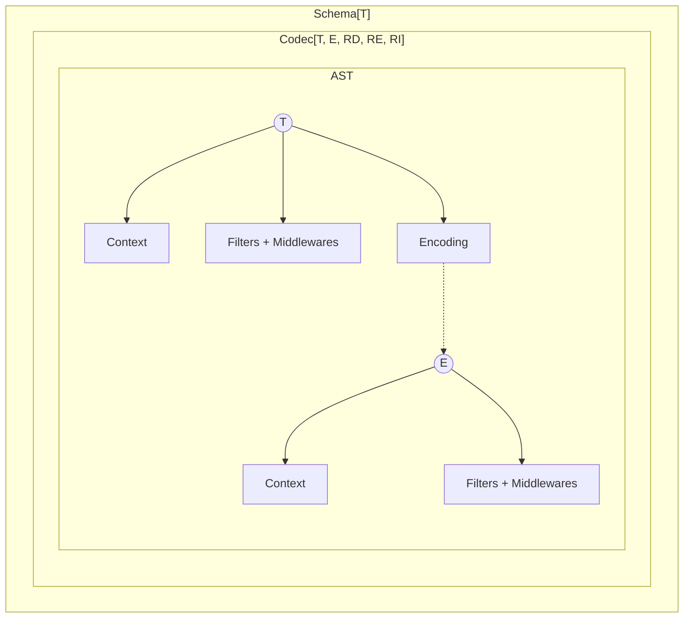
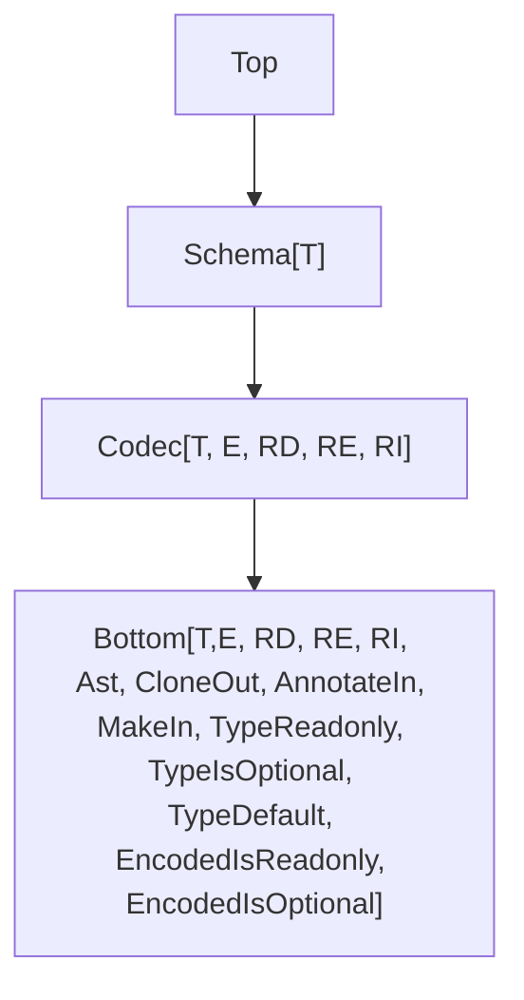

This document outlines upcoming improvements to the `Schema` module in the Effect library.

## Model



## Current Pain Points

These are known limitations and difficulties:

- `partial` only allows toggling all fields at once, which limits flexibility.
- Suspended schemas are awkward to use.
- Performance and bundle size need improvement.
- (optional) Custom error handling is limited ([example](https://discord.com/channels/795981131316985866/1347665724361019433/1347831833282347079)).

## Type Hierarchy



## More Requirement Type Parameters

Requirements are now split into three separate types:

- `RD`: for decoding
- `RE`: for encoding
- `RI`: for any intrinsic requirements defined in a custom data type

```ts
interface Codec<T, E, RD, RE, RI> {
  // ...
}
```

This makes it easier to apply requirements only where needed. For instance, encoding requirements can be ignored during decoding:

```ts
import type { Effect } from "effect"
import { Context, Schema, SchemaValidator } from "effect"

class EncodingService extends Context.Tag<
  EncodingService,
  { encode: Effect.Effect<string> }
>()("EncodingService") {}

declare const field: Schema.Codec<string, string, never, EncodingService>

const schema = Schema.Struct({
  a: field
})

//     ┌─── SchemaResult<{ readonly a: string; }, never>
//     ▼
const dec = SchemaValidator.decodeUnknownSchemaResult(schema)({ a: "a" })

//     ┌─── SchemaResult<{ readonly a: string; }, EncodingService>
//     ▼
const enc = SchemaValidator.encodeUnknownSchemaResult(schema)({ a: "a" })
```

**Aside** (Why RI Matters)

`RI` allows you to express that a data type needs a service even when it is not strictly about decoding or encoding. This was not possible in v3.

**Example** (Declaring a codec with intrinsic service requirements)

```ts
import { Context, Effect, Schema } from "effect"

// A service used internally by the data type itself
class SomeService extends Context.Tag<
  SomeService,
  {
    someOperation: (u: unknown) => Effect.Effect<string>
  }
>()("SomeService") {}

// The codec requires SomeService to be defined,
// even though the dependency is not passed explicitly
// through the type parameters
//
//     ┌─── declareParserResult<string, number, never, never, SomeService>
//     ▼
const codec = Schema.declareParserResult([])<number>()(
  () => (input) =>
    Effect.gen(function* () {
      const service = yield* SomeService
      return yield* service.someOperation(input)
    })
)
```

## JSON Serialization by Default

Given a schema, `SchemaToSerializer.make` will produce a codec that can serialize and deserialize a value compatible with the schema to and from JSON.

**Example** (Serializing a Map)

```ts
import { Option, Schema, SchemaToSerializer, SchemaValidator } from "effect"

//      ┌─── Codec<Map<Option.Option<symbol>, Date>>
//      ▼
const schema = Schema.Map(Schema.Option(Schema.Symbol), Schema.Date)

//      ┌─── Codec<Map<Option.Option<symbol>, Date>, unknown>
//      ▼
const serializer = SchemaToSerializer.make(schema)

const data = new Map([[Option.some(Symbol.for("a")), new Date("2021-01-01")]])

//      ┌─── unknown
//      ▼
const json = SchemaValidator.encodeUnknownSync(serializer)(data)

console.log(json)
// Output: [ [ [ 'a' ], '2021-01-01T00:00:00.000Z' ] ]

console.log(SchemaValidator.decodeUnknownSync(serializer)(json))
/*
Output:
Map(1) {
  { _id: 'Option', _tag: 'Some', value: Symbol(a) } => 2021-01-01T00:00:00.000Z
}
*/
```

## Flipping

Flipping is a transformation that creates a new codec from an existing one by swapping its input and output types.

```ts
import { Schema } from "effect"

// Flips a codec that decodes a string into a number,
// turning it into one that encodes a number into a string
const NumberToString = Schema.flip(Schema.NumberFromString)
```

All internal operations have been made symmetrical. This made it possible to define `Schema.flip`, and also simplified the implementation of the decoding / encoding engine.

```ts
// Encoding with a schema is equivalent to decoding with its flipped version
encode(schema) = decode(flip(schema))
```

## Middlewares

### Fallbacks

`Schema.catch` is a middleware that allows you to provide a fallback value for a schema.

```ts
import {
  Effect,
  Option,
  Result,
  Schema,
  SchemaFormatter,
  SchemaValidator
} from "effect"

const fallback = Result.ok(Option.some("b"))

const schema = Schema.String.pipe(Schema.catch(() => fallback))

SchemaValidator.decodeUnknown(schema)(null)
  .pipe(
    Effect.mapError(SchemaFormatter.TreeFormatter.format),
    Effect.runPromise
  )
  .then(console.log, console.error)
// Output: b
```

### Providing Services

You can provide services to a schema by using a middleware.

```ts
import {
  Context,
  Effect,
  identity,
  Option,
  Schema,
  SchemaAST,
  SchemaFormatter,
  SchemaParser,
  SchemaResult,
  SchemaTransformation,
  SchemaValidator
} from "effect"

class Service extends Context.Tag<
  Service,
  { defaultValue: Effect.Effect<string> }
>()("Service") {}

//      ┌─── Codec<string, string, Service, never, never>
//      ▼
const schema = Schema.String.pipe(
  Schema.decodeTo(
    Schema.String,
    new SchemaTransformation.Transformation(
      SchemaParser.onSome((s) =>
        Effect.gen(function* () {
          const service = yield* Service
          return Option.some(s + (yield* service.defaultValue))
        })
      ),
      SchemaParser.identity()
    )
  )
)

//      ┌─── Codec<string, string, never, never, never>
//      ▼
const provided = schema.pipe(
  Schema.decodeMiddleware(
    new SchemaAST.Middleware(
      (sr) =>
        SchemaResult.asEffect(sr).pipe(
          Effect.provideService(Service, { defaultValue: Effect.succeed("b") })
        ),
      identity,
      undefined
    )
  )
)

SchemaValidator.decodeUnknown(provided)("a")
  .pipe(
    Effect.mapError(SchemaFormatter.TreeFormatter.format),
    Effect.runPromise
  )
  .then(console.log, console.error)
// Output: ab
```

## Constructors Redesign

### Keeping Constructors in Composed Schemas

To retain constructors in composed schemas, `makeUnsafe` and `make` will be added to the base `Bottom` type.

### Default Values

**Example** (Adding a default value to a field)

```ts
import { Result, Schema } from "effect"

const schema = Schema.Struct({
  a: Schema.Number.pipe(Schema.withConstructorDefault(() => Result.some(-1)))
})

console.log(schema.makeUnsafe({}))
// { a: -1 }
```

### Effectful Defaults

Defaults can be effectful as long as their environment (`R`) is `never`.

**Example** (Async default)

```ts
import { Effect, Option, Schema, SchemaResult } from "effect"

const schema = Schema.Struct({
  a: Schema.Number.pipe(
    Schema.withConstructorDefault(() =>
      Effect.gen(function* () {
        yield* Effect.sleep(100)
        return Option.some(-1)
      })
    )
  )
})

SchemaResult.asEffect(schema.make({})).pipe(Effect.runPromise).then(console.log)
// { a: -1 }
```

**Example** (Default from optional service)

```ts
import { Context, Effect, Option, Schema, SchemaResult } from "effect"

class ConstructorService extends Context.Tag<
  ConstructorService,
  { defaultValue: Effect.Effect<number> }
>()("ConstructorService") {}

const schema = Schema.Struct({
  a: Schema.Number.pipe(
    Schema.withConstructorDefault(() =>
      Effect.gen(function* () {
        yield* Effect.sleep(100)
        const oservice = yield* Effect.serviceOption(ConstructorService)
        if (Option.isNone(oservice)) {
          return Option.none()
        }
        return Option.some(yield* oservice.value.defaultValue)
      })
    )
  )
})

SchemaResult.asEffect(schema.make({}))
  .pipe(
    Effect.provideService(
      ConstructorService,
      ConstructorService.of({ defaultValue: Effect.succeed(-1) })
    ),
    Effect.runPromise
  )
  .then(console.log, console.error)
// { a: -1 }
```

### Nested Default

Default values can be nested, and will be evaluated in order.

**Example** (Nested schema with defaults)

```ts
import { Result, Schema } from "effect"

const schema = Schema.Struct({
  a: Schema.Struct({
    b: Schema.Number.pipe(Schema.withConstructorDefault(() => Result.some(-1)))
  }).pipe(Schema.withConstructorDefault(() => Result.some({})))
})

console.log(schema.makeUnsafe({}))
// { a: { b: -1 } }
console.log(schema.makeUnsafe({ a: {} }))
// { a: { b: -1 } }
```

## Filters Redesign

### Return Type Preservation

When using `Schema.check`, the return type of the original schema is preserved. This means any additional metadata or methods remain available after applying filters.

```ts
import { Schema, SchemaFilter } from "effect"

//      ┌─── Schema.String
//      ▼
Schema.String

//      ┌─── Schema.String
//      ▼
const NonEmptyString = Schema.String.pipe(Schema.check(SchemaFilter.nonEmpty))

//      ┌─── Schema.String
//      ▼
const schema = NonEmptyString.annotate({})
```

This helps keep functionality such as `.makeUnsafe` or `.fields` intact, even after filters are applied.

```ts
import { Schema, SchemaFilter } from "effect"

const schema = Schema.Struct({
  name: Schema.String,
  age: Schema.Number
}).pipe(Schema.check(SchemaFilter.make(() => true)))

// The fields of the original struct are still accessible
//
//      ┌─── { readonly name: Schema.String; readonly age: Schema.Number; }
//      ▼
const fields = schema.fields
```

Refinements are excluded as the type will change:

**Example** (Refining an Option to be Some)

```ts
import {
  Effect,
  Option,
  Schema,
  SchemaFormatter,
  SchemaValidator
} from "effect"

const schema = Schema.Option(Schema.String).pipe(
  Schema.refine(Option.isSome, { title: "Some" })
)

SchemaValidator.decodeUnknown(schema)(Option.none())
  .pipe(
    Effect.mapError(SchemaFormatter.TreeFormatter.format),
    Effect.runPromise
  )
  .then(console.log, console.error)
/*
Output:
Option<string> & Some
└─ Some
   └─ Expected Option<string> & Some, actual {
  "_id": "Option",
  "_tag": "None"
}
*/
```

### Filters as First-Class

Filters are now standalone values. This allows them to be composed, reused, and applied to any schema that supports the necessary structure.

For example, `minLength` is no longer specific to strings. It can be applied to any schema that defines a `length` property.

**Example** (Validating a trimmed string with minimum length)

```ts
import {
  Effect,
  Schema,
  SchemaFilter,
  SchemaFormatter,
  SchemaValidator
} from "effect"

const schema = Schema.String.pipe(
  Schema.check(
    SchemaFilter.minLength(3), // Filter<string>
    SchemaFilter.trimmed // Filter<string>
  )
)

SchemaValidator.decodeUnknown(schema)(" a")
  .pipe(
    Effect.mapError(SchemaFormatter.TreeFormatter.format),
    Effect.runPromise
  )
  .then(console.log, console.error)
/*
Output:
string & minLength(3) & trimmed
├─ minLength(3)
│  └─ Invalid value " a"
└─ trimmed
   └─ Invalid value " a"
*/
```

**Example** (Applying `minLength` to a non-string schema)

```ts
import {
  Effect,
  Schema,
  SchemaFilter,
  SchemaFormatter,
  SchemaValidator
} from "effect"

const schema = Schema.Struct({ length: Schema.Number }).pipe(
  Schema.check(SchemaFilter.minLength(3))
)

SchemaValidator.decodeUnknown(schema)({ length: 2 })
  .pipe(
    Effect.mapError(SchemaFormatter.TreeFormatter.format),
    Effect.runPromise
  )
  .then(console.log, console.error)
/*
Output:
{ readonly "length": number } & minLength(3)
└─ minLength(3)
   └─ Invalid value {"length":2}
*/
```

By default all filters are run even if one fails. This allows Schema to collect multiple issues at once.

If you want to stop validation as soon as a filter fails, you can call `.abort()` on a filter.

**Example** (Stop at the first failed filter)

```ts
import {
  Effect,
  Schema,
  SchemaFilter,
  SchemaFormatter,
  SchemaValidator
} from "effect"

const schema = Schema.String.pipe(
  Schema.check(
    SchemaFilter.minLength(3).abort(), // Stop on failure here
    SchemaFilter.trimmed // This will not run if minLength fails
  )
)

SchemaValidator.decodeUnknown(schema)(" a")
  .pipe(
    Effect.mapError(SchemaFormatter.TreeFormatter.format),
    Effect.runPromise
  )
  .then(console.log, console.error)
/*
Output:
string & minLength(3) & trimmed
└─ minLength(3)
   └─ Invalid value " a"
*/
```

### Filter Factories

A **filter factory** is a function that returns a reusable filter. This pattern is useful when you want to create filters that can be customized at runtime.

You can now create filters like `greaterThan` for any type with an ordering.

**Example** (Reusable `greaterThan` filter)

```ts
import { Order, SchemaFilter } from "effect"

// Creates a filter factory using an Order instance
// Returns a `SchemaAST.Filter<T>`
export const makeGreaterThan = <T>(O: Order.Order<T>) => {
  const greaterThan = Order.greaterThan(O)
  return (exclusiveMinimum: T) =>
    SchemaFilter.make<T>((input) => greaterThan(input, exclusiveMinimum), {
      title: `greaterThan(${exclusiveMinimum})`,
      description: `a value greater than ${exclusiveMinimum}`
    })
}
```

## Structs

### Optional & Mutable Fields

```ts
import { Schema } from "effect"

const schema = Schema.Struct({
  a: Schema.String,
  b: Schema.optionalKey(Schema.String),
  c: Schema.mutableKey(Schema.String),
  d: Schema.optionalKey(Schema.mutableKey(Schema.String))
})

/*
type Type = {
    readonly a: string;
    readonly b?: string;
    c: string;
    d?: string;
}
*/
type Type = (typeof schema)["Type"]
```

### Opaque Structs

Opaque structs are a new feature that allows you to create a new type from an existing schema.

**Example** (Creating an Opaque Struct)

```ts
import { Schema } from "effect"

class Person extends Schema.Opaque<Person>()(
  Schema.Struct({
    name: Schema.String
  })
) {}

// const x: Person
const person = Person.makeUnsafe({ name: "John" })

console.log(person.name)
// "John"

console.log(Person)
// [Function: Person] Struct$

/*
(property) fields: {
    readonly name: Schema.String;
}
*/
Person.fields

/*
const another: Schema.Struct<{
    readonly name: typeof Person;
}>
*/
const another = Schema.Struct({ name: Person })

/*
type Type = {
    readonly name: Person;
}
*/
type Type = (typeof another)["Type"]
```

## Records

### Key Transformations

`Schema.ReadonlyRecord` now supports key transformations.

**Example**

```ts
import { Schema, SchemaTransformation, SchemaValidator } from "effect"

const SnakeToCamel = Schema.String.pipe(
  Schema.decodeTo(Schema.String, SchemaTransformation.snakeToCamel)
)

const schema = Schema.ReadonlyRecord(SnakeToCamel, Schema.Number)

console.log(SchemaValidator.decodeUnknownSync(schema)({ a_b: 1, c_d: 2 }))
// { aB: 1, cD: 2 }
```

By default duplicate keys are merged with the last value.

**Example** (Merging duplicate keys)

```ts
import { Schema, SchemaTransformation, SchemaValidator } from "effect"

const SnakeToCamel = Schema.String.pipe(
  Schema.decodeTo(Schema.String, SchemaTransformation.snakeToCamel)
)

const schema = Schema.ReadonlyRecord(SnakeToCamel, Schema.Number)

console.log(SchemaValidator.decodeUnknownSync(schema)({ a_b: 1, aB: 2 }))
// { aB: 2 }
```

You can also customize how duplicate keys are merged.

**Example** (Customizing key merging)

```ts
import { Schema, SchemaTransformation, SchemaValidator } from "effect"

const SnakeToCamel = Schema.String.pipe(
  Schema.decodeTo(Schema.String, SchemaTransformation.snakeToCamel)
)

const schema = Schema.ReadonlyRecord(SnakeToCamel, Schema.Number, {
  key: {
    decode: {
      combine: ([_, v1], [k2, v2]) => [k2, v1 + v2] // you can pass a Semigroup to combine keys
    },
    encode: {
      combine: ([_, v1], [k2, v2]) => [k2, v1 + v2]
    }
  }
})

console.log(SchemaValidator.decodeUnknownSync(schema)({ a_b: 1, aB: 2 }))
// { aB: 3 }

console.log(SchemaValidator.encodeUnknownSync(schema)({ a_b: 1, aB: 2 }))
// { a_b: 3 }
```

## Transformations Redesign

### Transformations as First-Class

Transformations are now treated as first-class values, rather than being tied to specific codec combinations as in v3.

For example, `trim` is no longer just a codec combinator. It is now a standalone transformation that can be used with any codec that supports it—in this case, any codec working with strings.

**Example** (Using a transformation with debug logging)

```ts
import { Option, Schema, SchemaTransformation, SchemaValidator } from "effect"

// Wrap the trim transformation with debug logging
const trim = SchemaTransformation.tap(SchemaTransformation.trim, {
  onDecode: (o) => {
    if (Option.isSome(o)) {
      console.log(`about to trim "${o.value}"`)
    }
  }
})

// Decode a string, trim it, then parse it into a number
const schema = Schema.String.pipe(Schema.decodeTo(Schema.String, trim))

console.log(SchemaValidator.decodeUnknownSync(schema)("  123"))
/*
about to trim "  123"
123
*/
```

## Generics Improvements

Using generics in schema composition and filters can be difficult.

The plan is to make generics **covariant** and easier to use.

**Before (v3)**

```ts
declare const minLength: <S extends Schema.Any>(
  minLength: number,
  annotations?: Annotations.Filter<Schema.Type<S>>
) => <A extends string>(
  self: S & Schema<A, Schema.Encoded<S>, Schema.Context<S>>
) => filter<S>
```

**After (v4)**

```ts
import type { Schema } from "effect"

declare const minLength: <T extends string>(
  minLength: number,
  annotations?: Schema.Annotations.Annotations<T>
) => <S extends Schema.Schema<T>>(self: S) => S
```

## Primitives

```ts
import { Schema } from "effect"

// primitive types
Schema.String
Schema.Number
Schema.BigInt
Schema.Boolean
Schema.Symbol
Schema.Undefined
Schema.Null
```

To coerce input data to the appropriate type:

```ts
import { Schema, SchemaTransformation, SchemaValidator } from "effect"

//      ┌─── Codec<string, unknown>
//      ▼
const schema = Schema.Unknown.pipe(
  Schema.decodeTo(Schema.String, SchemaTransformation.String)
)

const parse = SchemaValidator.decodeUnknownSync(schema)

console.dir(parse("tuna")) // => "tuna"
console.dir(parse(42)) // => "42"
console.dir(parse(true)) // => "true"
console.dir(parse(null)) // => "null"
```

## Literals

Literal types:

```ts
import { Schema } from "effect"

const tuna = Schema.Literal("tuna")
const twelve = Schema.Literal(12)
const twobig = Schema.Literal(2n)
const tru = Schema.Literal(true)
```

Symbol literals:

```ts
import { Schema } from "effect"

const terrific = Schema.UniqueSymbol(Symbol("terrific"))
```

`null`, `undefined`, and `void`:

```ts
import { Schema } from "effect"

Schema.Null
Schema.Undefined
Schema.Void
```

To allow multiple literal values:

```ts
import { Schema } from "effect"

const schema = Schema.Literals(["red", "green", "blue"])
```

To extract the set of allowed values from a literal schema:

```ts
import { Schema } from "effect"

const schema = Schema.Literals(["red", "green", "blue"])

schema.literals
```

## Strings

```ts
import { Schema, SchemaFilter } from "effect"

Schema.String.pipe(Schema.check(SchemaFilter.maxLength(5)))
Schema.String.pipe(Schema.check(SchemaFilter.minLength(5)))
Schema.String.pipe(Schema.check(SchemaFilter.length(5)))
Schema.String.pipe(Schema.check(SchemaFilter.regex(/^[a-z]+$/)))
Schema.String.pipe(Schema.check(SchemaFilter.startsWith("aaa")))
Schema.String.pipe(Schema.check(SchemaFilter.endsWith("zzz")))
Schema.String.pipe(Schema.check(SchemaFilter.includes("---")))
Schema.String.pipe(Schema.check(SchemaFilter.uppercased))
Schema.String.pipe(Schema.check(SchemaFilter.lowercased))
```

To perform some simple string transforms:

```ts
import { Schema, SchemaTransformation } from "effect"

Schema.String.pipe(Schema.decodeTo(Schema.String, SchemaTransformation.trim))
Schema.String.pipe(
  Schema.decodeTo(Schema.String, SchemaTransformation.toLowerCase)
)
Schema.String.pipe(
  Schema.decodeTo(Schema.String, SchemaTransformation.toUpperCase)
)
```

## RWC References

- https://github.com/Anastasia-Labs/lucid-evolution/blob/5068114c9f8f95c6b997d0d2233a9e9543632f35/packages/experimental/src/TSchema.ts#L353

## Snippets

### Memoization

```ts
function memoizeIdempotent(f: (ast: AST) => AST): (ast: AST) => AST {
  const cache = new WeakMap<AST, AST>()
  return (ast) => {
    if (cache.has(ast)) {
      return cache.get(ast)!
    }
    const result = f(ast)
    cache.set(ast, result)
    cache.set(result, result)
    return result
  }
}

function memoizeInvolution(f: (ast: AST) => AST): (ast: AST) => AST {
  const cache = new WeakMap<AST, AST>()
  return (ast) => {
    if (cache.has(ast)) {
      return cache.get(ast)!
    }
    const result = f(ast)
    cache.set(ast, result)
    cache.set(result, ast)
    return result
  }
}
```
