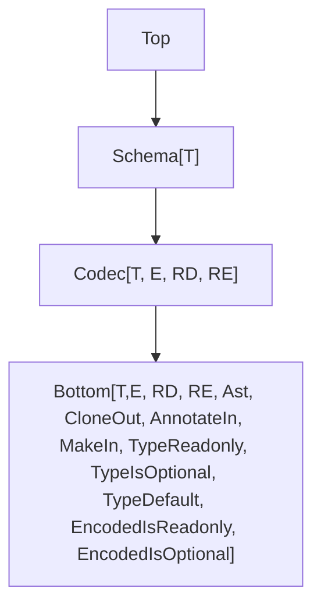

This document outlines upcoming improvements to the `Schema` module in the Effect library.

## Model


## Current Pain Points

These are known limitations and difficulties:

- `partial` only allows toggling all fields at once, which limits flexibility.
- Suspended schemas are awkward to use.
- Performance and bundle size need improvement.
- (optional) Custom error handling is limited ([example](https://discord.com/channels/795981131316985866/1347665724361019433/1347831833282347079)).

## Type Hierarchy



## More Requirement Type Parameters

Requirements are now split into two separate types:

- `RD`: for decoding
- `RE`: for encoding

```ts
interface Codec<T, E, RD, RE> {
  // ...
}
```

This makes it easier to apply requirements only where needed. For instance, encoding requirements can be ignored during decoding:

```ts
import type { Effect } from "effect"
import { Context, Schema } from "effect"

class EncodingService extends Context.Tag<
  EncodingService,
  { encode: Effect.Effect<string> }
>()("EncodingService") {}

declare const field: Schema.Codec<string, string, never, EncodingService>

const schema = Schema.Struct({
  a: field
})

//     ┌─── Effect.Effect<{ readonly a: string; }, Schema.CodecError, never>
//     ▼
const dec = Schema.decodeUnknown(schema)({ a: "a" })

//     ┌─── Effect.Effect<{ readonly a: string; }, Schema.CodecError, EncodingService>
//     ▼
const enc = Schema.encodeUnknown(schema)({ a: "a" })
```

## JSON Serialization by Default

Given a schema, `SchemaSerializerJson.make` will produce a codec that can serialize and deserialize a value compatible with the schema to and from JSON.

The behavior is as follows. Given a `schema: Codec<T, E>`:

- `encode(schema)` will always return a value of type `E`.
- `encode(SchemaSerializerJson(schema))` will return `E` if `E` is JSON-compatible; otherwise, it will use the `serialization` annotation on the `E` side to continue serialization.

**Example** (Serializing a Map)

```ts
import { Option, Schema, SchemaSerializerJson } from "effect"

//      ┌─── Codec<Map<Option.Option<symbol>, Date>>
//      ▼
const schema = Schema.Map(Schema.Option(Schema.Symbol), Schema.Date)

//      ┌─── Codec<Map<Option.Option<symbol>, Date>, unknown>
//      ▼
const serializer = SchemaSerializerJson.make(schema)

const data = new Map([[Option.some(Symbol.for("a")), new Date("2021-01-01")]])

//      ┌─── unknown
//      ▼
const json = Schema.encodeUnknownSync(serializer)(data)

console.log(json)
// Output: [ [ [ 'a' ], '2021-01-01T00:00:00.000Z' ] ]

console.log(Schema.decodeUnknownSync(serializer)(json))
/*
Output:
Map(1) {
  { _id: 'Option', _tag: 'Some', value: Symbol(a) } => 2021-01-01T00:00:00.000Z
}
*/
```

## Flipping

Flipping is a transformation that creates a new codec from an existing one by swapping its input and output types.

```ts
import { Schema, SchemaParser, SchemaTransformation } from "effect"

const FiniteFromString = Schema.String.pipe(
  Schema.decodeTo(
    Schema.Finite,
    new SchemaTransformation.Transformation(
      SchemaParser.Number,
      SchemaParser.String
    )
  )
)

// Flips a codec that decodes a string into a number,
// turning it into one that encodes a number into a string
const StringFromFinite = Schema.flip(FiniteFromString)
```

All internal operations have been made symmetrical. This made it possible to define `Schema.flip`, and also simplified the implementation of the decoding / encoding engine.

```ts
// Encoding with a schema is equivalent to decoding with its flipped version
encode(schema) = decode(flip(schema))
```

## Middlewares

### Fallbacks

`Schema.catch` is a middleware that allows you to provide a fallback value for a schema.

```ts
import { Effect, Option, Result, Schema, SchemaFormatter } from "effect"

const fallback = Result.ok(Option.some("b"))

const schema = Schema.String.pipe(Schema.catch(() => fallback))

Schema.decodeUnknown(schema)(null)
  .pipe(
    Effect.mapError((err) => SchemaFormatter.TreeFormatter.format(err.issue)),
    Effect.runPromise
  )
  .then(console.log, console.error)
// Output: b
```

### Providing Services

You can provide services to a schema by using a middleware.

```ts
import {
  Context,
  Effect,
  Option,
  Schema,
  SchemaFormatter,
  SchemaMiddleware,
  SchemaParser,
  SchemaTransformation
} from "effect"

class Service extends Context.Tag<Service, { value: Effect.Effect<string> }>()(
  "Service"
) {}

//      ┌─── Codec<string, string, Service, never>
//      ▼
const schema = Schema.String.pipe(
  Schema.decodeTo(
    Schema.String,
    new SchemaTransformation.Transformation(
      SchemaParser.parseSome((s) =>
        Effect.gen(function* () {
          const service = yield* Service
          return Option.some(s + (yield* service.value))
        })
      ),
      SchemaParser.identity()
    )
  )
)

//      ┌─── Codec<string, string, never, never>
//      ▼
const provided = schema.pipe(
  Schema.decodeMiddleware(
    SchemaMiddleware.onEffect(
      Effect.provideService(Service, { value: Effect.succeed("b") }),
      { title: "Service provider" }
    )
  )
)

Schema.decodeUnknown(provided)("a")
  .pipe(
    Effect.mapError((err) => SchemaFormatter.TreeFormatter.format(err.issue)),
    Effect.runPromise
  )
  .then(console.log, console.error)
// Output: ab
```

## Constructors Redesign

### Keeping Constructors in Composed Schemas

To retain constructors in composed schemas, `makeUnsafe` and `make` will be added to the base `Bottom` type.

### Default Values

**Example** (Adding a default value to a field)

```ts
import { Result, Schema } from "effect"

const schema = Schema.Struct({
  a: Schema.Number.pipe(
    Schema.setConstructorDefault(() => Result.succeedSome(-1))
  )
})

console.log(schema.makeUnsafe({}))
// { a: -1 }
```

### Effectful Defaults

Defaults can be effectful as long as the environment is `never`.

**Example** (Async default)

```ts
import { Effect, Option, Schema, SchemaResult } from "effect"

const schema = Schema.Struct({
  a: Schema.Number.pipe(
    Schema.setConstructorDefault(() =>
      Effect.gen(function* () {
        yield* Effect.sleep(100)
        return Option.some(-1)
      })
    )
  )
})

SchemaResult.asEffect(schema.make({})).pipe(Effect.runPromise).then(console.log)
// { a: -1 }
```

**Example** (Default from optional service)

```ts
import { Context, Effect, Option, Schema, SchemaResult } from "effect"

class ConstructorService extends Context.Tag<
  ConstructorService,
  { defaultValue: Effect.Effect<number> }
>()("ConstructorService") {}

const schema = Schema.Struct({
  a: Schema.Number.pipe(
    Schema.setConstructorDefault(() =>
      Effect.gen(function* () {
        yield* Effect.sleep(100)
        const oservice = yield* Effect.serviceOption(ConstructorService)
        if (Option.isNone(oservice)) {
          return Option.none()
        }
        return Option.some(yield* oservice.value.defaultValue)
      })
    )
  )
})

SchemaResult.asEffect(schema.make({}))
  .pipe(
    Effect.provideService(
      ConstructorService,
      ConstructorService.of({ defaultValue: Effect.succeed(-1) })
    ),
    Effect.runPromise
  )
  .then(console.log, console.error)
// { a: -1 }
```

### Nested Default

Default values can be nested, and will be evaluated in order.

**Example** (Nested schema with defaults)

```ts
import { Result, Schema } from "effect"

const schema = Schema.Struct({
  a: Schema.Struct({
    b: Schema.Number.pipe(
      Schema.setConstructorDefault(() => Result.succeedSome(-1))
    )
  }).pipe(Schema.setConstructorDefault(() => Result.succeedSome({})))
})

console.log(schema.makeUnsafe({}))
// { a: { b: -1 } }
console.log(schema.makeUnsafe({ a: {} }))
// { a: { b: -1 } }
```

## Filters Redesign

Filters can be effectful as long as the environment is `never`.

### Return Type Preservation

When using `Schema.check`, the return type of the original schema is preserved. This means any additional metadata or methods remain available after applying filters.

```ts
import { Schema, SchemaFilter } from "effect"

//      ┌─── Schema.String
//      ▼
Schema.String

//      ┌─── Schema.String
//      ▼
const NonEmptyString = Schema.String.pipe(Schema.check(SchemaFilter.nonEmpty))

//      ┌─── Schema.String
//      ▼
const schema = NonEmptyString.annotate({})
```

This helps keep functionality such as `.makeUnsafe` or `.fields` intact, even after filters are applied.

```ts
import { Schema, SchemaFilter } from "effect"

const schema = Schema.Struct({
  name: Schema.String,
  age: Schema.Number
}).pipe(Schema.check(SchemaFilter.make(() => true)))

// The fields of the original struct are still accessible
//
//      ┌─── { readonly name: Schema.String; readonly age: Schema.Number; }
//      ▼
const fields = schema.fields
```

Refinements are excluded as the type will change:

**Example** (Refining an Option to be Some)

```ts
import { Effect, Option, Schema, SchemaFormatter } from "effect"

const schema = Schema.Option(Schema.String).pipe(
  Schema.refine(Option.isSome, { title: "Some" })
)

Schema.decodeUnknown(schema)(Option.none())
  .pipe(
    Effect.mapError((err) => SchemaFormatter.TreeFormatter.format(err.issue)),
    Effect.runPromise
  )
  .then(console.log, console.error)
/*
Output:
Option<string> & Some
└─ Some
   └─ Expected Option<string> & Some, actual {
  "_id": "Option",
  "_tag": "None"
}
*/
```

### Filters as First-Class

Filters are now standalone values. This allows them to be composed, reused, and applied to any schema that supports the necessary structure.

For example, `minLength` is no longer specific to strings. It can be applied to any schema that defines a `length` property.

**Example** (Validating a trimmed string with minimum length)

```ts
import { Effect, Schema, SchemaFilter, SchemaFormatter } from "effect"

const schema = Schema.String.pipe(
  Schema.check(
    SchemaFilter.minLength(3), // Filter<string>
    SchemaFilter.trimmed // Filter<string>
  )
)

Schema.decodeUnknown(schema)(" a")
  .pipe(
    Effect.mapError((err) => SchemaFormatter.TreeFormatter.format(err.issue)),
    Effect.runPromise
  )
  .then(console.log, console.error)
/*
Output:
string & minLength(3) & trimmed
├─ minLength(3)
│  └─ Invalid value " a"
└─ trimmed
   └─ Invalid value " a"
*/
```

**Example** (Applying `minLength` to a non-string schema)

```ts
import { Effect, Schema, SchemaFilter, SchemaFormatter } from "effect"

const schema = Schema.Struct({ length: Schema.Number }).pipe(
  Schema.check(SchemaFilter.minLength(3))
)

Schema.decodeUnknown(schema)({ length: 2 })
  .pipe(
    Effect.mapError((err) => SchemaFormatter.TreeFormatter.format(err.issue)),
    Effect.runPromise
  )
  .then(console.log, console.error)
/*
Output:
{ readonly "length": number } & minLength(3)
└─ minLength(3)
   └─ Invalid value {"length":2}
*/
```

By default all filters are run even if one fails. This allows Schema to collect multiple issues at once.

If you want to stop validation as soon as a filter fails, you can call `.abort()` on a filter.

**Example** (Stop at the first failed filter)

```ts
import { Effect, Schema, SchemaFilter, SchemaFormatter } from "effect"

const schema = Schema.String.pipe(
  Schema.check(
    SchemaFilter.minLength(3).abort(), // Stop on failure here
    SchemaFilter.trimmed // This will not run if minLength fails
  )
)

Schema.decodeUnknown(schema)(" a")
  .pipe(
    Effect.mapError((err) => SchemaFormatter.TreeFormatter.format(err.issue)),
    Effect.runPromise
  )
  .then(console.log, console.error)
/*
Output:
string & minLength(3) & trimmed
└─ minLength(3)
   └─ Invalid value " a"
*/
```

### Filter Factories

A **filter factory** is a function that returns a reusable filter. This pattern is useful when you want to create filters that can be customized at runtime.

You can now create filters like `greaterThan` for any type with an ordering.

**Example** (Reusable `greaterThan` filter)

```ts
import { Order, SchemaFilter } from "effect"

// Creates a filter factory using an Order instance
// Returns a `SchemaAST.Filter<T>`
export const makeGreaterThan = <T>(O: Order.Order<T>) => {
  const greaterThan = Order.greaterThan(O)
  return (exclusiveMinimum: T) =>
    SchemaFilter.make<T>((input) => greaterThan(input, exclusiveMinimum), {
      title: `greaterThan(${exclusiveMinimum})`,
      description: `a value greater than ${exclusiveMinimum}`
    })
}
```

## Structs

### Optional and Mutable Fields

You can mark struct properties as optional or mutable using `Schema.optionalKey` and `Schema.mutableKey`.

```ts
import { Schema } from "effect"

const schema = Schema.Struct({
  a: Schema.String,
  b: Schema.optionalKey(Schema.String),
  c: Schema.mutableKey(Schema.String),
  d: Schema.optionalKey(Schema.mutableKey(Schema.String))
})

/*
type Type = {
    readonly a: string;
    readonly b?: string;
    c: string;
    d?: string;
}
*/
type Type = (typeof schema)["Type"]
```

### Key Transformations

`Schema.ReadonlyRecord` now supports key transformations.

**Example**

```ts
import { Schema, SchemaTransformation } from "effect"

const SnakeToCamel = Schema.String.pipe(
  Schema.decodeTo(Schema.String, SchemaTransformation.snakeToCamel)
)

const schema = Schema.ReadonlyRecord(SnakeToCamel, Schema.Number)

console.log(Schema.decodeUnknownSync(schema)({ a_b: 1, c_d: 2 }))
// { aB: 1, cD: 2 }
```

By default duplicate keys are merged with the last value.

**Example** (Merging duplicate keys)

```ts
import { Schema, SchemaTransformation } from "effect"

const SnakeToCamel = Schema.String.pipe(
  Schema.decodeTo(Schema.String, SchemaTransformation.snakeToCamel)
)

const schema = Schema.ReadonlyRecord(SnakeToCamel, Schema.Number)

console.log(Schema.decodeUnknownSync(schema)({ a_b: 1, aB: 2 }))
// { aB: 2 }
```

You can also customize how duplicate keys are merged.

**Example** (Customizing key merging)

```ts
import { Schema, SchemaTransformation } from "effect"

const SnakeToCamel = Schema.String.pipe(
  Schema.decodeTo(Schema.String, SchemaTransformation.snakeToCamel)
)

const schema = Schema.ReadonlyRecord(SnakeToCamel, Schema.Number, {
  key: {
    decode: {
      combine: ([_, v1], [k2, v2]) => [k2, v1 + v2] // you can pass a Semigroup to combine keys
    },
    encode: {
      combine: ([_, v1], [k2, v2]) => [k2, v1 + v2]
    }
  }
})

console.log(Schema.decodeUnknownSync(schema)({ a_b: 1, aB: 2 }))
// { aB: 3 }

console.log(Schema.encodeUnknownSync(schema)({ a_b: 1, aB: 2 }))
// { a_b: 3 }
```

## Opaque Structs and Classes

### Opaque Structs

**Use Case**: When you are fine with a struct but you want an opaque type for its `Type`.

Opaque structs wrap an existing struct in a new class type. They preserve the schema's shape but hide implementation details.
Instance methods or custom constructors **are not allowed** on opaque structs.

**Open Problems**:

- instance methods are not supported but this is not enforced (eslint rule?)

**Example** (Creating an Opaque Struct)

```ts
import { Schema } from "effect"

class Person extends Schema.Opaque<Person>()(
  Schema.Struct({
    name: Schema.String
  })
) {}

//      ┌─── Codec<Person, { readonly name: string; }, never, never>
//      ▼
const codec = Schema.revealCodec(Person)

// const x: Person
const person = Person.makeUnsafe({ name: "John" })

console.log(person.name)
// "John"

// The class itself holds the original schema and its metadata
console.log(Person)
// -> [Function: Person] Struct$

// { readonly name: Schema.String }
Person.fields

/*
const another: Schema.Struct<{
    readonly name: typeof Person;
}>
*/
const another = Schema.Struct({ name: Person }) // You can use the opaque type inside other schemas

/*
type Type = {
    readonly name: Person;
}
*/
type Type = (typeof another)["Type"]
```

Opaque structs can be used just like regular structs, with no other changes needed.

**Example** (Retrieving Schema Fields)

```ts
import { Schema } from "effect"

// A function that takes a generic struct
const getFields = <Fields extends Schema.Struct.Fields>(
  struct: Schema.Struct<Fields>
) => struct.fields

class Person extends Schema.Opaque<Person>()(
  Schema.Struct({
    name: Schema.String
  })
) {}

/*
const fields: {
    readonly name: Schema.String;
}
*/
const fields = getFields(Person)
```

#### Static methods

You can add static members to an opaque struct class to extend its behavior.

**Example** (Custom serializer via static method)

```ts
import { Schema, SchemaSerializerJson } from "effect"

class Person extends Schema.Opaque<Person>()(
  Schema.Struct({
    name: Schema.String,
    createdAt: Schema.Date
  })
) {
  // Create a custom serializer using the class itself
  static readonly serializer = SchemaSerializerJson.make(this)
}

console.log(
  Schema.encodeUnknownSync(Person)({
    name: "John",
    createdAt: new Date()
  })
)
// { name: 'John', createdAt: 2025-05-02T13:49:29.926Z }

console.log(
  Schema.encodeUnknownSync(Person.serializer)({
    name: "John",
    createdAt: new Date()
  })
)
// { name: 'John', createdAt: '2025-05-02T13:49:29.928Z' }
```

#### Annotations and filters

You can attach filters and annotations to the struct passed into `Opaque`.

**Example** (Applying a filter and title annotation)

```ts
import { Effect, Schema, SchemaFilter, SchemaFormatter } from "effect"

class Person extends Schema.Opaque<Person>()(
  Schema.Struct({
    name: Schema.String
  })
    .pipe(Schema.check(SchemaFilter.make(({ name }) => name.length > 0)))
    .annotate({
      title: "Person"
    })
) {}

Schema.decodeUnknown(Person)({ name: "" })
  .pipe(
    Effect.mapError((err) => SchemaFormatter.TreeFormatter.format(err.issue)),
    Effect.runPromise
  )
  .then(console.log, console.error)
/*
Person & <filter>
└─ <filter>
   └─ Invalid value {"name":""}
*/
```

When you call methods like `annotate` on an opaque struct class, you get back the original struct, not a new class.

```ts
import { Schema } from "effect"

class Person extends Schema.Opaque<Person>()(
  Schema.Struct({
    name: Schema.String
  })
) {}

/*
const S: Schema.Struct<{
    readonly name: Schema.String;
}>
*/
const S = Person.annotate({ title: "Person" }) // `annotate` returns the wrapped struct type
```

#### Recursive Opaque Structs

```ts
import { Schema } from "effect"

interface CategoryEncoded extends Schema.Codec.Encoded<typeof Category> {}

export class Category extends Schema.Opaque<Category>()(
  Schema.Struct({
    name: Schema.String,
    children: Schema.ReadonlyArray(
      Schema.suspend((): Schema.Codec<Category, CategoryEncoded> => Category)
    )
  })
) {}
```

### Existing Classes

#### Validating the Constructor

**Use Case**: When you want to validate the constructor arguments of an existing class.

**Example** (Using a tuple to validate the constructor arguments)

```ts
import { Schema, SchemaFormatter, SchemaIssue } from "effect"

const PersonConstructorArguments = Schema.ReadonlyTuple([
  Schema.String,
  Schema.Finite
])

// Existing class
class Person {
  constructor(
    readonly name: string,
    readonly age: number
  ) {
    PersonConstructorArguments.makeUnsafe([name, age])
  }
}

try {
  new Person("John", NaN)
} catch (error) {
  if (error instanceof Error) {
    if (SchemaIssue.isIssue(error.cause)) {
      console.error(SchemaFormatter.TreeFormatter.format(error.cause))
    } else {
      console.error(error)
    }
  }
}
/*
readonly [string, number & finite]
└─ [1]
   └─ number & finite
      └─ finite
         └─ Invalid value NaN
*/
```

**Example** (Inheritance)

```ts
import { Schema } from "effect"

const PersonConstructorArguments = Schema.ReadonlyTuple([
  Schema.String,
  Schema.Finite
])

class Person {
  constructor(
    readonly name: string,
    readonly age: number
  ) {
    PersonConstructorArguments.makeUnsafe([name, age])
  }
}

const PersonWithEmailConstructorArguments = Schema.ReadonlyTuple([
  Schema.String
])

class PersonWithEmail extends Person {
  constructor(
    name: string,
    age: number,
    readonly email: string
  ) {
    // Only validate the additional argument
    PersonWithEmailConstructorArguments.makeUnsafe([email])
    super(name, age)
  }
}
```

#### Defining a Schema

```ts
import { Schema, SchemaTransformation } from "effect"

class Person {
  constructor(
    readonly name: string,
    readonly age: number
  ) {}
}

const PersonSchema = Schema.instanceOf({
  constructor: Person,
  annotations: {
    title: "Person",
    // optional: default JSON serialization
    serialization: {
      json: () =>
        Schema.link<Person>()(
          Schema.ReadonlyTuple([Schema.String, Schema.Number]),
          SchemaTransformation.transform(
            (args) => new Person(...args),
            (instance) => [instance.name, instance.age] as const
          )
        )
    }
  }
})
  // optional: explicit encoding
  .pipe(
    Schema.encodeTo(
      Schema.Struct({
        name: Schema.String,
        age: Schema.Number
      }),
      SchemaTransformation.transform(
        (args) => new Person(args.name, args.age),
        (instance) => instance
      )
    )
  )
```

**Example** (Inheritance)

```ts
import { Schema, SchemaTransformation } from "effect"

class Person {
  constructor(
    readonly name: string,
    readonly age: number
  ) {}
}

const PersonSchema = Schema.instanceOf({
  constructor: Person,
  annotations: {
    title: "Person",
    // optional: default JSON serialization
    serialization: {
      json: () =>
        Schema.link<Person>()(
          Schema.ReadonlyTuple([Schema.String, Schema.Number]),
          SchemaTransformation.transform(
            (args) => new Person(...args),
            (instance) => [instance.name, instance.age] as const
          )
        )
    }
  }
})
  // optional: explicit encoding
  .pipe(
    Schema.encodeTo(
      Schema.Struct({
        name: Schema.String,
        age: Schema.Number
      }),
      SchemaTransformation.transform(
        (args) => new Person(args.name, args.age),
        (instance) => instance
      )
    )
  )

class PersonWithEmail extends Person {
  constructor(
    name: string,
    age: number,
    readonly email: string
  ) {
    super(name, age)
  }
}

// const PersonWithEmailSchema = ...repeat the pattern above...
```

#### Errors

**Example** (Extending Data.Error)

```ts
import { Data, Effect, identity, Schema, SchemaTransformation } from "effect"

const Props = Schema.Struct({
  message: Schema.String
})

class Err extends Data.Error<typeof Props.Type> {
  constructor(props: typeof Props.Type) {
    super(Props.makeUnsafe(props))
  }
}

const program = Effect.gen(function* () {
  yield* new Err({ message: "Uh oh" })
})

Effect.runPromiseExit(program).then((exit) =>
  console.log(JSON.stringify(exit, null, 2))
)
/*
{
  "_id": "Exit",
  "_tag": "Failure",
  "cause": {
    "_id": "Cause",
    "failures": [
      {
        "_tag": "Fail",
        "error": {
          "message": "Uh oh"
        }
      }
    ]
  }
}
*/

const transformation = SchemaTransformation.transform<
  Err,
  (typeof Props)["Type"]
>((props) => new Err(props), identity)

const schema = Schema.instanceOf({
  constructor: Err,
  annotations: {
    title: "Err",
    serialization: {
      json: () => Schema.link<Err>()(Props, transformation)
    }
  }
}).pipe(Schema.encodeTo(Props, transformation))

// built-in helper?
const builtIn = Schema.getClassSchema(Err, { encoding: Props })
```

### Class

**Open Problems**:

- `class D extends A {}` in the example is not supported but this is not enforced (eslint rule?)

**Example**

```ts
import { Schema } from "effect"

class A extends Schema.Class<A>("A")({
  a: Schema.String
}) {
  readonly _a = 1
}

console.log(new A({ a: "a" }))
// A { a: 'a', _a: 1 }
console.log(A.makeUnsafe({ a: "a" }))
// A { a: 'a', _a: 1 }
console.log(Schema.decodeUnknownSync(A)({ a: "a" }))
// A { a: 'a', _a: 1 }

// @ts-expect-error
export class B extends Schema.Class<B>("B")(A) {}

// ok
class C extends Schema.Class<C>("C")(A.fields) {}

console.log(new C({ a: "a" }))
// C { a: 'a' }
console.log(C.makeUnsafe({ a: "a" }))
// C { a: 'a' }
console.log(Schema.decodeUnknownSync(C)({ a: "a" }))
// C { a: 'a' }
```

#### Filters

```ts
import { Schema, SchemaFilter, SchemaFormatter, SchemaIssue } from "effect"

class A extends Schema.Class<A>("A")({
  a: Schema.String.pipe(Schema.check(SchemaFilter.nonEmpty))
}) {}

try {
  new A({ a: "" })
} catch (error) {
  if (error instanceof Error) {
    if (SchemaIssue.isIssue(error.cause)) {
      console.error(SchemaFormatter.TreeFormatter.format(error.cause))
    } else {
      console.error(error)
    }
  }
}
/*
{ readonly "a": string & minLength(1) }
└─ ["a"]
   └─ string & minLength(1)
      └─ minLength(1)
         └─ Invalid value ""
*/
```

#### Annotations

```ts
import { Schema, SchemaFormatter, SchemaIssue } from "effect"

export class A extends Schema.Class<A>("A")(
  {
    a: Schema.String
  },
  {
    title: "A"
  }
) {}

try {
  Schema.decodeUnknownSync(A)({ a: null })
} catch (error) {
  if (SchemaIssue.isIssue(error)) {
    console.error(SchemaFormatter.TreeFormatter.format(error))
  } else {
    console.error(error)
  }
}
/*
A <-> { readonly "a": string }
└─ { readonly "a": string }
   └─ ["a"]
      └─ Expected string, actual null
*/
```

#### extend

```ts
import { Schema } from "effect"

class A extends Schema.Class<A>("A")(
  Schema.Struct({
    a: Schema.String
  })
) {
  readonly _a = 1
}
class B extends A.extend<B>("B")({
  b: Schema.Number
}) {
  readonly _b = 2
}

console.log(new B({ a: "a", b: 2 }))
// B { a: 'a', _a: 1, _b: 2 }
console.log(B.makeUnsafe({ a: "a", b: 2 }))
// B { a: 'a', _a: 1, _b: 2 }
console.log(Schema.decodeUnknownSync(B)({ a: "a", b: 2 }))
// B { a: 'a', _a: 1, _b: 2 }
```

### ErrorClass

```ts
import { Schema } from "effect"

class E extends Schema.ErrorClass<E>("E")({
  id: Schema.Number
}) {}
```

### RequestClass

```ts
import { Schema } from "effect"

class A extends Schema.RequestClass<A>("A")({
  payload: Schema.Struct({
    a: Schema.String
  }),
  success: Schema.String,
  error: Schema.Number
}) {}
```

## Transformations Redesign

### Transformations as First-Class

Transformations are now treated as first-class values, rather than being tied to specific codec combinations as in v3.

For example, `trim` is no longer just a codec combinator. It is now a standalone transformation that can be used with any codec that supports it—in this case, any codec working with strings.

**Example** (Using a transformation with debug logging)

```ts
import { Option, Schema, SchemaTransformation } from "effect"

// Wrap the trim transformation with debug logging
const trim = SchemaTransformation.tap(SchemaTransformation.trim, {
  onDecode: (o) => {
    if (Option.isSome(o)) {
      console.log(`about to trim "${o.value}"`)
    }
  }
})

// Decode a string, trim it, then parse it into a number
const schema = Schema.String.pipe(Schema.decodeTo(Schema.String, trim))

console.log(Schema.decodeUnknownSync(schema)("  123"))
/*
about to trim "  123"
123
*/
```

### Composition

#### compose

The `compose` transformation lets you convert from one schema to another when the encoded output of the target schema matches the type of the source schema.

**Example** (Composing schemas where `To.Encoded = From.Type`)

```ts
import { Schema, SchemaParser, SchemaTransformation } from "effect"

const FiniteFromString = Schema.String.pipe(
  Schema.decodeTo(
    Schema.Finite,
    new SchemaTransformation.Transformation(
      SchemaParser.Number,
      SchemaParser.String
    )
  )
)

const From = Schema.Struct({
  a: Schema.String,
  b: Schema.String
})

const To = Schema.Struct({
  a: FiniteFromString,
  b: FiniteFromString
})

// To.Encoded (string) = From.Type (string)
const schema = From.pipe(
  Schema.decodeTo(To, SchemaTransformation.compose({ strict: false }))
)
```

#### composeSupertype

Use `composeSupertype` when your source type extends the encoded output of your target schema.

**Example** (Composing schemas where `From.Type extends To.Encoded`)

```ts
import { Schema, SchemaParser, SchemaTransformation } from "effect"

const FiniteFromString = Schema.String.pipe(
  Schema.decodeTo(
    Schema.Finite,
    new SchemaTransformation.Transformation(
      SchemaParser.Number,
      SchemaParser.String
    )
  )
)

const From = FiniteFromString

const To = Schema.UndefinedOr(Schema.Number)

// From.Type (number) extends To.Encoded (number | undefined)
const schema = From.pipe(
  Schema.decodeTo(To, SchemaTransformation.composeSupertype())
)
```

#### composeSubtype

Use `composeSubtype` when the encoded output of your target schema extends the type of your source schema.

**Example** (Composing schemas where `From.Encoded extends To.Type`)

```ts
import { Schema, SchemaParser, SchemaTransformation } from "effect"

const FiniteFromString = Schema.String.pipe(
  Schema.decodeTo(
    Schema.Finite,
    new SchemaTransformation.Transformation(
      SchemaParser.Number,
      SchemaParser.String
    )
  )
)

const From = Schema.UndefinedOr(Schema.String)

const To = FiniteFromString

// To.Encoded (string) extends From.Type (string | undefined)
const schema = From.pipe(
  Schema.decodeTo(To, SchemaTransformation.composeSubtype())
)
```

#### Turning off strict mode

To turn off strict mode, pass `{ strict: false }` to `compose`

```ts
import { Schema, SchemaTransformation } from "effect"

const From = Schema.String

const To = Schema.Number

const schema = From.pipe(
  Schema.decodeTo(To, SchemaTransformation.compose({ strict: false }))
)
```

### Parse JSON

## Generics Improvements

Using generics in schema composition and filters can be difficult.

The plan is to make generics **covariant** and easier to use.

**Before (v3)**

```ts
declare const minLength: <S extends Schema.Any>(
  minLength: number,
  annotations?: Annotations.Filter<Schema.Type<S>>
) => <A extends string>(
  self: S & Schema<A, Schema.Encoded<S>, Schema.Context<S>>
) => filter<S>
```

**After (v4)**

```ts
import type { Schema } from "effect"

declare const minLength: <T extends string>(
  minLength: number,
  annotations?: Schema.Annotations.Annotations<T>
) => <S extends Schema.Schema<T>>(self: S) => S
```

## Primitives

```ts
import { Schema } from "effect"

// primitive types
Schema.String
Schema.Number
Schema.BigInt
Schema.Boolean
Schema.Symbol
Schema.Undefined
Schema.Null
```

To coerce input data to the appropriate type:

```ts
import { Schema, SchemaTransformation, SchemaValidator } from "effect"

//      ┌─── Codec<string, unknown>
//      ▼
const schema = Schema.Unknown.pipe(
  Schema.decodeTo(Schema.String, SchemaTransformation.String)
)

const parse = SchemaValidator.decodeUnknownSync(schema)

console.dir(parse("tuna")) // => "tuna"
console.dir(parse(42)) // => "42"
console.dir(parse(true)) // => "true"
console.dir(parse(null)) // => "null"
```

## Literals

Literal types:

```ts
import { Schema } from "effect"

const tuna = Schema.Literal("tuna")
const twelve = Schema.Literal(12)
const twobig = Schema.Literal(2n)
const tru = Schema.Literal(true)
```

Symbol literals:

```ts
import { Schema } from "effect"

const terrific = Schema.UniqueSymbol(Symbol("terrific"))
```

`null`, `undefined`, and `void`:

```ts
import { Schema } from "effect"

Schema.Null
Schema.Undefined
Schema.Void
```

To allow multiple literal values:

```ts
import { Schema } from "effect"

const schema = Schema.Literals(["red", "green", "blue"])
```

To extract the set of allowed values from a literal schema:

```ts
import { Schema } from "effect"

const schema = Schema.Literals(["red", "green", "blue"])

schema.literals
```

## Strings

```ts
import { Schema, SchemaFilter } from "effect"

Schema.String.pipe(Schema.check(SchemaFilter.maxLength(5)))
Schema.String.pipe(Schema.check(SchemaFilter.minLength(5)))
Schema.String.pipe(Schema.check(SchemaFilter.length(5)))
Schema.String.pipe(Schema.check(SchemaFilter.regex(/^[a-z]+$/)))
Schema.String.pipe(Schema.check(SchemaFilter.startsWith("aaa")))
Schema.String.pipe(Schema.check(SchemaFilter.endsWith("zzz")))
Schema.String.pipe(Schema.check(SchemaFilter.includes("---")))
Schema.String.pipe(Schema.check(SchemaFilter.uppercased))
Schema.String.pipe(Schema.check(SchemaFilter.lowercased))
```

To perform some simple string transforms:

```ts
import { Schema, SchemaTransformation } from "effect"

Schema.String.pipe(Schema.decodeTo(Schema.String, SchemaTransformation.trim))
Schema.String.pipe(
  Schema.decodeTo(Schema.String, SchemaTransformation.toLowerCase)
)
Schema.String.pipe(
  Schema.decodeTo(Schema.String, SchemaTransformation.toUpperCase)
)
```

## RWC References

- https://github.com/Anastasia-Labs/lucid-evolution/blob/5068114c9f8f95c6b997d0d2233a9e9543632f35/packages/experimental/src/TSchema.ts#L353

## Snippets

### Memoization

```ts
function memoizeIdempotent(f: (ast: AST) => AST): (ast: AST) => AST {
  const cache = new WeakMap<AST, AST>()
  return (ast) => {
    if (cache.has(ast)) {
      return cache.get(ast)!
    }
    const result = f(ast)
    cache.set(ast, result)
    cache.set(result, result)
    return result
  }
}

function memoizeInvolution(f: (ast: AST) => AST): (ast: AST) => AST {
  const cache = new WeakMap<AST, AST>()
  return (ast) => {
    if (cache.has(ast)) {
      return cache.get(ast)!
    }
    const result = f(ast)
    cache.set(ast, result)
    cache.set(result, ast)
    return result
  }
}
```
